# Guía de Alimentos Saludables — Mercadona

> Guía curada de los mejores productos saludables de Mercadona, organizada por grupos de alimentos con descripción nutricional y beneficios para la salud.

---

## Índice

- [1. Aceites, Especias y Salsas](#1-aceites-especias-y-salsas)
- [2. Frutos Secos, Semillas y Encurtidos](#2-frutos-secos-semillas-y-encurtidos)
- [3. Arroz, Legumbres y Pasta](#3-arroz-legumbres-y-pasta)
- [4. Panes y Harinas](#4-panes-y-harinas)
- [5. Chocolates, Cereales y Tortitas](#5-chocolates-cereales-y-tortitas)
- [6. Charcutería y Quesos](#6-charcuteria-y-quesos)
- [7. Congelados](#7-congelados)
- [8. Conservas, Caldos y Cremas](#8-conservas-caldos-y-cremas)
- [9. Carne, Pescado y Huevos](#9-carne-pescado-y-huevos)
- [10. Proteínas Vegetales](#10-proteinas-vegetales)
- [11. Postres y Yogures](#11-postres-y-yogures)

---

## 1. Aceites, Especias y Salsas

El aceite de oliva virgen extra (AOVE), pilar de la dieta mediterránea, concentra polifenoles, vitamina E y ácido oleico. Las especias son la farmacia natural de la cocina: antiinflamatorias, antioxidantes y digestivas sin calorías.

### Aceite de oliva virgen extra Hacendado

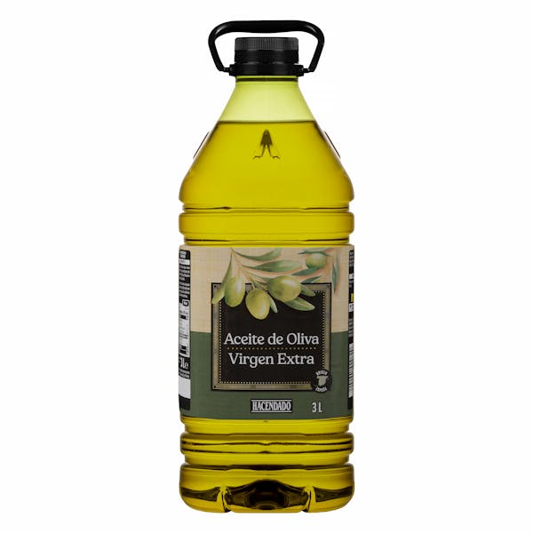

| | |
|---|---|
| **Formato** | Garrafa 3l |
| **Precio** | 14.55 € / ud. |
| **Origen** | Puente de Génave, Sierra de Segura. Jaén. |
| **Ingredientes** | Aceite de Oliva Virgen Extra 100% |

**Beneficios nutricionales:** Rico en ácidos grasos monoinsaturados (oleico) y antioxidantes naturales (polifenoles y vitamina E). Protege el corazón, reduce la inflamación y mejora el perfil lipídico. Ideal en crudo para aprovechar al máximo sus propiedades.

---

### Aceite de oliva virgen extra Hacendado Gran Selección

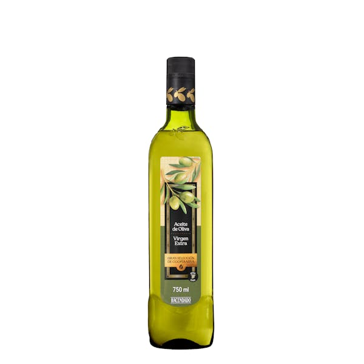

| | |
|---|---|
| **Formato** | Botella 0.75l |
| **Precio** | 5.95 € / ud. |
| **Origen** | España |
| **Ingredientes** | Ingredientes: Aceite de Oliva Virgen Extra |

**Beneficios nutricionales:** Rico en ácidos grasos monoinsaturados (oleico) y antioxidantes naturales (polifenoles y vitamina E). Protege el corazón, reduce la inflamación y mejora el perfil lipídico. Ideal en crudo para aprovechar al máximo sus propiedades.

---

### Aceite de oliva virgen extra Picual Casa Juncal

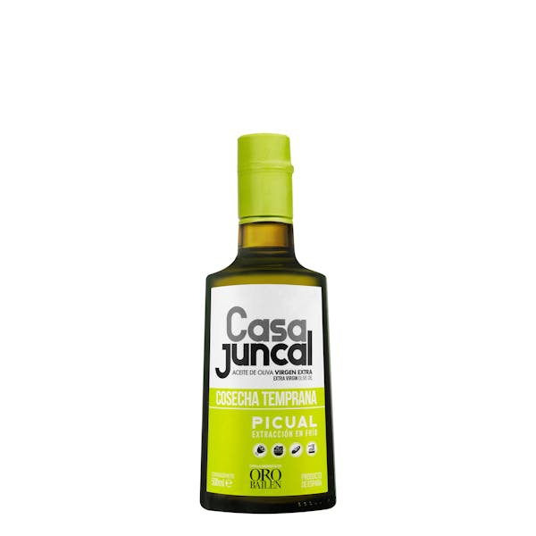

| | |
|---|---|
| **Formato** | Botella 0.5l |
| **Precio** | 4.85 € / ud. |
| **Ingredientes** | Aceite de oliva virgen extra |

**Beneficios nutricionales:** Rico en ácidos grasos monoinsaturados (oleico) y antioxidantes naturales (polifenoles y vitamina E). Protege el corazón, reduce la inflamación y mejora el perfil lipídico. Ideal en crudo para aprovechar al máximo sus propiedades.

---

### Vinagre de vino blanco Hacendado

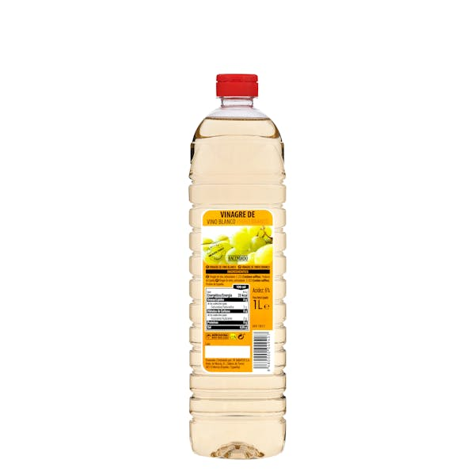

| | |
|---|---|
| **Formato** | Botella 1l |
| **Precio** | 0.65 € / ud. |
| **Origen** | España |
| **Ingredientes** | Vinagre de vino , antioxidante: E-223 (Contiene sulfitos). |

**Beneficios nutricionales:** Fuente de grasas saludables esenciales para la absorción de vitaminas liposolubles y la función celular. Prioriza siempre las variedades vírgenes o virgen extra.

---

### Vinagre de manzana Hacendado

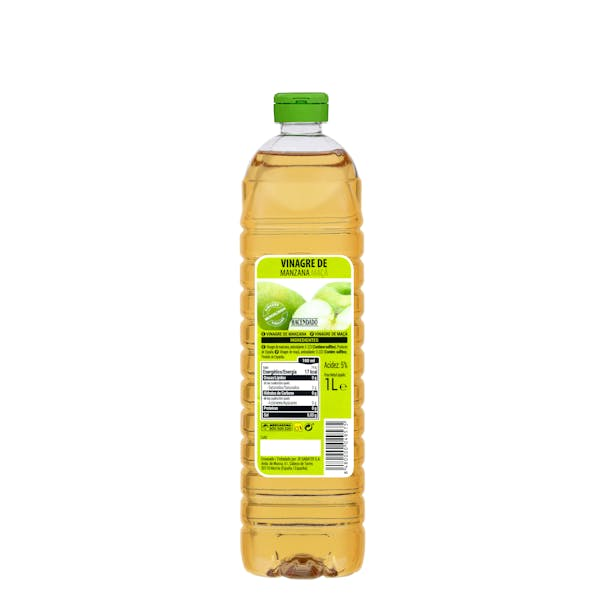

| | |
|---|---|
| **Formato** | Botella 1l |
| **Precio** | 0.90 € / ud. |
| **Origen** | España |
| **Ingredientes** | Vinagre de manzana, antioxidante : E-223 (Contiene sulfitos) |

**Beneficios nutricionales:** Rica en quercetina (antioxidante), pectina (fibra soluble prebiótica) y vitamina C. Regula el azúcar en sangre y favorece la microbiota intestinal. "Una manzana al día...".

---

### Limón exprimido Hacendado

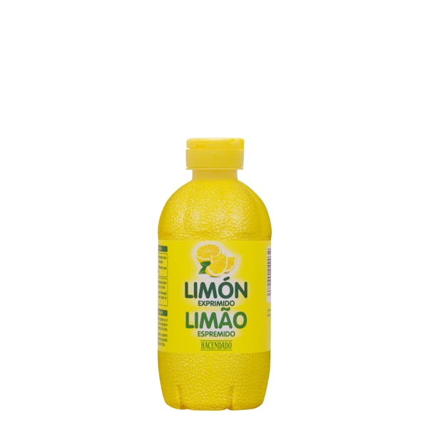

| | |
|---|---|
| **Formato** | Botella 0.28l |
| **Precio** | 1.40 € / ud. |
| **Origen** | España |
| **Ingredientes** | Zumo de limón exprimido (99,98%), antioxidante: E-223 (Contiene sulfitos). |

**Beneficios nutricionales:** Fuente de grasas saludables esenciales para la absorción de vitaminas liposolubles y la función celular. Prioriza siempre las variedades vírgenes o virgen extra.

---

### Orégano Hacendado

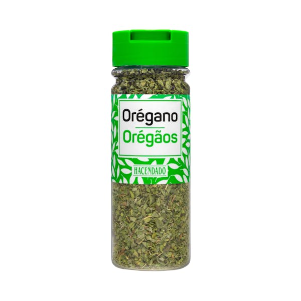

| | |
|---|---|
| **Formato** | Bote 0.025kg |
| **Precio** | 1.00 € / ud. |
| **Ingredientes** | Orégano. Puede contener trazas de soja |

**Beneficios nutricionales:** El orégano tiene una de las mayores concentraciones de antioxidantes entre las hierbas. Contiene carvacrol y timol con potentes propiedades antimicrobianas y antiinflamatorias.

---

### Perejil Hacendado

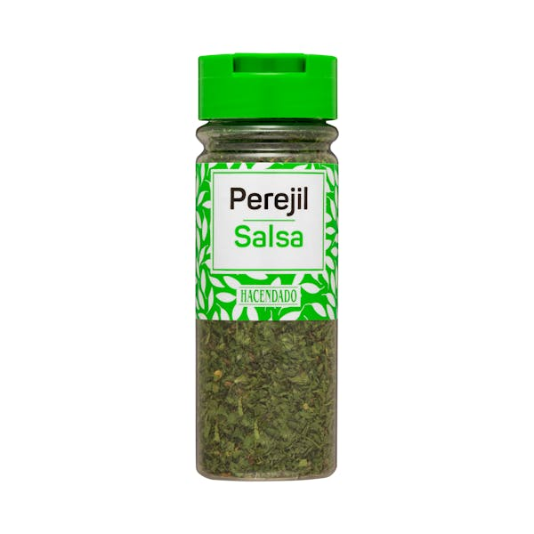

| | |
|---|---|
| **Formato** | Bote 0.018kg |
| **Precio** | 0.95 € / ud. |
| **Origen** | España |
| **Ingredientes** | Perejil |

**Beneficios nutricionales:** Alimento de calidad con importantes propiedades nutricionales. Incluirlo regularmente en una dieta variada y equilibrada contribuye al bienestar general.

---

### Hoja de laurel Hacendado

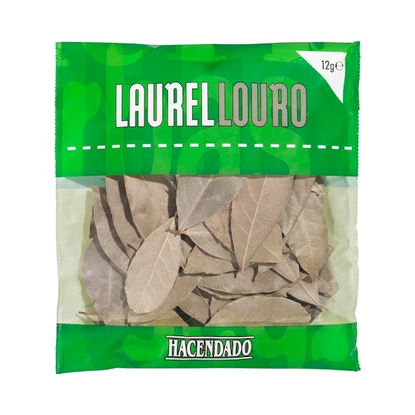

| | |
|---|---|
| **Formato** | Paquete 0.012kg |
| **Precio** | 0.85 € / ud. |
| **Origen** | Turquía |
| **Ingredientes** | 100% hojas de laurel |

**Beneficios nutricionales:** El laurel contiene eugenol y ácido láurico con propiedades antiinflamatorias y digestivas. Facilita la digestión de legumbres y reduce los gases.

---

### Hierbas provenzales Hacendado

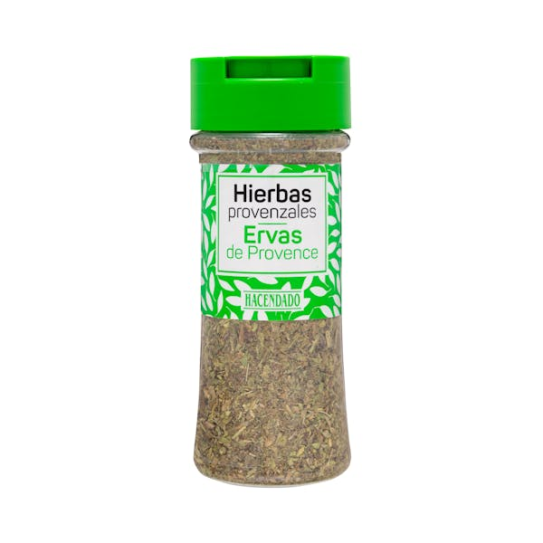

| | |
|---|---|
| **Formato** | Bote 0.025kg |
| **Precio** | 1.20 € / ud. |
| **Origen** | España |
| **Ingredientes** | Albahaca, orégano, romero, tomillo, ajedrea y mejorana. |

**Beneficios nutricionales:** Mezcla de hierbas mediterráneas (tomillo, romero, orégano, lavanda) con sinergia antioxidante y antiinflamatoria. Realzan el sabor de carnes, verduras y legumbres.

---

### Albahaca Hacendado

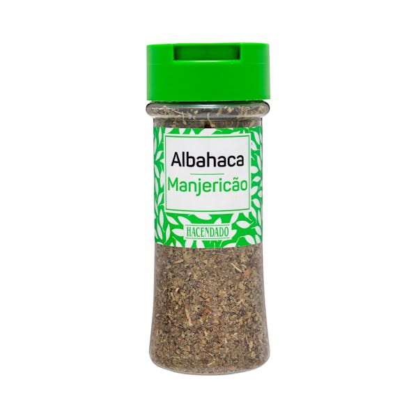

| | |
|---|---|
| **Formato** | Bote 0.02kg |
| **Precio** | 1.25 € / ud. |
| **Origen** | España |
| **Ingredientes** | Albahaca. Puede contener trazas de apio y soja. |

**Beneficios nutricionales:** Rica en vitamina K, vitamina A y antioxidantes (flavonoides). Sus aceites esenciales tienen propiedades antibacterianas y antiinflamatorias.

---

### Tomillo Hacendado

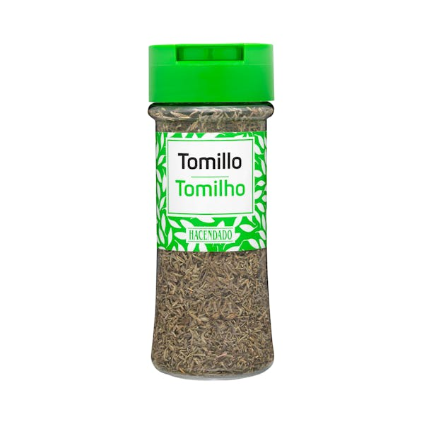

| | |
|---|---|
| **Formato** | Bote 0.024kg |
| **Precio** | 1.05 € / ud. |
| **Origen** | España |
| **Ingredientes** | Tomillo |

**Beneficios nutricionales:** El tomillo contiene timol, uno de los antibacterianos naturales más potentes. Expectorante y antiinflamatorio de las vías respiratorias. Rico en vitamina C y hierro.

---

### Eneldo Hacendado

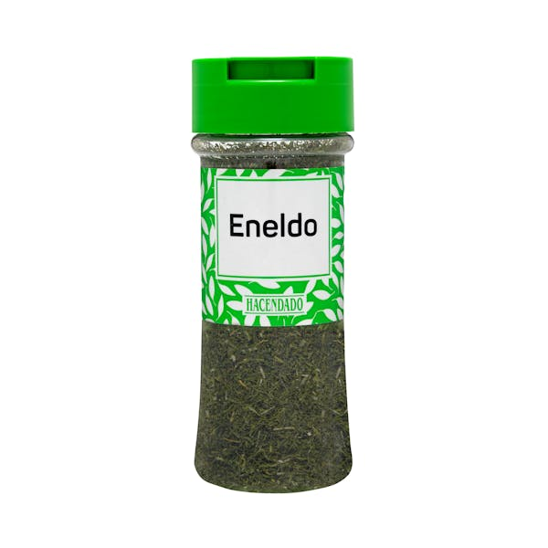

| | |
|---|---|
| **Formato** | Bote 0.018kg |
| **Precio** | 1.85 € / ud. |
| **Ingredientes** | Eneldo |

**Beneficios nutricionales:** Alimento de calidad con importantes propiedades nutricionales. Incluirlo regularmente en una dieta variada y equilibrada contribuye al bienestar general.

---

### Cilantro Hacendado

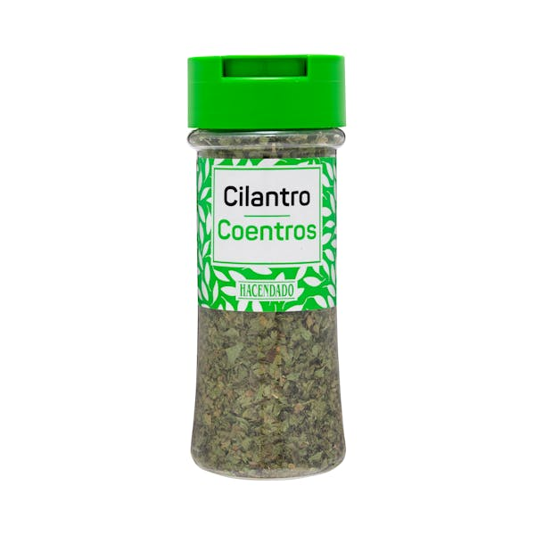

| | |
|---|---|
| **Formato** | Bote 0.012kg |
| **Precio** | 1.85 € / ud. |
| **Origen** | España |
| **Ingredientes** | Cilantro |

**Beneficios nutricionales:** Alimento de calidad con importantes propiedades nutricionales. Incluirlo regularmente en una dieta variada y equilibrada contribuye al bienestar general.

---

### Ajo y Perejil Hacendado

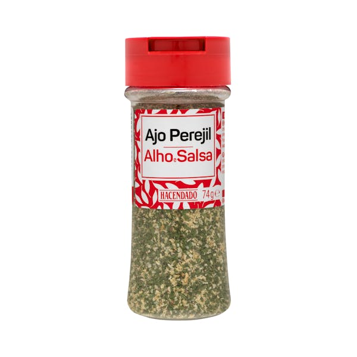

| | |
|---|---|
| **Formato** | Bote 0.074kg |
| **Precio** | 1.35 € / ud. |
| **Origen** | España |
| **Ingredientes** | Especias (35% ajo, cebolla, 7% perejil y pimienta negra) y sal. |

**Beneficios nutricionales:** Alimento de calidad con importantes propiedades nutricionales. Incluirlo regularmente en una dieta variada y equilibrada contribuye al bienestar general.

---

### Romero Hacendado

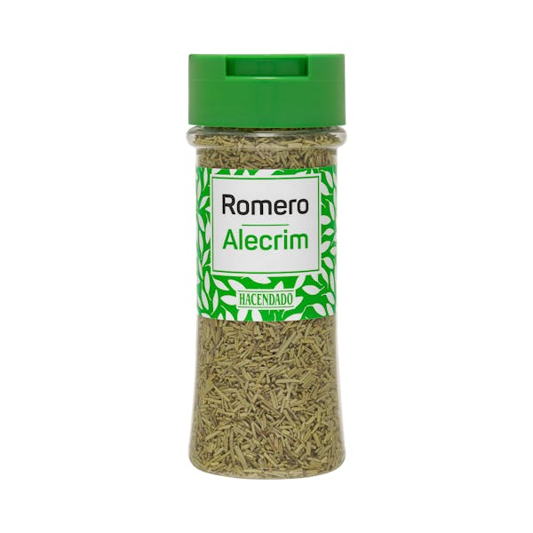

| | |
|---|---|
| **Formato** | Bote 0.035kg |
| **Precio** | 1.35 € / ud. |
| **Ingredientes** | Romero |

**Beneficios nutricionales:** El ácido rosmarínico y el carnosol del romero son potentes antioxidantes y neuroprotectores. Mejora la memoria y la concentración. Antiinflamatorio y digestivo.

---

### Pimentón dulce de la Vera Hacendado

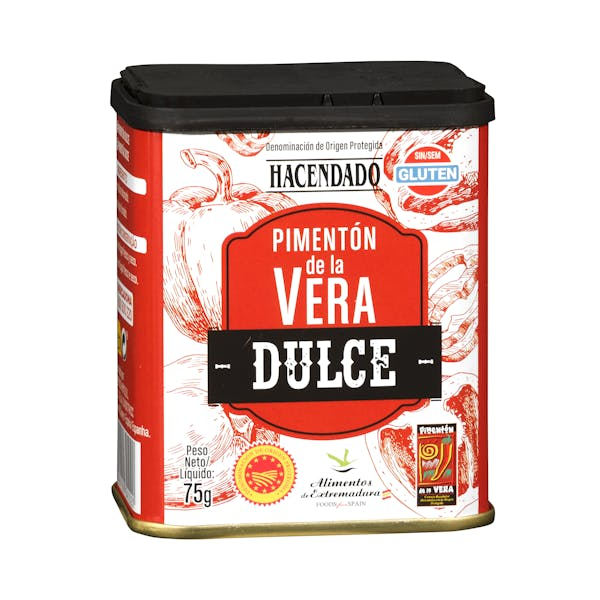

| | |
|---|---|
| **Formato** | Bote 0.075kg |
| **Precio** | 1.85 € / ud. |
| **Origen** | Denominación de origen Pimentón de la Vera |
| **Ingredientes** | Pimentón dulce ahumado. |

**Beneficios nutricionales:** Alimento de calidad con importantes propiedades nutricionales. Incluirlo regularmente en una dieta variada y equilibrada contribuye al bienestar general.

---

### Azafrán molido Hacendado

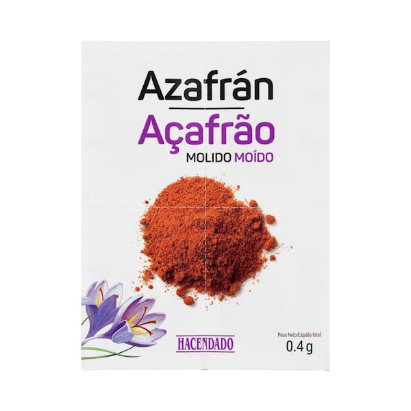

| | |
|---|---|
| **Formato** | Paquete 0.0004kg |
| **Precio** | 1.90 € / ud. |
| **Origen** | España |
| **Ingredientes** | Azafrán |

**Beneficios nutricionales:** Alimento de calidad con importantes propiedades nutricionales. Incluirlo regularmente en una dieta variada y equilibrada contribuye al bienestar general.

---

### Azafrán hebra Hacendado

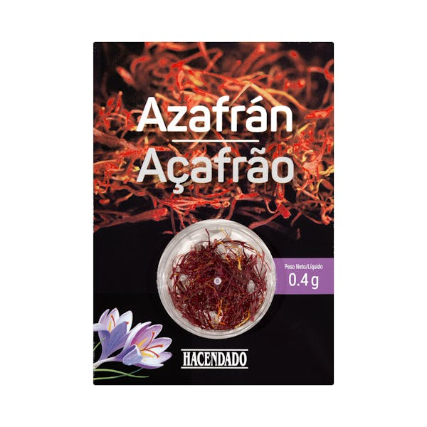

| | |
|---|---|
| **Formato** | Paquete 0.0004kg |
| **Precio** | 1.95 € / ud. |
| **Ingredientes** | Azafrán |

**Beneficios nutricionales:** Alimento de calidad con importantes propiedades nutricionales. Incluirlo regularmente en una dieta variada y equilibrada contribuye al bienestar general.

---

### Pimentón picante Hacendado

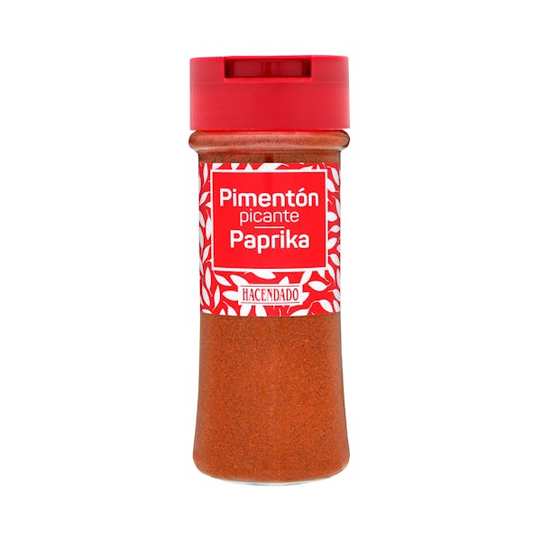

| | |
|---|---|
| **Formato** | Bote 0.06kg |
| **Precio** | 1.35 € / ud. |
| **Origen** | España |
| **Ingredientes** | Pimentón picante |

**Beneficios nutricionales:** Alimento de calidad con importantes propiedades nutricionales. Incluirlo regularmente en una dieta variada y equilibrada contribuye al bienestar general.

---

### Aceite de coco virgen Hacendado

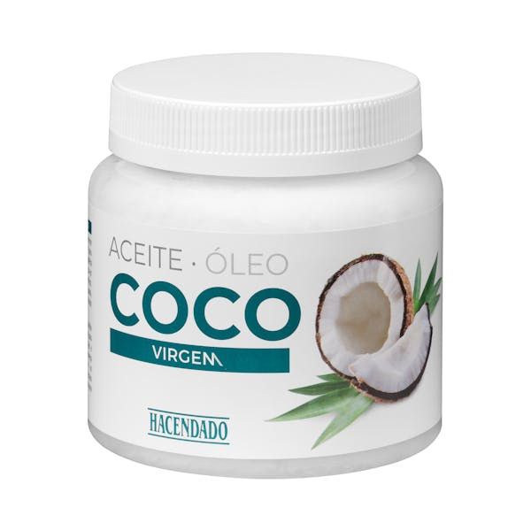

| | |
|---|---|
| **Formato** | Bote 0.45l |
| **Precio** | 5.25 € / ud. |
| **Ingredientes** | Aceite de coco (100%) |

**Beneficios nutricionales:** Fuente de grasas saludables esenciales para la absorción de vitaminas liposolubles y la función celular. Prioriza siempre las variedades vírgenes o virgen extra.

---

### Salsa de tomate Zero sin azúcares añadidos Hacendado

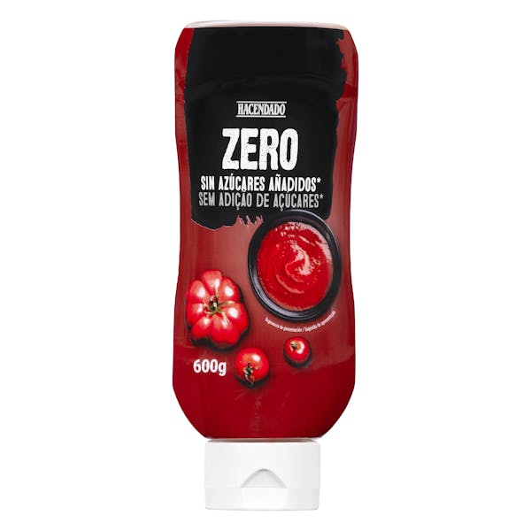

| | |
|---|---|
| **Formato** | Bote 0.6kg |
| **Precio** | 1.60 € / ud. |
| **Origen** | España |
| **Ingredientes** | Tomate (250 g por 100 g de salsa de tomate), fibra de maíz, vinagre de alcohol, almidón modificado de maíz, sal, especia, extracto de especias, edulcorante (sucralosa), conservadores (sorbato potásico y benzoato sódico). |

**Beneficios nutricionales:** Rico en licopeno (potente antioxidante), vitamina C y potasio. El licopeno aumenta su biodisponibilidad con el cocinado y el aceite de oliva.

---

### Mostaza de Dijon Hacendado

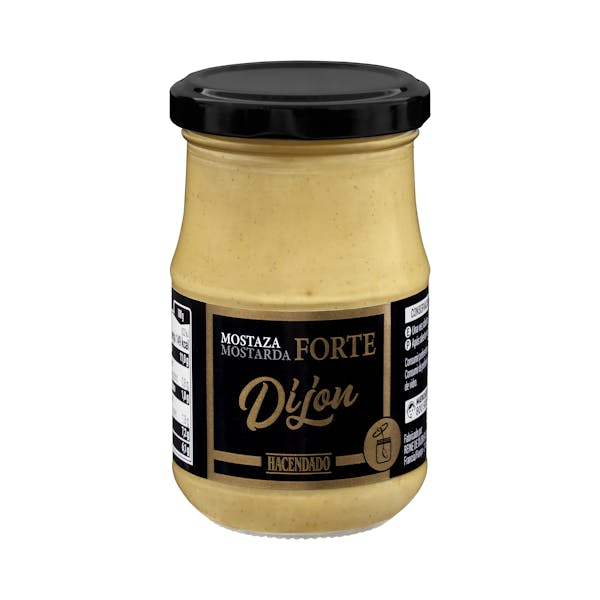

| | |
|---|---|
| **Formato** | Tarro 0.2kg |
| **Precio** | 1.25 € / ud. |
| **Origen** | Francia |
| **Ingredientes** | Ingredientes: agua, SEMILLA De MOSTOZA, vinagre de alcohol (15% ácido), sal, acidulante (ácido cítrico), conservador (METABISULFITO POSTÁSICO). |

**Beneficios nutricionales:** Fuente de grasas saludables esenciales para la absorción de vitaminas liposolubles y la función celular. Prioriza siempre las variedades vírgenes o virgen extra.

---

### Mostaza clásica Hacendado

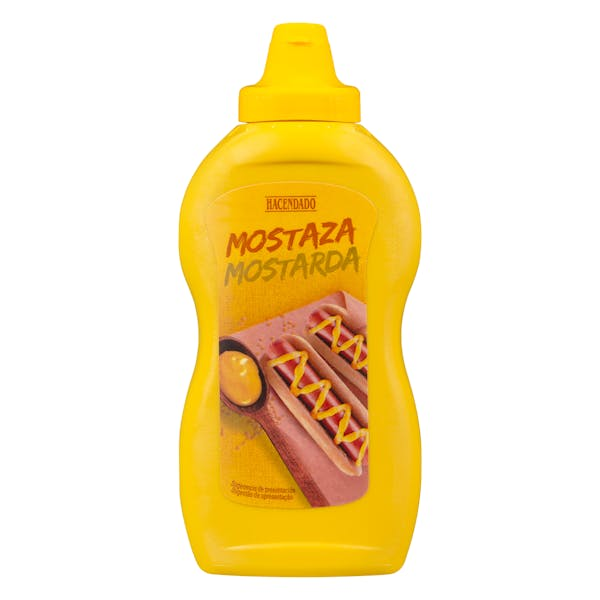

| | |
|---|---|
| **Formato** | Bote 0.388kg |
| **Precio** | 1.35 € / ud. |
| **Ingredientes** | — |

**Beneficios nutricionales:** Fuente de grasas saludables esenciales para la absorción de vitaminas liposolubles y la función celular. Prioriza siempre las variedades vírgenes o virgen extra.

---

### Salsa de tomate con Albahaca Hacendado

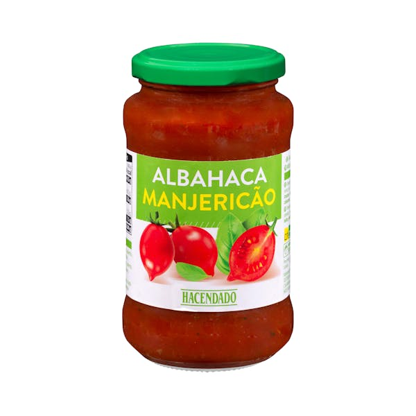

| | |
|---|---|
| **Formato** | Tarro 0.4kg |
| **Precio** | 1.65 € / ud. |
| **Ingredientes** | — |

**Beneficios nutricionales:** Rico en licopeno (potente antioxidante), vitamina C y potasio. El licopeno aumenta su biodisponibilidad con el cocinado y el aceite de oliva.

---

### Salsa de Soja Hacendado

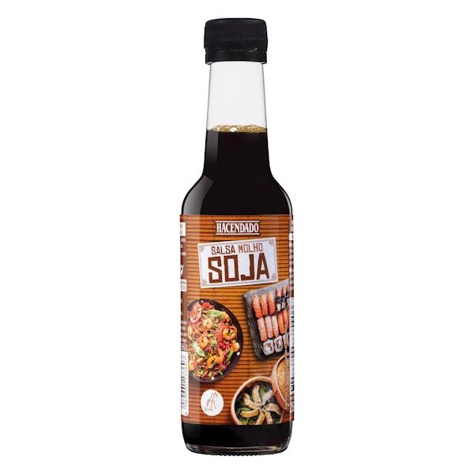

| | |
|---|---|
| **Formato** | Botella 0.25l |
| **Precio** | 1.20 € / ud. |
| **Origen** | Austria |
| **Ingredientes** | Zutaten: Ingredientes: Agua, HABAS DE SOJA, TRIGO (contiene GLUTEN), sal, azúcar, acidulante (ácido láctico), espesante (goma guar). |

**Beneficios nutricionales:** La legumbre más proteica con todos los aminoácidos esenciales. Rica en isoflavonas con beneficios cardiovasculares y óseos. Fuente importante de calcio vegetal.

---

### Salsa de Soja sin gluten Hacendado

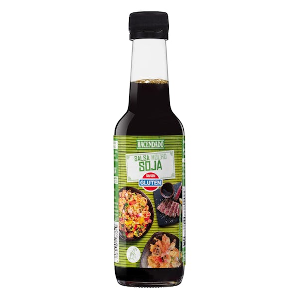

| | |
|---|---|
| **Formato** | Botella 0.25l |
| **Precio** | 2.50 € / ud. |
| **Origen** | Austria |
| **Ingredientes** | Ingredientes: Agua, HABAS DE SOJA, sal, vinagre de alcohol. |

**Beneficios nutricionales:** La legumbre más proteica con todos los aminoácidos esenciales. Rica en isoflavonas con beneficios cardiovasculares y óseos. Fuente importante de calcio vegetal.

---

### Guacamole Hacendado

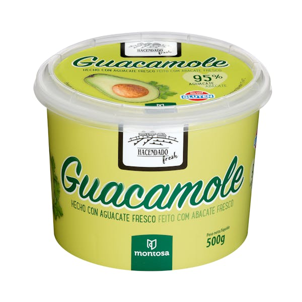

| | |
|---|---|
| **Formato** | Tarrina 0.5kg |
| **Precio** | 3.95 € / ud. |
| **Ingredientes** | Aguacate 95%, cebolla y ajo deshidratado, sal, jalapeño, azúcar, ácido cítrico, ácido ascórbico, antioxidantes (E-301 y E-331), conservador (E-202) y cilantro deshidratado. |

**Beneficios nutricionales:** Fuente de grasas saludables esenciales para la absorción de vitaminas liposolubles y la función celular. Prioriza siempre las variedades vírgenes o virgen extra.

---

### Salsa Mexicana Hacendado

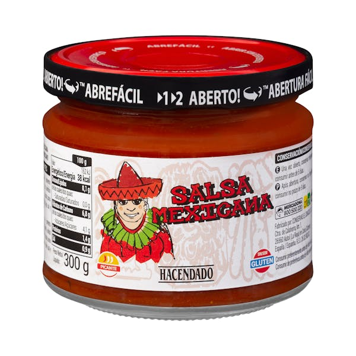

| | |
|---|---|
| **Formato** | Tarro 0.3kg |
| **Precio** | 1.25 € / ud. |
| **Origen** | España |
| **Ingredientes** | Tomate, cebolla, pimiento verde, vinagre de vino, almidón modificado de maíz, azúcar, zumo de limón concentrado, ajo, sal y especias. |

**Beneficios nutricionales:** Fuente de grasas saludables esenciales para la absorción de vitaminas liposolubles y la función celular. Prioriza siempre las variedades vírgenes o virgen extra.

---

### Pasta de sésamo Tahini Hacendado

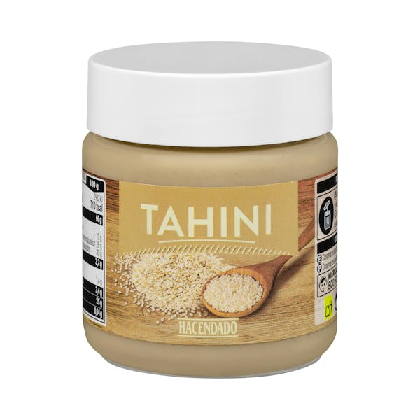

| | |
|---|---|
| **Formato** | Tarro 0.2kg |
| **Precio** | 2.95 € / ud. |
| **Ingredientes** | Semillas de sésamo |

**Beneficios nutricionales:** Fuente de grasas saludables esenciales para la absorción de vitaminas liposolubles y la función celular. Prioriza siempre las variedades vírgenes o virgen extra.

---

## 2. Frutos Secos, Semillas y Encurtidos

Los frutos secos naturales concentran omega-3, proteínas y fibra. Las semillas de chía, lino y calabaza son superalimentos ricos en omega-3 vegetal, zinc y fibra soluble. Las aceitunas aportan MUFA y polifenoles.

### Nuez natural Hacendado pelada

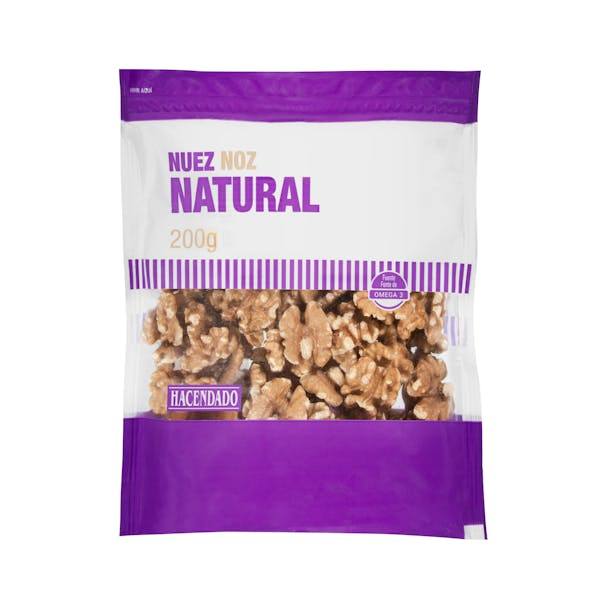

| | |
|---|---|
| **Formato** | Paquete 0.2kg |
| **Precio** | 2.50 € / ud. |
| **Origen** | Chile |
| **Ingredientes** | NUECES. TRAZAS DE CACAHUETE Y OTROS FRUTOS DE CÁSCARA. |

**Beneficios nutricionales:** Una de las fuentes vegetales más ricas en omega-3 (ALA). Aportan proteínas, fibra, magnesio y vitamina B6. Su consumo regular está asociado a mejor salud cardiovascular y función cerebral.

---

### Almendra natural Hacendado

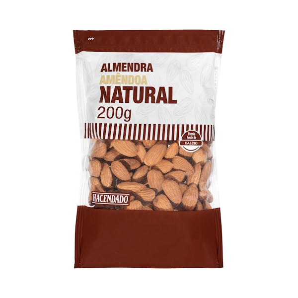

| | |
|---|---|
| **Formato** | Paquete 0.2kg |
| **Precio** | 2.30 € / ud. |
| **Origen** | Estados Unidos (los) |
| **Ingredientes** | Almendra. Puede contener trazas de cacahuete y otros frutos de cáscara |

**Beneficios nutricionales:** Ricas en vitamina E, magnesio, calcio y proteína vegetal. Sus grasas monoinsaturadas reducen el colesterol LDL. Ideales como snack saludable y muy saciantes.

---

### Pistacho tostado Hacendado con sal

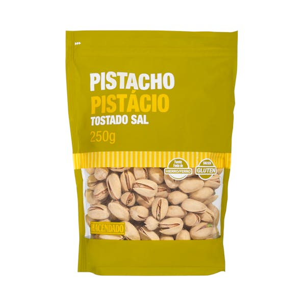

| | |
|---|---|
| **Formato** | Paquete 0.25kg |
| **Precio** | 3.50 € / ud. |
| **Origen** | Estados Unidos (los) |
| **Ingredientes** | PISTACHOS y sal. TRAZAS DE CACAHUETE Y OTROS FRUTOS DE CÁSCARA. |

**Beneficios nutricionales:** Alto contenido en proteínas vegetales, fibra, potasio y antioxidantes (luteína, zeaxantina). Ayuda a controlar el azúcar en sangre y mejora la salud ocular.

---

### Pistacho tostado Hacendado 0% sal añadida

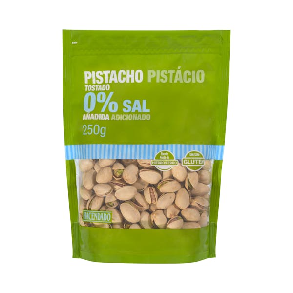

| | |
|---|---|
| **Formato** | Paquete 0.25kg |
| **Precio** | 3.50 € / ud. |
| **Origen** | Estados Unidos (los) |
| **Ingredientes** | PISTACHOS tostados. TRAZAS DE CACAHUETE Y OTROS FRUTOS DE CÁSCARA. |

**Beneficios nutricionales:** Alto contenido en proteínas vegetales, fibra, potasio y antioxidantes (luteína, zeaxantina). Ayuda a controlar el azúcar en sangre y mejora la salud ocular.

---

### Pipas girasol tostadas Hacendado gigante aguasal

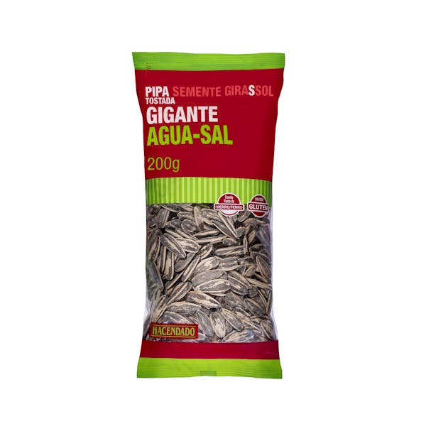

| | |
|---|---|
| **Formato** | Paquete 0.2kg |
| **Precio** | 1.10 € / ud. |
| **Origen** | China |
| **Ingredientes** | Pipas girasol y sal. |

**Beneficios nutricionales:** Fuente excepcional de vitamina E (antioxidante), selenio, magnesio y zinc. Sus grasas poliinsaturadas contribuyen a la salud cardiovascular.

---

### Anacardo natural Hacendado

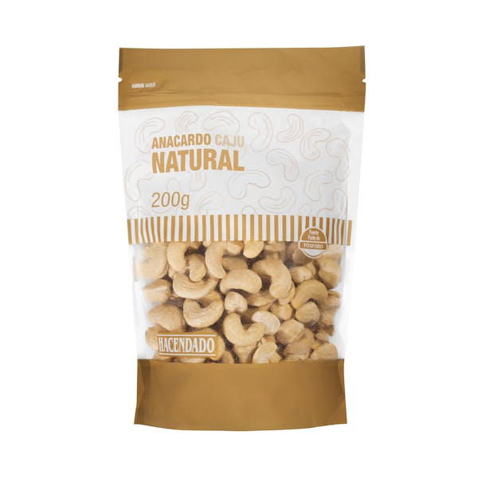

| | |
|---|---|
| **Formato** | Paquete 0.2kg |
| **Precio** | 2.70 € / ud. |
| **Origen** | India |
| **Ingredientes** | Anacardo. Puede contener trazas de cacahuete y otros frutos de cáscara |

**Beneficios nutricionales:** Fuente de hierro, zinc, magnesio y cobre. Sus grasas monoinsaturadas cuidan el corazón. Aportan triptófano, precursor de la serotonina, favoreciendo el estado de ánimo.

---

### Avellana tostada Hacendado 0% sal añadida

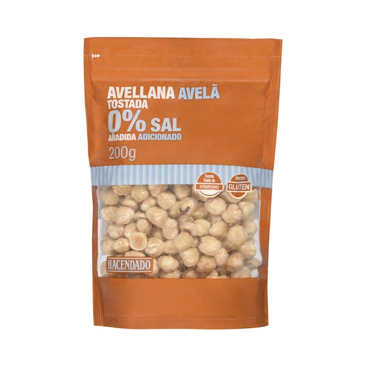

| | |
|---|---|
| **Formato** | Paquete 0.2kg |
| **Precio** | 4.30 € / ud. |
| **Origen** | Turquía |
| **Ingredientes** | Avellanas tostadas. Trazas de cacahuete y otros frutos de cáscara. |

**Beneficios nutricionales:** Ricas en vitamina E, ácido fólico y manganeso. Sus antioxidantes protegen frente al estrés oxidativo. Fuente de energía de lenta liberación, perfectas para el desayuno.

---

### Almendra tostada y salada Hacendado con piel

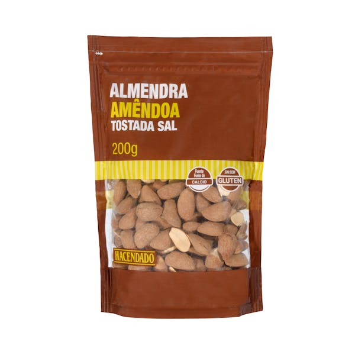

| | |
|---|---|
| **Formato** | Paquete 0.2kg |
| **Precio** | 2.40 € / ud. |
| **Ingredientes** | Almendras y sal. Trazas de cacahuete y otros frutos de cáscara. |

**Beneficios nutricionales:** Ricas en vitamina E, magnesio, calcio y proteína vegetal. Sus grasas monoinsaturadas reducen el colesterol LDL. Ideales como snack saludable y muy saciantes.

---

### Almendra frita y salada Hacendado pelada

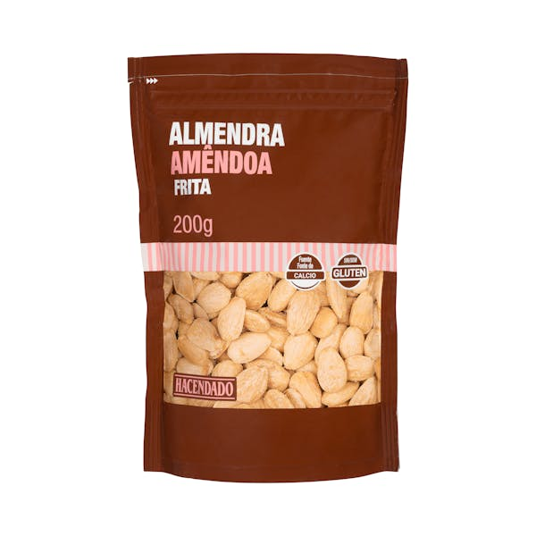

| | |
|---|---|
| **Formato** | Paquete 0.2kg |
| **Precio** | 2.95 € / ud. |
| **Origen** | España |
| **Ingredientes** | Almendra, sal y aceite refinado de girasol. Trazas de cacahuete y otros frutos de cáscara. |

**Beneficios nutricionales:** Ricas en vitamina E, magnesio, calcio y proteína vegetal. Sus grasas monoinsaturadas reducen el colesterol LDL. Ideales como snack saludable y muy saciantes.

---

### Cacahuete tostado Hacendado 0% sal añadida

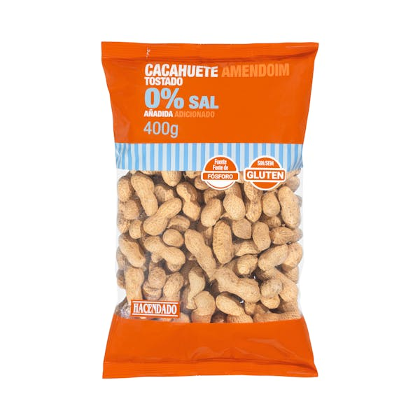

| | |
|---|---|
| **Formato** | Paquete 0.4kg |
| **Precio** | 1.55 € / ud. |
| **Origen** | China |
| **Ingredientes** | CACAHUETES con cáscara tostados. TRAZAS DE FRUTOS DE CÁSCARA. |

**Beneficios nutricionales:** Los frutos secos naturales (sin sal ni azúcar añadida) concentran grasas saludables, proteínas, fibra y micronutrientes esenciales en pequeñas raciones.

---

### Almendra tostada Hacendado 0% sal añadida con piel

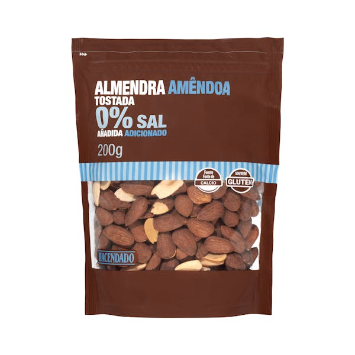

| | |
|---|---|
| **Formato** | Paquete 0.2kg |
| **Precio** | 2.95 € / ud. |
| **Origen** | España |
| **Ingredientes** | Almendras tostadas. Trazas de cacahuete y otros frutos de cáscara. |

**Beneficios nutricionales:** Ricas en vitamina E, magnesio, calcio y proteína vegetal. Sus grasas monoinsaturadas reducen el colesterol LDL. Ideales como snack saludable y muy saciantes.

---

### Nuez macadamia Hacendado tostada con sal

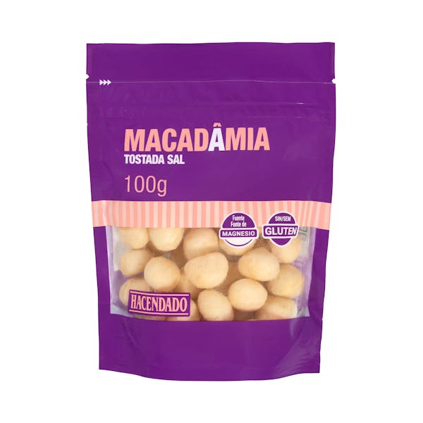

| | |
|---|---|
| **Formato** | Paquete 0.1kg |
| **Precio** | 2.90 € / ud. |
| **Origen** | Sudáfrica |
| **Ingredientes** | Nueces de macadamia y sal. Trazas de cacahuete y otros frutos de cáscara. |

**Beneficios nutricionales:** Una de las fuentes vegetales más ricas en omega-3 (ALA). Aportan proteínas, fibra, magnesio y vitamina B6. Su consumo regular está asociado a mejor salud cardiovascular y función cerebral.

---

### Mezcla semillas Hacendado

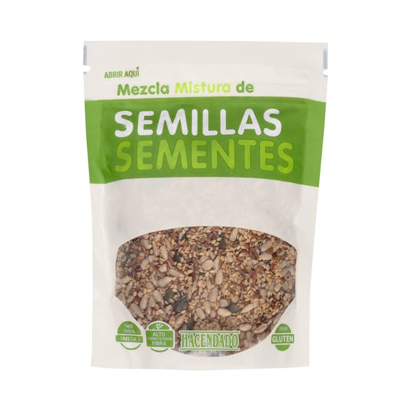

| | |
|---|---|
| **Formato** | Paquete 0.2kg |
| **Precio** | 1.46 € / ud. |
| **Origen** | Italia |
| **Ingredientes** | Semillas de girasol peladas, semillas de sésamo natural, semillas de lino marrón, semillas de calabaza peladas y semillas de chía. |

**Beneficios nutricionales:** Los frutos secos naturales (sin sal ni azúcar añadida) concentran grasas saludables, proteínas, fibra y micronutrientes esenciales en pequeñas raciones.

---

### Pipas de calabaza natural Hacendado peladas

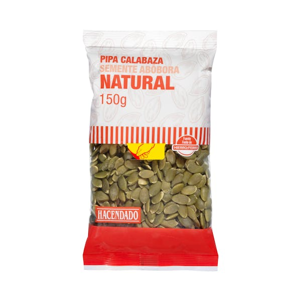

| | |
|---|---|
| **Formato** | Paquete 0.15kg |
| **Precio** | 1.70 € / ud. |
| **Origen** | China |
| **Ingredientes** | Pipas de calabaza peladas. |

**Beneficios nutricionales:** Fuente excepcional de vitamina E (antioxidante), selenio, magnesio y zinc. Sus grasas poliinsaturadas contribuyen a la salud cardiovascular.

---

### Castañas cocidas y peladas Hacendado

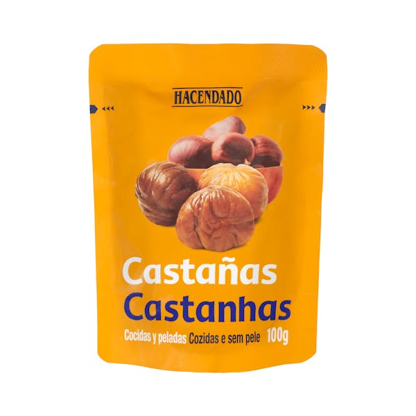

| | |
|---|---|
| **Formato** | Paquete 0.1kg |
| **Precio** | 1.40 € / ud. |
| **Origen** | China |
| **Ingredientes** | Castañas. |

**Beneficios nutricionales:** Los frutos secos naturales (sin sal ni azúcar añadida) concentran grasas saludables, proteínas, fibra y micronutrientes esenciales en pequeñas raciones.

---

### Semillas de chía Hacendado

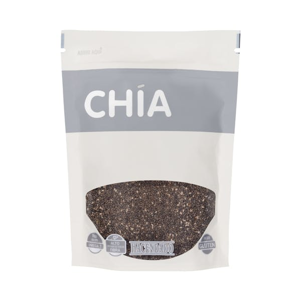

| | |
|---|---|
| **Formato** | Paquete 0.15kg |
| **Precio** | 1.45 € / ud. |
| **Ingredientes** | Semilla de chía (100%). |

**Beneficios nutricionales:** Superalimento rico en omega-3, fibra soluble e insoluble, calcio y antioxidantes. Regula el tránsito intestinal, mejora la saciedad y estabiliza el azúcar en sangre.

---

### Semillas sésamo tostado Hacendado

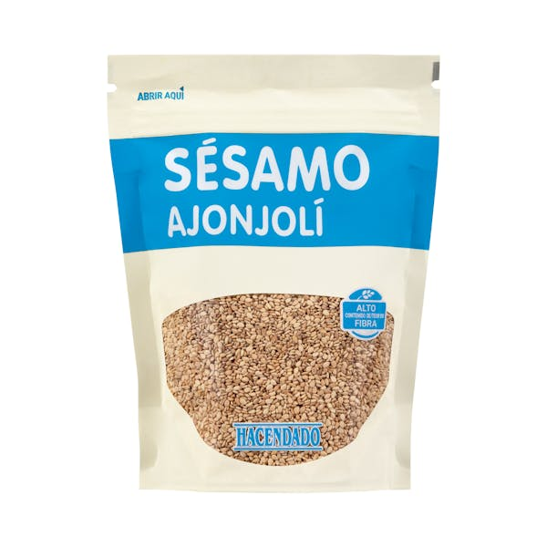

| | |
|---|---|
| **Formato** | Paquete 0.15kg |
| **Precio** | 1.50 € / ud. |
| **Origen** | Italia |
| **Ingredientes** | Semilla de sésamo (100%). Este producto puede contener trazas de  soja |

**Beneficios nutricionales:** Los frutos secos naturales (sin sal ni azúcar añadida) concentran grasas saludables, proteínas, fibra y micronutrientes esenciales en pequeñas raciones.

---

### Pipas girasol naturales Hacendado peladas

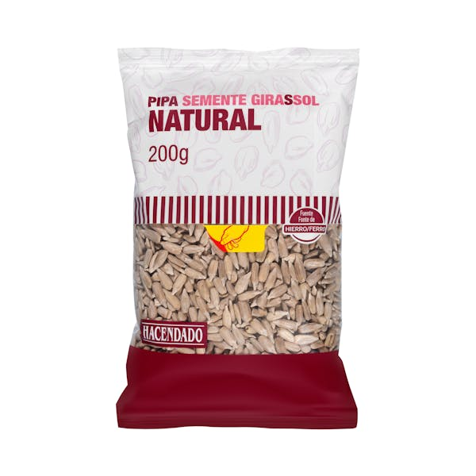

| | |
|---|---|
| **Formato** | Paquete 0.2kg |
| **Precio** | 1.15 € / ud. |
| **Origen** | Bulgaria |
| **Ingredientes** | Pipas de girasol peladas. TRAZAS DE CACAHUETE, FRUTOS DE CÁSCARA Y SOJA. |

**Beneficios nutricionales:** Fuente excepcional de vitamina E (antioxidante), selenio, magnesio y zinc. Sus grasas poliinsaturadas contribuyen a la salud cardiovascular.

---

### Semillas lino dorado Hacendado

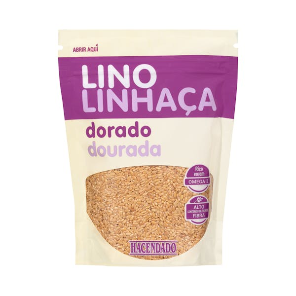

| | |
|---|---|
| **Formato** | Paquete 0.15kg |
| **Precio** | 1.19 € / ud. |
| **Origen** | Italia |
| **Ingredientes** | Semilla de lino dorado (100%). Puede contener trazas de sésamo y soja. |

**Beneficios nutricionales:** Excelente fuente de omega-3 vegetal (ALA) y lignanos (fitoestrógenos antioxidantes). Favorece el tránsito intestinal y puede contribuir al equilibrio hormonal.

---

### Nuez natural Hacendado

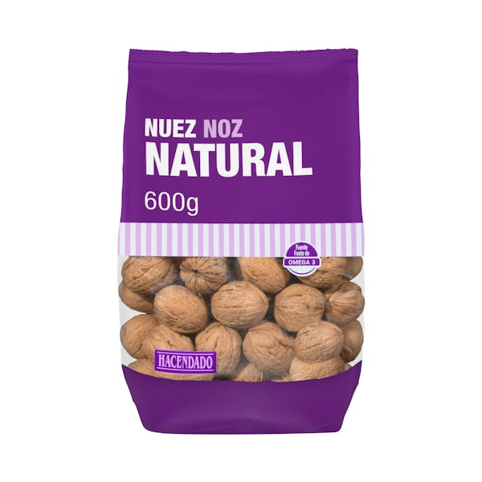

| | |
|---|---|
| **Formato** | Paquete 0.6kg |
| **Precio** | 3.70 € / ud. |
| **Origen** | España |
| **Ingredientes** | NUECES. TRAZAS DE CACAHUETE Y OTROS FRUTOS DE CÁSCARA. |

**Beneficios nutricionales:** Una de las fuentes vegetales más ricas en omega-3 (ALA). Aportan proteínas, fibra, magnesio y vitamina B6. Su consumo regular está asociado a mejor salud cardiovascular y función cerebral.

---

### Pipas calabaza tostadas Hacendado aguasal

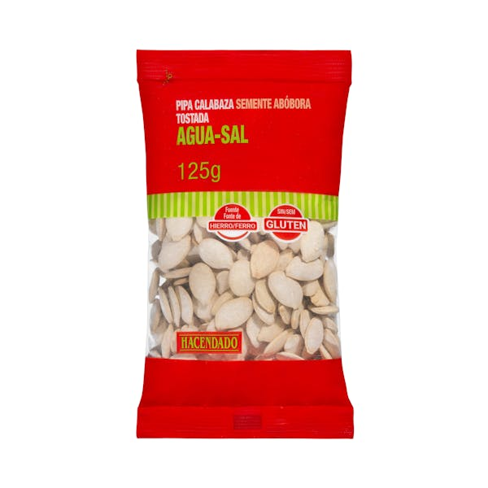

| | |
|---|---|
| **Formato** | Paquete 0.125kg |
| **Precio** | 1.55 € / ud. |
| **Origen** | China |
| **Ingredientes** | Pipas de calabaza, sal y colorante (E-170). |

**Beneficios nutricionales:** Fuente excepcional de vitamina E (antioxidante), selenio, magnesio y zinc. Sus grasas poliinsaturadas contribuyen a la salud cardiovascular.

---

### Pipas girasol tostadas Hacendado 0% sal añadida

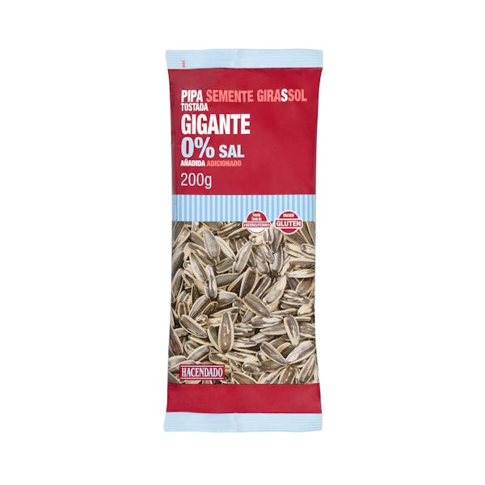

| | |
|---|---|
| **Formato** | Paquete 0.2kg |
| **Precio** | 1.30 € / ud. |
| **Origen** | China |
| **Ingredientes** | Pipas de girasol tostadas. |

**Beneficios nutricionales:** Fuente excepcional de vitamina E (antioxidante), selenio, magnesio y zinc. Sus grasas poliinsaturadas contribuyen a la salud cardiovascular.

---

### Nuez de Brasil natural Hacendado

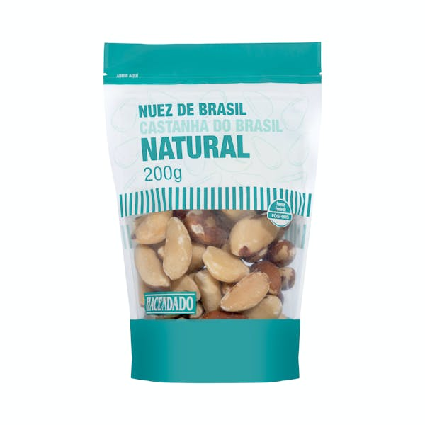

| | |
|---|---|
| **Formato** | Paquete 0.2kg |
| **Precio** | 3.50 € / ud. |
| **Origen** | Alemania |
| **Ingredientes** | NUEZ DE BRASIL. TRAZAS DE CACAHUETE Y OTROS FRUTOS DE CÁSCARA. |

**Beneficios nutricionales:** Una de las fuentes vegetales más ricas en omega-3 (ALA). Aportan proteínas, fibra, magnesio y vitamina B6. Su consumo regular está asociado a mejor salud cardiovascular y función cerebral.

---

### Pistacho natural Hacendado pelado

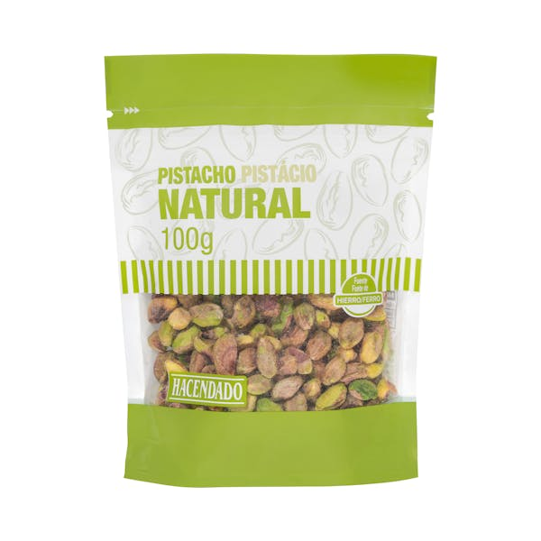

| | |
|---|---|
| **Formato** | Paquete 0.1kg |
| **Precio** | 2.95 € / ud. |
| **Origen** | Irán (la República Islámica de) |
| **Ingredientes** | Pistacho. Trazas de cacahuete y otros frutos de cáscara. |

**Beneficios nutricionales:** Alto contenido en proteínas vegetales, fibra, potasio y antioxidantes (luteína, zeaxantina). Ayuda a controlar el azúcar en sangre y mejora la salud ocular.

---

### Nuez Pecana natural Hacendado pelada

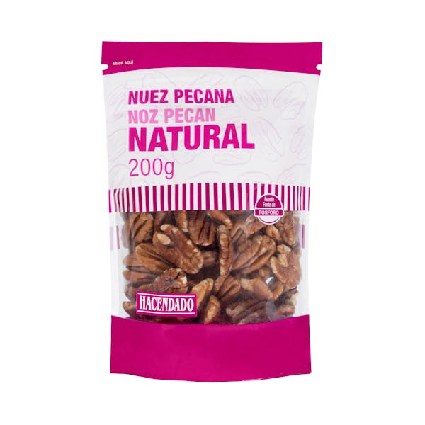

| | |
|---|---|
| **Formato** | Paquete 0.2kg |
| **Precio** | 3.90 € / ud. |
| **Origen** | Estados Unidos (los) |
| **Ingredientes** | NUEZ pecana. TRAZAS DE CACAHUETE Y OTROS FRUTOS DE CÁSCARA. |

**Beneficios nutricionales:** Una de las fuentes vegetales más ricas en omega-3 (ALA). Aportan proteínas, fibra, magnesio y vitamina B6. Su consumo regular está asociado a mejor salud cardiovascular y función cerebral.

---

### Cacahuete tostado Hacendado pelado 0% sal añadida

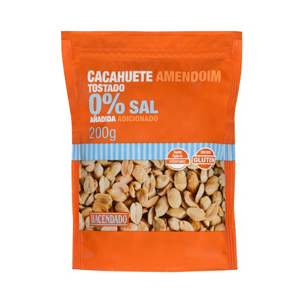

| | |
|---|---|
| **Formato** | Paquete 0.2kg |
| **Precio** | 1.05 € / ud. |
| **Origen** | Argentina |
| **Ingredientes** | Cacahuetes tostados. Trazas de frutos secos de casca rija. |

**Beneficios nutricionales:** Los frutos secos naturales (sin sal ni azúcar añadida) concentran grasas saludables, proteínas, fibra y micronutrientes esenciales en pequeñas raciones.

---

### Cacahuete +Proteínas en polvo desgrasado Hacendado 14 g proteínas 70% reducido en grasa

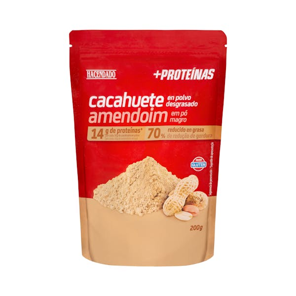

| | |
|---|---|
| **Formato** | Paquete 0.2kg |
| **Precio** | 2.75 € / ud. |
| **Origen** | Argentina |
| **Ingredientes** | Cacahuetes tostados desgrasados. Trazas de frutos de cáscara. |

**Beneficios nutricionales:** Los frutos secos naturales (sin sal ni azúcar añadida) concentran grasas saludables, proteínas, fibra y micronutrientes esenciales en pequeñas raciones.

---

### Nuez troceada pelada Hacendado

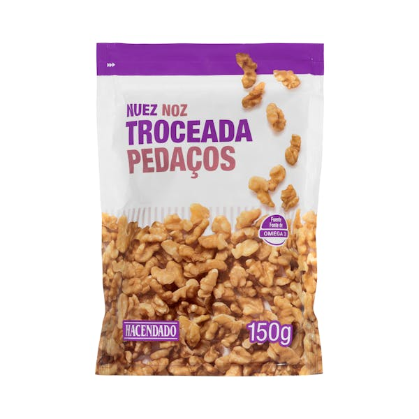

| | |
|---|---|
| **Formato** | Paquete 0.15kg |
| **Precio** | 1.80 € / ud. |
| **Origen** | Chile |
| **Ingredientes** | Nueces. Trazas de cacahuetes y frutos secos de cáscara. |

**Beneficios nutricionales:** Una de las fuentes vegetales más ricas en omega-3 (ALA). Aportan proteínas, fibra, magnesio y vitamina B6. Su consumo regular está asociado a mejor salud cardiovascular y función cerebral.

---

### Anacardo tostado 0% sal añadida Hacendado

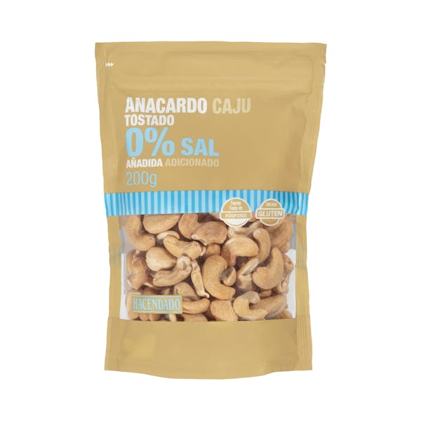

| | |
|---|---|
| **Formato** | Paquete 0.2kg |
| **Precio** | 2.70 € / ud. |
| **Origen** | Viet Nam |
| **Ingredientes** | Anacardos tostados. Trazas de cacahuete y otros frutos de cáscara. |

**Beneficios nutricionales:** Fuente de hierro, zinc, magnesio y cobre. Sus grasas monoinsaturadas cuidan el corazón. Aportan triptófano, precursor de la serotonina, favoreciendo el estado de ánimo.

---

### Pistacho tostado Hacendado pelado

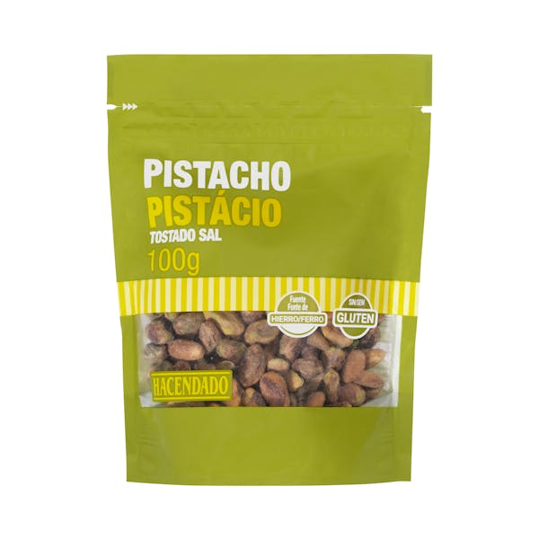

| | |
|---|---|
| **Formato** | Paquete 0.1kg |
| **Precio** | 2.95 € / ud. |
| **Ingredientes** | Pistachos y sal. Trazas de cacahuete y otros frutos de cáscara. |

**Beneficios nutricionales:** Alto contenido en proteínas vegetales, fibra, potasio y antioxidantes (luteína, zeaxantina). Ayuda a controlar el azúcar en sangre y mejora la salud ocular.

---

### Dátiles Medjoul con hueso Hacendado

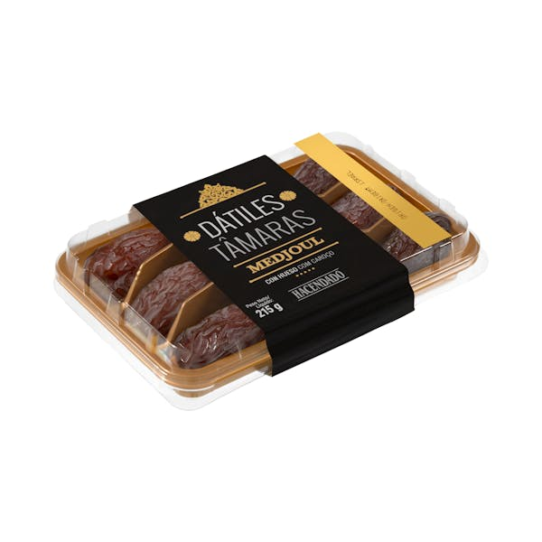

| | |
|---|---|
| **Formato** | Bandeja 0.215kg |
| **Precio** | 4.10 € / ud. |
| **Origen** | Israel |
| **Ingredientes** | Dátiles Medjoul con hueso |

**Beneficios nutricionales:** Endulzante natural con alto contenido en fibra, potasio, magnesio y hierro. Energía de liberación rápida y natural. Aliados del sistema digestivo.

---

### Dátiles desecados sin hueso Hacendado

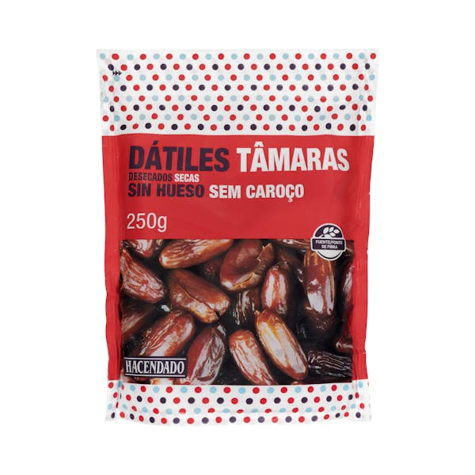

| | |
|---|---|
| **Formato** | Paquete 0.25kg |
| **Precio** | 1.65 € / ud. |
| **Ingredientes** | Dátiles desecados sin hueso. Trazas de sulfitos. |

**Beneficios nutricionales:** Endulzante natural con alto contenido en fibra, potasio, magnesio y hierro. Energía de liberación rápida y natural. Aliados del sistema digestivo.

---

### Aceitunas verdes sin hueso Hacendado

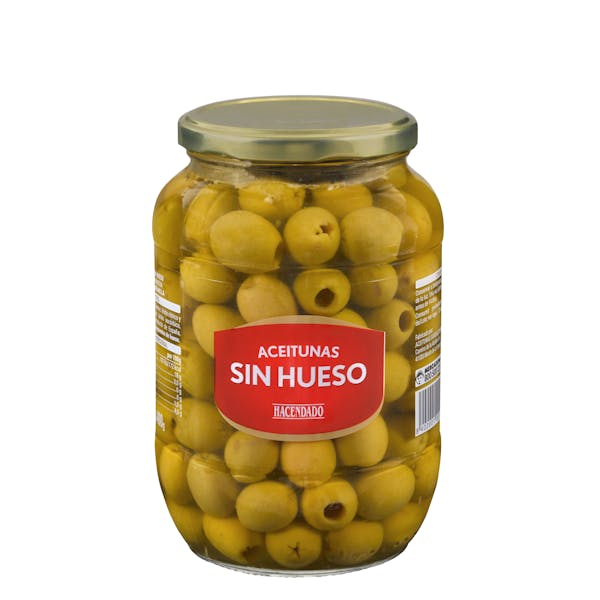

| | |
|---|---|
| **Formato** | Tarro 0.81kg |
| **Precio** | 2.80 € / ud. |
| **Origen** | España |
| **Ingredientes** | Aceitunas verdes deshuesadas, agua, sal, acidulante: ácido cítrico, antioxidante: ácido ascórbico. |

**Beneficios nutricionales:** Alimento de calidad con importantes propiedades nutricionales. Incluirlo regularmente en una dieta variada y equilibrada contribuye al bienestar general.

---

### Aceitunas negras sin hueso Hacendado

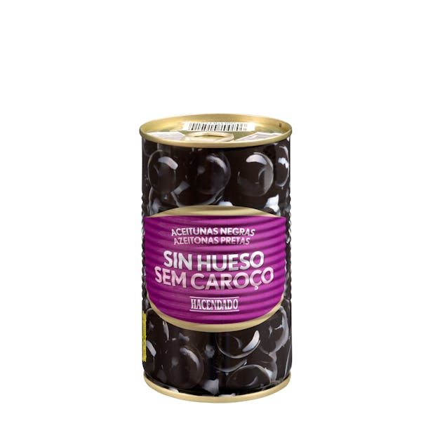

| | |
|---|---|
| **Formato** | Bote 0.35kg |
| **Precio** | 1.05 € / ud. |
| **Ingredientes** | Agua, aceitunas, sal, estabilizador de color: gluconato ferroso. Producto estelirizado. |

**Beneficios nutricionales:** Alimento de calidad con importantes propiedades nutricionales. Incluirlo regularmente en una dieta variada y equilibrada contribuye al bienestar general.

---

### Pepinillos pequeños Hacendado

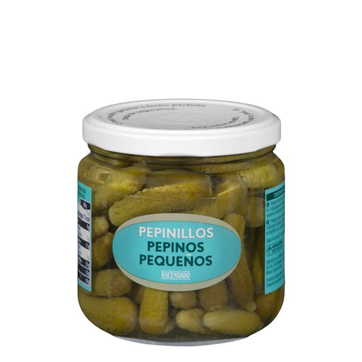

| | |
|---|---|
| **Formato** | Tarro 0.4kg |
| **Precio** | 1.55 € / ud. |
| **Origen** | España |
| **Ingredientes** | Pepinillo (SULFITOS), vinagre de vino, sal y potenciador del sabor: glutamato monosódico. Puede contener ALTRAMUZ y MOSTAZA. |

**Beneficios nutricionales:** Alimento de calidad con importantes propiedades nutricionales. Incluirlo regularmente en una dieta variada y equilibrada contribuye al bienestar general.

---

### Alcaparras Hacendado

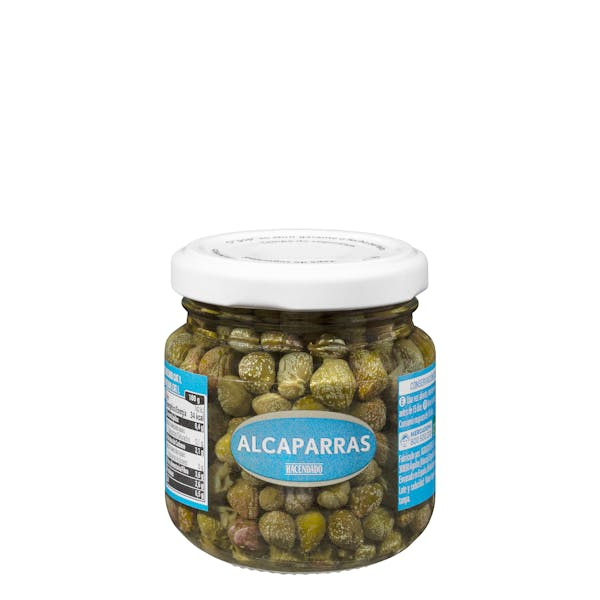

| | |
|---|---|
| **Formato** | Tarro 0.135kg |
| **Precio** | 1.35 € / ud. |
| **Origen** | Marruecos |
| **Ingredientes** | Alcaparra, agua, vinagre y sal. |

**Beneficios nutricionales:** Alimento de calidad con importantes propiedades nutricionales. Incluirlo regularmente en una dieta variada y equilibrada contribuye al bienestar general.

---

### Ajos aliñados Hacendado

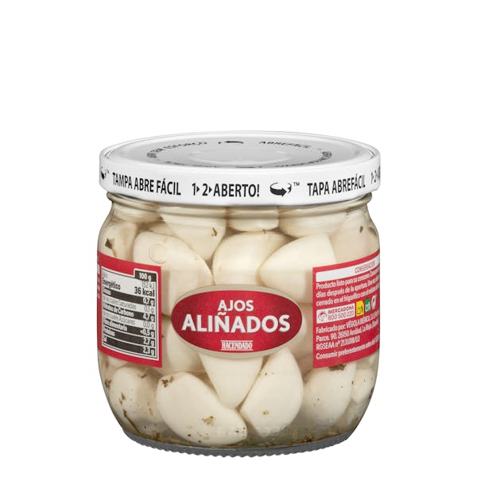

| | |
|---|---|
| **Formato** | Tarro 0.345kg |
| **Precio** | 2.60 € / ud. |
| **Origen** | España |
| **Ingredientes** | Ajo, vinagre de vino, sal y especias (0.9%): (orégano y estragón). |

**Beneficios nutricionales:** Alimento de calidad con importantes propiedades nutricionales. Incluirlo regularmente en una dieta variada y equilibrada contribuye al bienestar general.

---

### Mango deshidratado Hacendado

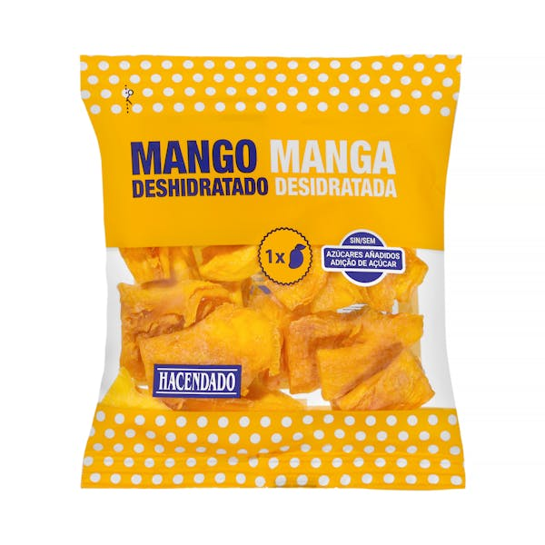

| | |
|---|---|
| **Formato** | Paquete 0.06kg |
| **Precio** | 1.45 € / ud. |
| **Origen** | Sudáfrica |
| **Ingredientes** | Mango deshidratado y conservador (E-223 (sulfitos)). |

**Beneficios nutricionales:** Los frutos secos naturales (sin sal ni azúcar añadida) concentran grasas saludables, proteínas, fibra y micronutrientes esenciales en pequeñas raciones.

---

### Piña deshidratada Hacendado

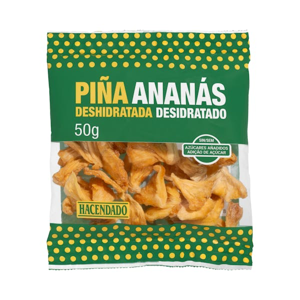

| | |
|---|---|
| **Formato** | Paquete 0.05kg |
| **Precio** | 1.60 € / ud. |
| **Ingredientes** | Piña deshidratada, conservador (E-223 (sulfitos)) y harina de piña. |

**Beneficios nutricionales:** Los frutos secos naturales (sin sal ni azúcar añadida) concentran grasas saludables, proteínas, fibra y micronutrientes esenciales en pequeñas raciones.

---

## 3. Arroz, Legumbres y Pasta

Las legumbres son la proteína vegetal de referencia de la dieta mediterránea. El arroz basmati estabiliza la glucemia. La pasta integral y de legumbres multiplica el aporte proteico y de fibra.

### Arroz redondo Hacendado

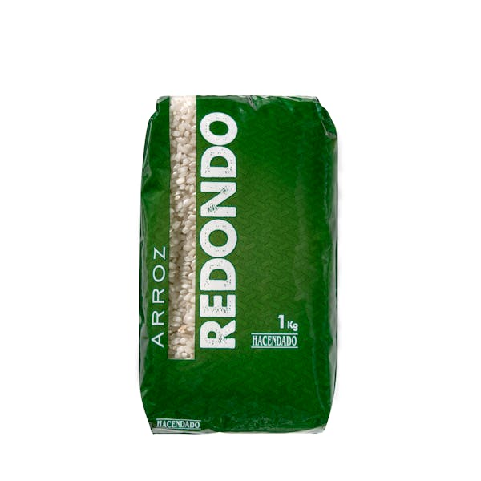

| | |
|---|---|
| **Formato** | Paquete 1kg |
| **Precio** | 1.30 € / ud. |
| **Ingredientes** | Arroz |

**Beneficios nutricionales:** Los cereales integrales mantienen el salvado y el germen con fibra, vitaminas B y minerales que se pierden en el refinado. Prioriza siempre la versión integral.

---

### Arroz largo Hacendado

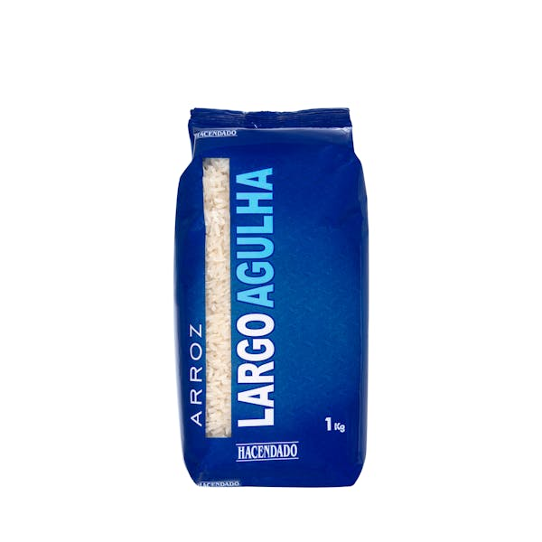

| | |
|---|---|
| **Formato** | Paquete 1kg |
| **Precio** | 1.25 € / ud. |
| **Ingredientes** | Arroz |

**Beneficios nutricionales:** Los cereales integrales mantienen el salvado y el germen con fibra, vitaminas B y minerales que se pierden en el refinado. Prioriza siempre la versión integral.

---

### Arroz redondo La Fallera

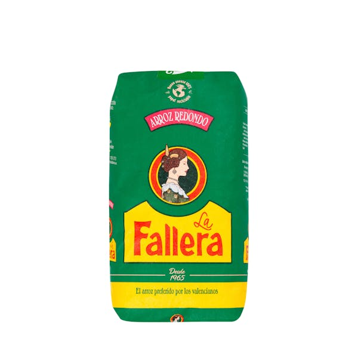

| | |
|---|---|
| **Formato** | Paquete 1kg |
| **Precio** | 1.69 € / ud. |
| **Ingredientes** | 100% Arroz |

**Beneficios nutricionales:** Los cereales integrales mantienen el salvado y el germen con fibra, vitaminas B y minerales que se pierden en el refinado. Prioriza siempre la versión integral.

---

### Arroz cocido basmati Sabroz

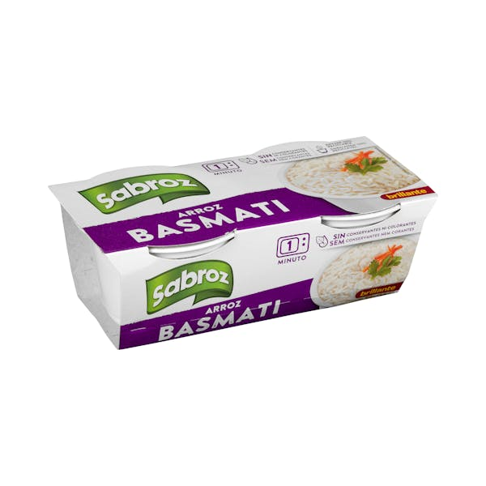

| | |
|---|---|
| **Formato** | Pack-2 0.25kg |
| **Precio** | 1.10 € / ud. |
| **Ingredientes** | Arroz basmati cocido 98%. (agua, arroz basmati) aceite de girasol. sal. emulgente:lecitina de girasol. Sin gluten |

**Beneficios nutricionales:** Los cereales integrales mantienen el salvado y el germen con fibra, vitaminas B y minerales que se pierden en el refinado. Prioriza siempre la versión integral.

---

### Arroz cocido integral Sabroz

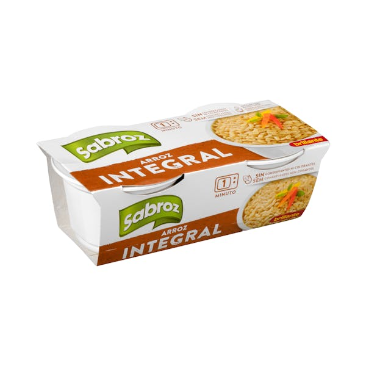

| | |
|---|---|
| **Formato** | Pack-2 0.25kg |
| **Precio** | 1.05 € / ud. |
| **Ingredientes** | Arroz cocido 98% (agua, arroz integral). aceite de girasol. sal.emulgente:lecitina de girasol. |

**Beneficios nutricionales:** Conserva el salvado con fibra, vitaminas B y minerales. Índice glucémico más bajo que el arroz blanco. Favorece el tránsito intestinal y proporciona energía sostenida sin picos de glucosa.

---

### Arroz Albufera Hacendado

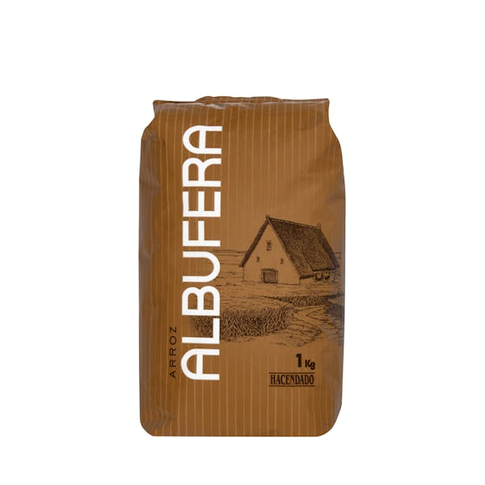

| | |
|---|---|
| **Formato** | Paquete 1kg |
| **Precio** | 2.95 € / ud. |
| **Ingredientes** | Arroz |

**Beneficios nutricionales:** Los cereales integrales mantienen el salvado y el germen con fibra, vitaminas B y minerales que se pierden en el refinado. Prioriza siempre la versión integral.

---

### Quinoa cocida blanca y roja Sabroz

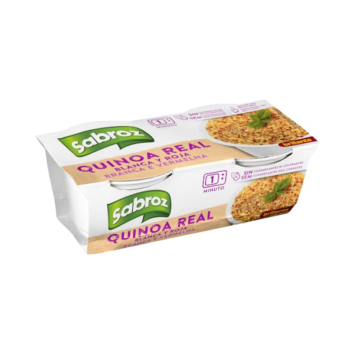

| | |
|---|---|
| **Formato** | Pack-2 0.25kg |
| **Precio** | 1.45 € / ud. |
| **Ingredientes** | Quinoa blanca real cocida 92% (agua, quinoa blanca real), quinoa roja cocida 7% (agua, quinoa roja), aceite de oliva virgen, sal, emulgente: lecitina de girasol. Envasado en atmósfera protectora. |

**Beneficios nutricionales:** Pseudocereal con proteína completa (todos los aminoácidos esenciales), hierro, magnesio y fibra. Sin gluten y bajo índice glucémico. Ideal para deportistas y dietas plant-based.

---

### Arroz cocido redondo Sabroz

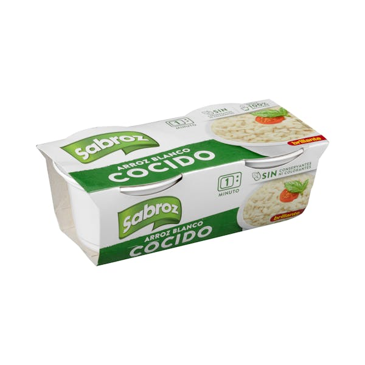

| | |
|---|---|
| **Formato** | Pack-2 0.25kg |
| **Precio** | 1.05 € / ud. |
| **Ingredientes** | Arroz cocido 97% (agua, arroz vaporizado). aceite de oliva virgen (2%). sal. emulgente:lecitina de girasol. Sin gluten |

**Beneficios nutricionales:** Los cereales integrales mantienen el salvado y el germen con fibra, vitaminas B y minerales que se pierden en el refinado. Prioriza siempre la versión integral.

---

### Arroz redondo J Sendra Hacendado

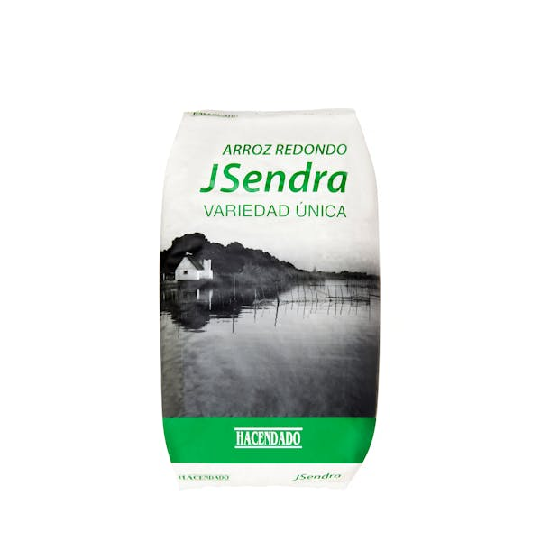

| | |
|---|---|
| **Formato** | Paquete 1kg |
| **Precio** | 1.60 € / ud. |
| **Ingredientes** | Arroz |

**Beneficios nutricionales:** Los cereales integrales mantienen el salvado y el germen con fibra, vitaminas B y minerales que se pierden en el refinado. Prioriza siempre la versión integral.

---

### Arroz basmati aromático Hacendado

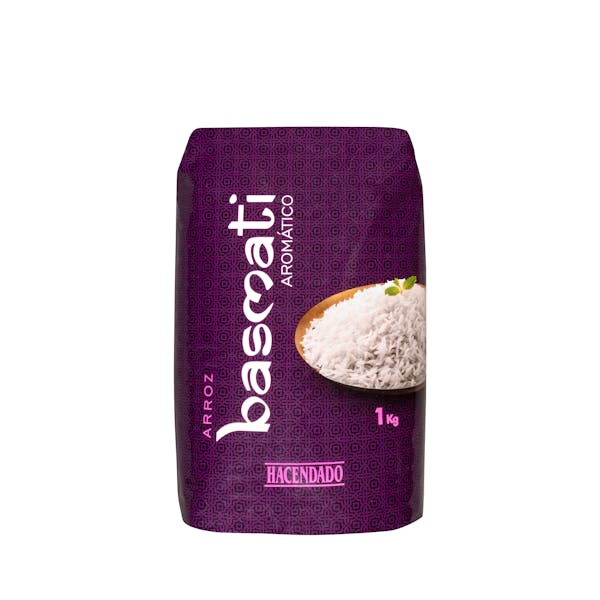

| | |
|---|---|
| **Formato** | Paquete 1kg |
| **Precio** | 2.10 € / ud. |
| **Ingredientes** | Arroz |

**Beneficios nutricionales:** Los cereales integrales mantienen el salvado y el germen con fibra, vitaminas B y minerales que se pierden en el refinado. Prioriza siempre la versión integral.

---

### Cous cous mediano Hacendado

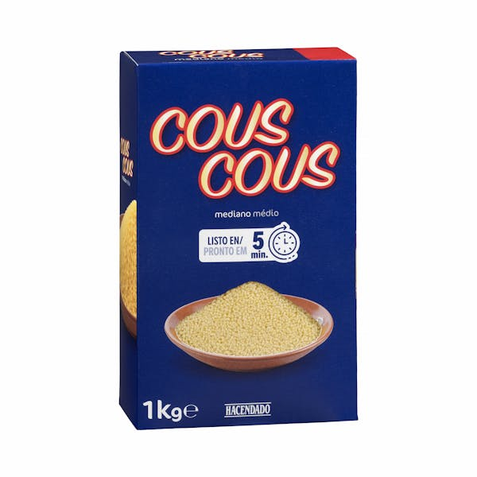

| | |
|---|---|
| **Formato** | Caja 1kg |
| **Precio** | 1.95 € / ud. |
| **Origen** | Italia |
| **Ingredientes** | Sémola de trigo duro, agua. Contiene gluten. Puede contener trazas de soja |

**Beneficios nutricionales:** Los cereales integrales mantienen el salvado y el germen con fibra, vitaminas B y minerales que se pierden en el refinado. Prioriza siempre la versión integral.

---

### Arroz vaporizado Hacendado

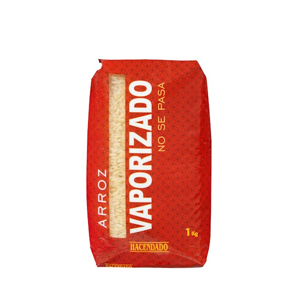

| | |
|---|---|
| **Formato** | Paquete 1kg |
| **Precio** | 1.55 € / ud. |
| **Ingredientes** | Arroz |

**Beneficios nutricionales:** Los cereales integrales mantienen el salvado y el germen con fibra, vitaminas B y minerales que se pierden en el refinado. Prioriza siempre la versión integral.

---

### Quinoa Hacendado

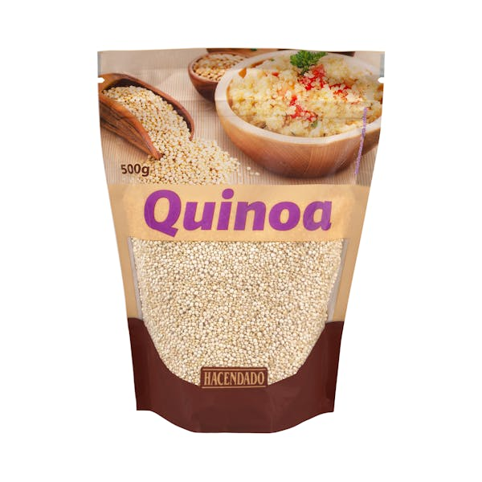

| | |
|---|---|
| **Formato** | Paquete 0.5kg |
| **Precio** | 2.70 € / ud. |
| **Origen** | Origen: Perú |
| **Ingredientes** | Granos de quinoa (100%) |

**Beneficios nutricionales:** Pseudocereal con proteína completa (todos los aminoácidos esenciales), hierro, magnesio y fibra. Sin gluten y bajo índice glucémico. Ideal para deportistas y dietas plant-based.

---

### Arroz integral largo Hacendado

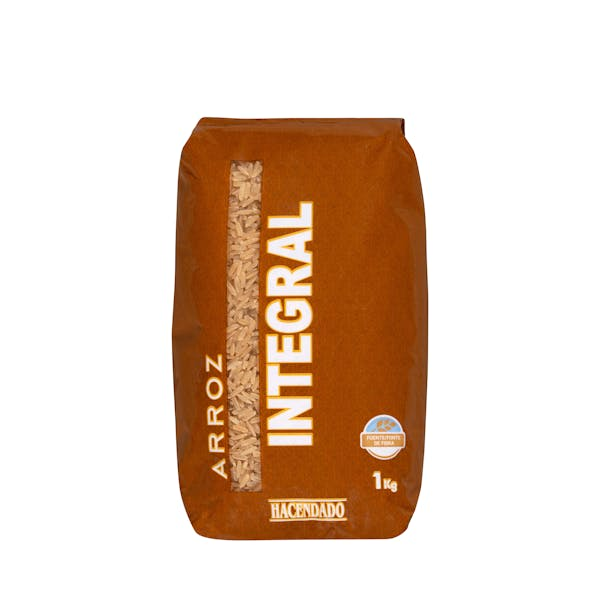

| | |
|---|---|
| **Formato** | Paquete 1kg |
| **Precio** | 1.65 € / ud. |
| **Ingredientes** | Arroz |

**Beneficios nutricionales:** Conserva el salvado con fibra, vitaminas B y minerales. Índice glucémico más bajo que el arroz blanco. Favorece el tránsito intestinal y proporciona energía sostenida sin picos de glucosa.

---

### Arroz redondo Sabor

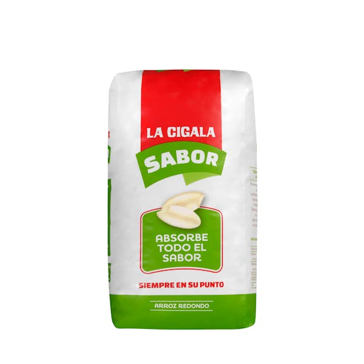

| | |
|---|---|
| **Formato** | Paquete 1kg |
| **Precio** | 2.45 € / ud. |
| **Ingredientes** | Mezcla de arroces |

**Beneficios nutricionales:** Los cereales integrales mantienen el salvado y el germen con fibra, vitaminas B y minerales que se pierden en el refinado. Prioriza siempre la versión integral.

---

### Garbanzo cocido Hacendado

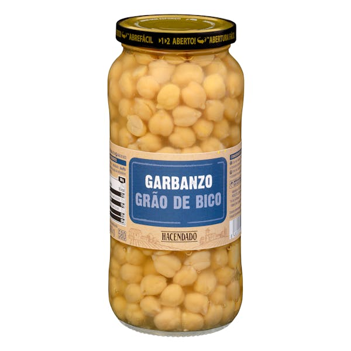

| | |
|---|---|
| **Formato** | Tarro 0.57kg |
| **Precio** | 0.85 € / ud. |
| **Origen** | España |
| **Ingredientes** | Garbanzos, agua, sal y antioxidantes (disulfito sódico, E 385). |

**Beneficios nutricionales:** Alto en proteína vegetal, fibra, hierro y folato. Su fibra soluble regula el colesterol y la glucemia. Base de la dieta mediterránea con probados beneficios cardiovasculares. Versátil en cocina.

---

### Garbanzo cocido Pedrosillano Hacendado

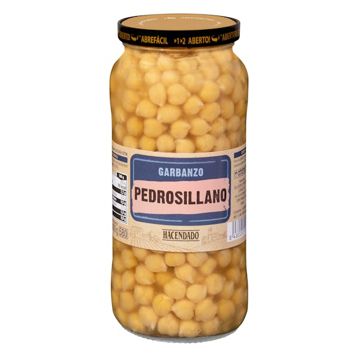

| | |
|---|---|
| **Formato** | Tarro 0.57kg |
| **Precio** | 0.90 € / ud. |
| **Origen** | España |
| **Ingredientes** | Garbanzos, agua, sal y antioxidantes (disulfito sódico, E-385). |

**Beneficios nutricionales:** Alto en proteína vegetal, fibra, hierro y folato. Su fibra soluble regula el colesterol y la glucemia. Base de la dieta mediterránea con probados beneficios cardiovasculares. Versátil en cocina.

---

### Garbanzo Hacendado

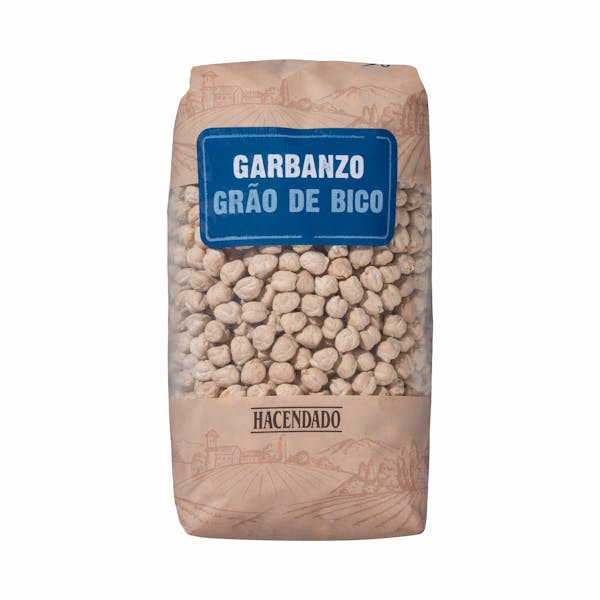

| | |
|---|---|
| **Formato** | Paquete 1kg |
| **Precio** | 2.20 € / ud. |
| **Origen** | Garbanzo. Origen: USA / Gro de bico. Origem: EUA |
| **Ingredientes** | Garbanzos |

**Beneficios nutricionales:** Alto en proteína vegetal, fibra, hierro y folato. Su fibra soluble regula el colesterol y la glucemia. Base de la dieta mediterránea con probados beneficios cardiovasculares. Versátil en cocina.

---

### Garbanzo lechoso Andaluz Hacendado

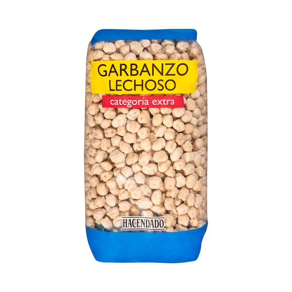

| | |
|---|---|
| **Formato** | Paquete 1kg |
| **Precio** | 2.50 € / ud. |
| **Origen** | Origen: España |
| **Ingredientes** | Garbanzo lechoso |

**Beneficios nutricionales:** Alto en proteína vegetal, fibra, hierro y folato. Su fibra soluble regula el colesterol y la glucemia. Base de la dieta mediterránea con probados beneficios cardiovasculares. Versátil en cocina.

---

### Alubia cocida blanca Hacendado

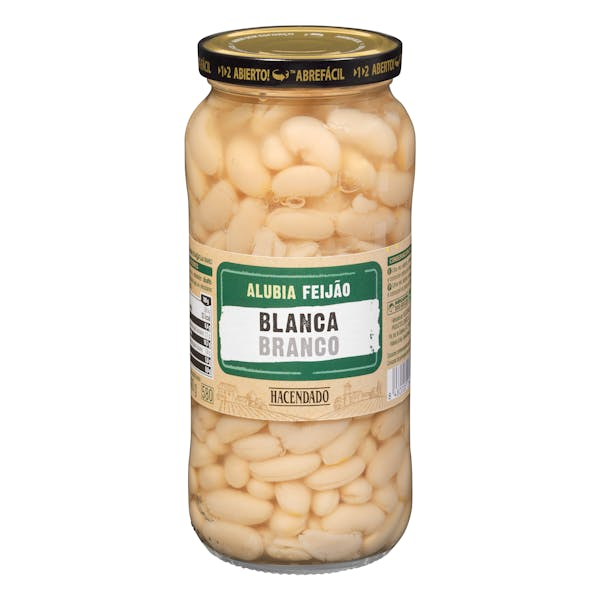

| | |
|---|---|
| **Formato** | Tarro 0.57kg |
| **Precio** | 0.80 € / ud. |
| **Origen** | España |
| **Ingredientes** | Alubia blanca, agua, sal y antioxidantes (disulfito sódico, E 385). |

**Beneficios nutricionales:** Ricas en proteína vegetal, fibra, potasio y magnesio. Reducen el colesterol y estabilizan el azúcar en sangre. Fuente de folato esencial para el embarazo.

---

### Alubia cocida roja Hacendado

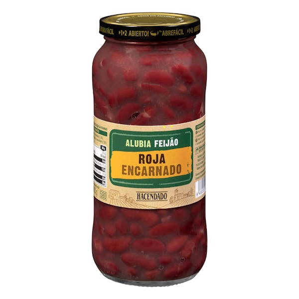

| | |
|---|---|
| **Formato** | Tarro 0.57kg |
| **Precio** | 1.20 € / ud. |
| **Origen** | España |
| **Ingredientes** | Alubia roja, agua, sal y antioxidante (E 385). |

**Beneficios nutricionales:** Ricas en proteína vegetal, fibra, potasio y magnesio. Reducen el colesterol y estabilizan el azúcar en sangre. Fuente de folato esencial para el embarazo.

---

### Alubia cocida pinta Hacendado

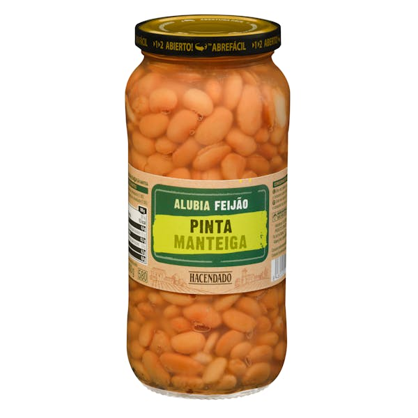

| | |
|---|---|
| **Formato** | Tarro 0.57kg |
| **Precio** | 1.25 € / ud. |
| **Origen** | España |
| **Ingredientes** | Alubias pintas, agua, sal y antioxidante (E-385). |

**Beneficios nutricionales:** Ricas en proteína vegetal, fibra, potasio y magnesio. Reducen el colesterol y estabilizan el azúcar en sangre. Fuente de folato esencial para el embarazo.

---

### Alubia blanca Hacendado

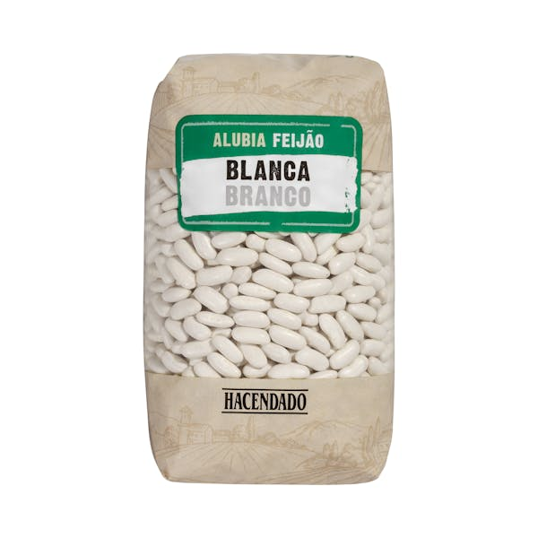

| | |
|---|---|
| **Formato** | Paquete 1kg |
| **Precio** | 2.45 € / ud. |
| **Origen** | Alubia. Origen: Argentina / Feijo, Origem: Argentina |
| **Ingredientes** | Alubia Blanca |

**Beneficios nutricionales:** Ricas en proteína vegetal, fibra, potasio y magnesio. Reducen el colesterol y estabilizan el azúcar en sangre. Fuente de folato esencial para el embarazo.

---

### Alubia negra Hacendado

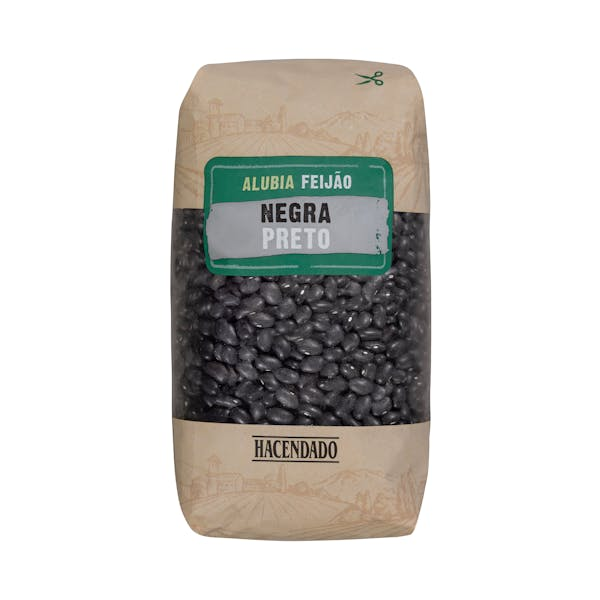

| | |
|---|---|
| **Formato** | Paquete 1kg |
| **Precio** | 2.50 € / ud. |
| **Origen** | Alubia. Origen: Canadá / Feijo, Origem: Canadá |
| **Ingredientes** | Alubia Negra |

**Beneficios nutricionales:** Ricas en proteína vegetal, fibra, potasio y magnesio. Reducen el colesterol y estabilizan el azúcar en sangre. Fuente de folato esencial para el embarazo.

---

### Alubia roja Hacendado

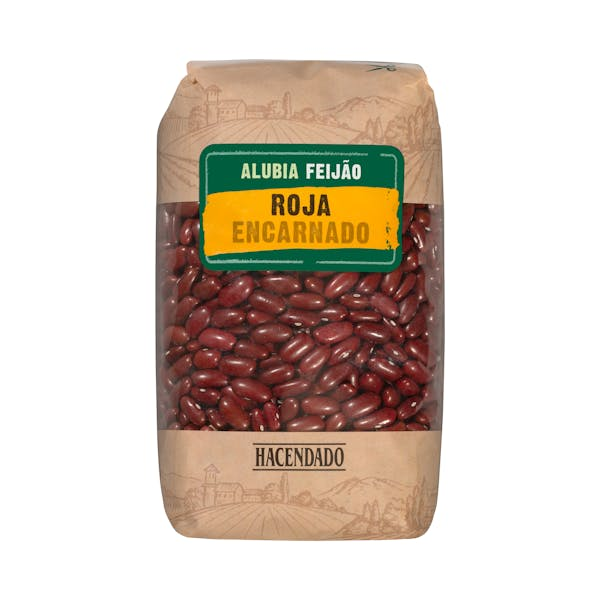

| | |
|---|---|
| **Formato** | Paquete 1kg |
| **Precio** | 3.20 € / ud. |
| **Origen** | Alubia. Origen: USA / Feijo, Origem: EUA |
| **Ingredientes** | Alubia Roja. |

**Beneficios nutricionales:** Ricas en proteína vegetal, fibra, potasio y magnesio. Reducen el colesterol y estabilizan el azúcar en sangre. Fuente de folato esencial para el embarazo.

---

### Pasta fusilli 100% lentejas rojas Felicia

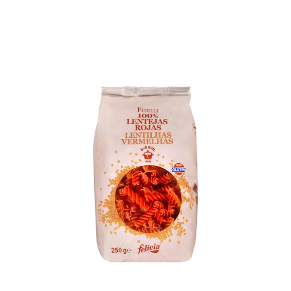

| | |
|---|---|
| **Formato** | Paquete 0.25kg |
| **Precio** | 1.65 € / ud. |
| **Origen** | Italia |
| **Ingredientes** | 100% Harina de lentejas rojas. No contiene gluten. |

**Beneficios nutricionales:** Legumbre con el mejor equilibrio proteína-fibra. Aporta hierro vegetal, ácido fólico, zinc y carbohidratos de liberación lenta. Clave para la microbiota intestinal y la energía sostenida.

---

### Noodles de arroz Hacendado

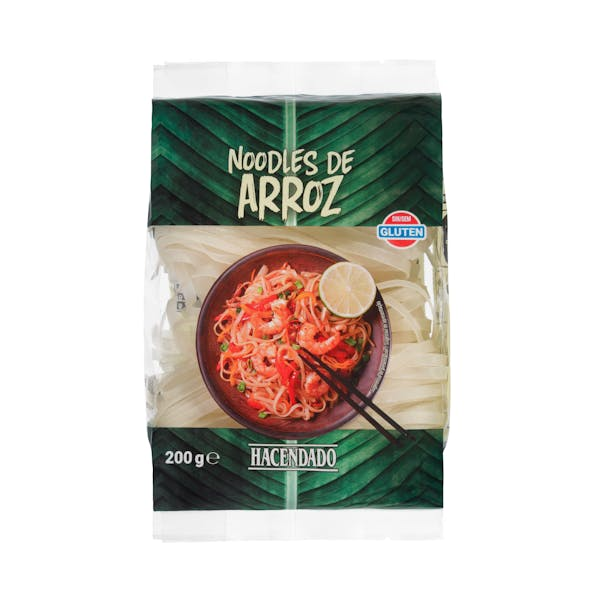

| | |
|---|---|
| **Formato** | Paquete 0.2kg |
| **Precio** | 1.45 € / ud. |
| **Origen** | Viet Nam |
| **Ingredientes** | Harina de arroz, almidón de tapioca, sal. |

**Beneficios nutricionales:** Las legumbres son la base proteica vegetal de la dieta mediterránea. Ricas en fibra, hierro, folato y carbohidratos complejos. Recomendadas 3-4 veces por semana.

---

## 4. Panes y Harinas

El pan integral conserva el salvado con fibra, vitaminas B y menor índice glucémico. La espelta y el centeno son los cereales más nutritivos para pan. Elige siempre versiones 100% integrales.

### Pan de molde 100% integral familiar Hacendado

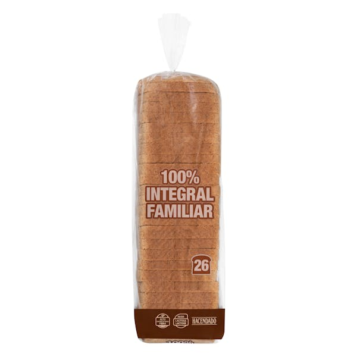

| | |
|---|---|
| **Formato** | Paquete 0.82kg |
| **Precio** | 1.15 € / ud. |
| **Ingredientes** | Harina    integral de trigo (gluten) (57%), agua, levadura, aceite de girasol, sal, harina de haba, fibra de avena (gluten),    espesante: goma guar, conservadores: E-282 y E-200, harina integral de cebada    malteada tostada (gluten) (0.2%), emulgentes: E-481 agente de tratamiento de    la harina: ácido ascórbico y aroma. Puede contener trazas de semillas de  sésamo, soja, mostaza y productos derivados. |

**Beneficios nutricionales:** Alimento de calidad con importantes propiedades nutricionales. Incluirlo regularmente en una dieta variada y equilibrada contribuye al bienestar general.

---

### Pan de molde 100% integral Hacendado

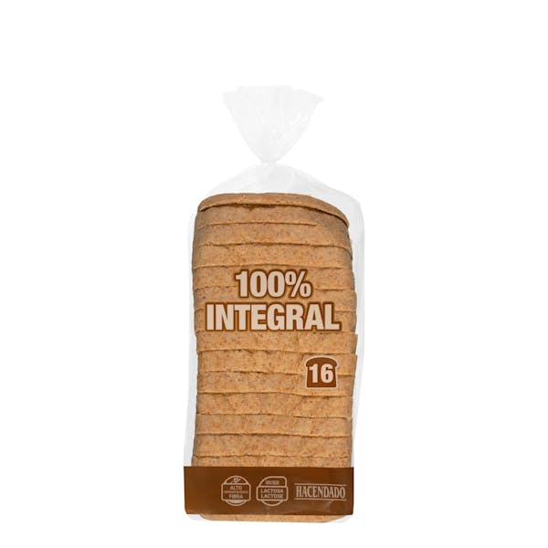

| | |
|---|---|
| **Formato** | Paquete 0.46kg |
| **Precio** | 0.90 € / ud. |
| **Origen** | España |
| **Ingredientes** | Harina integral de trigo (gluten) (59%), agua, levadura, gluten de trigo, azúcar, aceite de girasol (1%), sal, fibra de trigo (gluten), vinagre de vino, harina integral de cebada malteada (gluten) (0,2%), emulgentes (E-472e, E-471), conservadores (E-282, E202, E-200). Puede contener trazas de semillas de sésamo y soja. |

**Beneficios nutricionales:** Alimento de calidad con importantes propiedades nutricionales. Incluirlo regularmente en una dieta variada y equilibrada contribuye al bienestar general.

---

### Pan de molde 100% integral sin corteza Hacendado

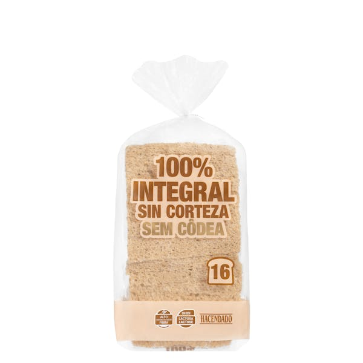

| | |
|---|---|
| **Formato** | Paquete 0.45kg |
| **Precio** | 1.20 € / ud. |
| **Origen** | España |
| **Ingredientes** | Harina integral de trigo (gluten) (58%), agua, gluten de trigo, levadura, aceite refinado de girasol (1%), sal, fibra de trigo (gluten), vinagre de vino, harina integral de cebada malteada (gluten) (0,2%), emulgentes (E-472e, E-471), conservadores (E-282, E-200), antioxidante (E-300), aroma. Puede contener trazas de semillas de sésamo, soja y mostaza. |

**Beneficios nutricionales:** Alimento de calidad con importantes propiedades nutricionales. Incluirlo regularmente en una dieta variada y equilibrada contribuye al bienestar general.

---

### Pan de molde espelta 100% integral Hacendado natural

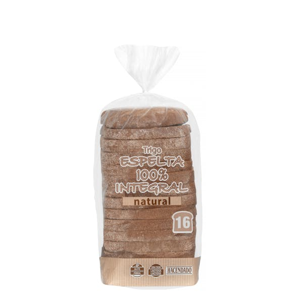

| | |
|---|---|
| **Formato** | Paquete 0.55kg |
| **Precio** | 1.65 € / ud. |
| **Ingredientes** | Harina integral de TRIGO ESPELTA (GLUTEN) (58%), agua, GLUTEN DE TRIGO, masa madre integral (2,4%), aceite refinado de girasol, levadura, harina integral de TRIGO (GLUTEN) fermentada (1,6%), sal, harina integral de CEBADA (GLUTEN) malteada tostada (0,5%), extracto vegetal y aroma. Puede contener trazas de SOJA, MOSTAZA, granos de SÉSAMO. Sin lactosa. |

**Beneficios nutricionales:** Cereal ancestral con mayor contenido en proteínas, fibra y minerales que el trigo común. Su gluten es más soluble y tolerado por algunos sensibles al trigo convencional.

---

### Tortillas de trigo integrales Hacendado

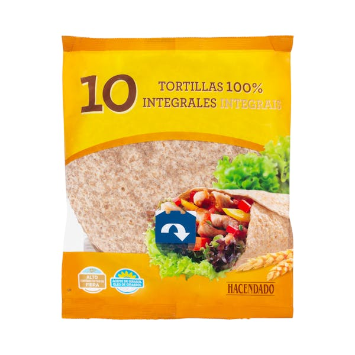

| | |
|---|---|
| **Formato** | Paquete 0.36kg |
| **Precio** | 1.55 € / ud. |
| **Ingredientes** | Harina integral de trigo (59%), agua, aceite de girasol alto oleico (3%), estabilizante (E422),emulgente (E471), sal, correctores de acidez (E296, E330), dextrosa, conservadores (E202, E282), gasificante (E500ii), espesante (E415), agente de tratamiento de la harina (E920). |

**Beneficios nutricionales:** Alimento de calidad con importantes propiedades nutricionales. Incluirlo regularmente en una dieta variada y equilibrada contribuye al bienestar general.

---

### Pan de burger Hacendado Rústico 100% integral

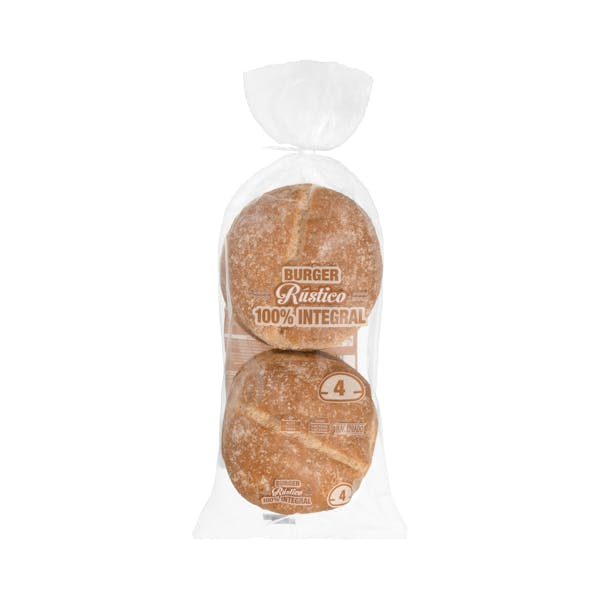

| | |
|---|---|
| **Formato** | Paquete 0.3kg |
| **Precio** | 1.05 € / ud. |
| **Ingredientes** | — |

**Beneficios nutricionales:** Alimento de calidad con importantes propiedades nutricionales. Incluirlo regularmente en una dieta variada y equilibrada contribuye al bienestar general.

---

### Pan tostado vitalité Wasa

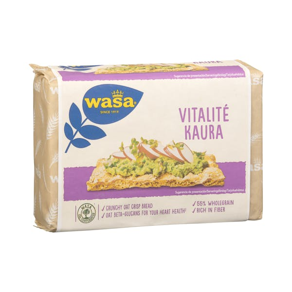

| | |
|---|---|
| **Formato** | Paquete 0.28kg |
| **Precio** | 2.45 € / ud. |
| **Origen** | Suecia |
| **Ingredientes** | Harina de avena integral (38%), harina de trigo, harina de centeno, copos de avena (18%), levadura, aroma natural (leche), masa fermentada seca (harina de centeno integral, agua), emulgente (mono y diglicéridos de ácidos grasos), sal, gasificante (carbonato ácido de sodio). |

**Beneficios nutricionales:** Alimento de calidad con importantes propiedades nutricionales. Incluirlo regularmente en una dieta variada y equilibrada contribuye al bienestar general.

---

### Pan integral trigo 100%

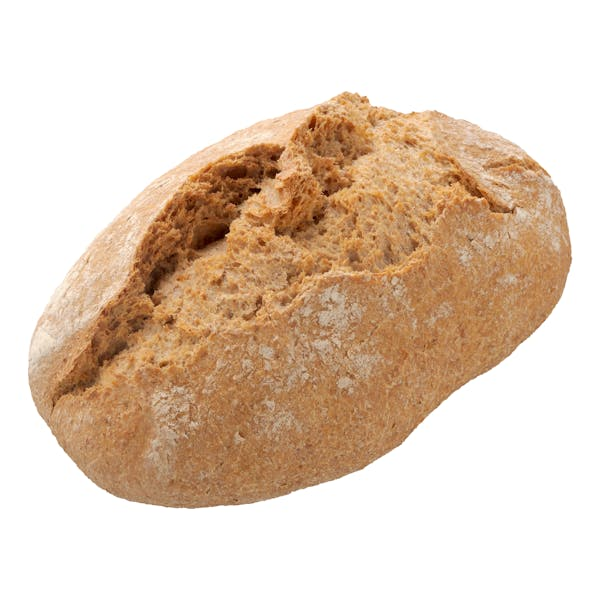

| | |
|---|---|
| **Formato** | 0.35kg |
| **Precio** | 1.50 € / ud. |
| **Ingredientes** | Harina integral de trigo, agua, sal y levadura.Puede contener :soja y productos a base de soja, mostaza y productos a base de mostaza |

**Beneficios nutricionales:** Alimento de calidad con importantes propiedades nutricionales. Incluirlo regularmente en una dieta variada y equilibrada contribuye al bienestar general.

---

### Barra pan integral de espelta 100%

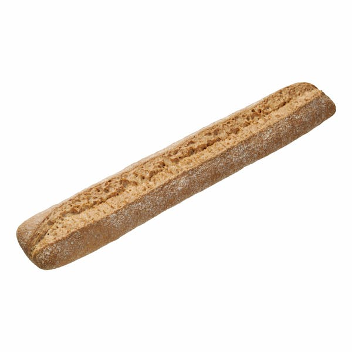

| | |
|---|---|
| **Formato** | 0.25kg |
| **Precio** | 1.25 € / ud. |
| **Ingredientes** | Harina integral de trigo espelta (gluten) 60%**, agua, sal, gluten de trigo, masa madre de trigo espelta integral (gluten) inactiva, harina de malta caramelizada de trigo  espelta (gluten), levadura, emulgente E-472e y antioxidante E-300.Puede contener soja y mostaza*Porcentaje expresado sobre el total de las harinas.** Porcentaje expresado sobre el producto final. |

**Beneficios nutricionales:** Cereal ancestral con mayor contenido en proteínas, fibra y minerales que el trigo común. Su gluten es más soluble y tolerado por algunos sensibles al trigo convencional.

---

### 6 Panecillos integrales 100%

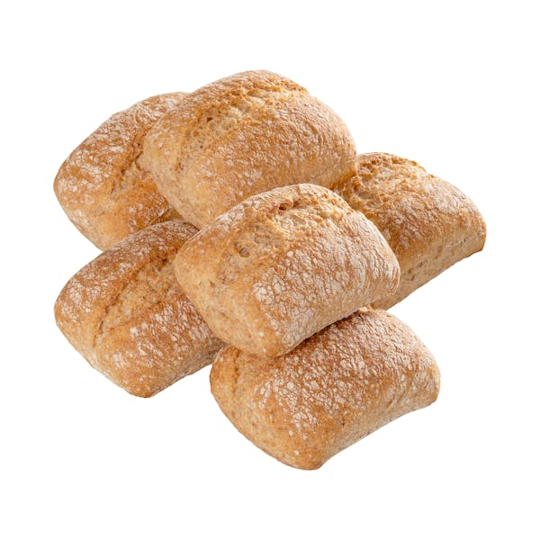

| | |
|---|---|
| **Formato** | Bolsa 0.27kg |
| **Precio** | 1.05 € / ud. |
| **Ingredientes** | Harina integral de trigo (gluten) 68%**, agua, sal, levadura, masa madre de trigo integral (gluten) inactiva, gluten de trigo, emulgente E-472e, antioxidante E-300. Puede contener soja y mostaza.*Porcentaje expresado sobre el total de las harinas.** Porcentaje expresado sobre el producto final. |

**Beneficios nutricionales:** Alimento de calidad con importantes propiedades nutricionales. Incluirlo regularmente en una dieta variada y equilibrada contribuye al bienestar general.

---

### Panes integrales 100% fino

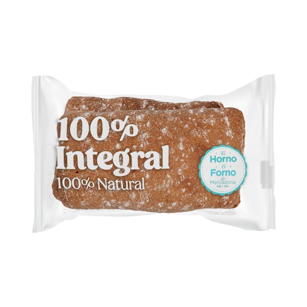

| | |
|---|---|
| **Formato** | Bolsa 0.165kg |
| **Precio** | 1.40 € / ud. |
| **Ingredientes** | Harina de TRIGO integral 50%**, agua, masa madre de TRIGO integral 6,9% (harina de TRIGO integral fermentada, agua), levadura, gluten de TRIGO, aceite de oliva virgen extra, sal, harina de malta de CEBADA integral tostada 0,5%**, masa madre inactiva de TRIGO integral 0,5%(almidón de TRIGO fermentado, harina de TRIGO integral fermentada, harina de CENTENO integral fermentada), aroma natural, harina integral de TRIGO espelta 0,2%**. *Porcentaje expresado sobre el total de las harinas. **Porcentaje que representa en el 100% del producto. Puede contener trazas de: huevo, soja, leche, sésamo, mostaza |

**Beneficios nutricionales:** Alimento de calidad con importantes propiedades nutricionales. Incluirlo regularmente en una dieta variada y equilibrada contribuye al bienestar general.

---

### Pan integral de trigo 100% rebanado

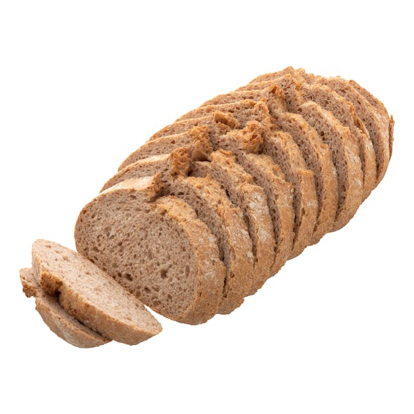

| | |
|---|---|
| **Formato** | 0.35kg |
| **Precio** | 1.50 € / ud. |
| **Ingredientes** | Harina integral de trigo, agua, sal y levadura.Puede contener :soja y productos a base de soja, mostaza y productos a base de mostaza |

**Beneficios nutricionales:** Alimento de calidad con importantes propiedades nutricionales. Incluirlo regularmente en una dieta variada y equilibrada contribuye al bienestar general.

---

### Barra pan integral de espelta 100% rebanado

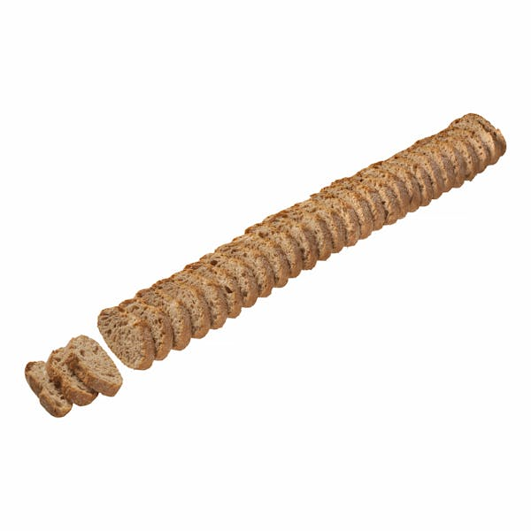

| | |
|---|---|
| **Formato** | 0.25kg |
| **Precio** | 1.25 € / ud. |
| **Ingredientes** | Harina integral de trigo espelta (gluten) 60%**, agua, sal, gluten de trigo, masa madre de trigo espelta integral (gluten) inactiva, harina de malta caramelizada de trigo  espelta (gluten), levadura, emulgente E-472e y antioxidante E-300.Puede contener soja y mostaza*Porcentaje expresado sobre el total de las harinas.** Porcentaje expresado sobre el producto final. |

**Beneficios nutricionales:** Cereal ancestral con mayor contenido en proteínas, fibra y minerales que el trigo común. Su gluten es más soluble y tolerado por algunos sensibles al trigo convencional.

---

## 5. Chocolates, Cereales y Tortitas

El chocolate negro (>70% cacao) aporta flavonoides, magnesio y hierro. El cacao puro en polvo es la forma más concentrada. Los copos de avena son el desayuno más nutritivo. Las tortitas de maíz o arroz son snacks sin grasas trans.

### Chocolate negro 85% cacao Hacendado

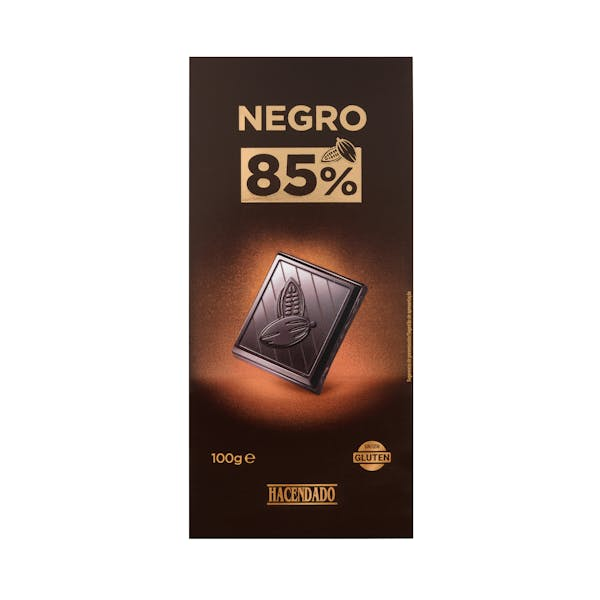

| | |
|---|---|
| **Formato** | Tableta 0.1kg |
| **Precio** | 1.75 € / ud. |
| **Origen** | Portugal |
| **Ingredientes** | Pasta de cacao, azúcar, manteca de cacao, cacao  desgrasado en polvo, emulgente (lecitina de soja) y aroma. Cacao: 85%  mínimo. Puede contener trazas de leche y sus derivados y  frutos de cáscara. Sin gluten. |

**Beneficios nutricionales:** Alimento de calidad con importantes propiedades nutricionales. Incluirlo regularmente en una dieta variada y equilibrada contribuye al bienestar general.

---

### Porciones de chocolate negro 72% cacao extrafino Hacendado

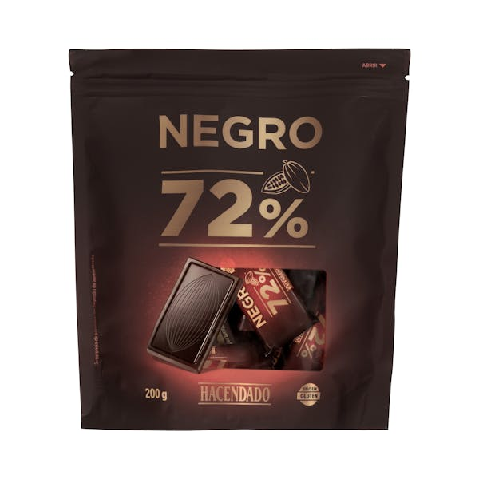

| | |
|---|---|
| **Formato** | Paquete 0.2kg |
| **Precio** | 3.55 € / ud. |
| **Ingredientes** | Pasta de cacao, azúcar, manteca de cacao, emulgente: lecitina (soja) y aroma. Cacao: 72% mínimo. Puede contener trazas de almendras, avellanas, anacardos y leche. Sin gluten. |

**Beneficios nutricionales:** Alimento de calidad con importantes propiedades nutricionales. Incluirlo regularmente en una dieta variada y equilibrada contribuye al bienestar general.

---

### Chocolate negro 72% de cacao Hacendado

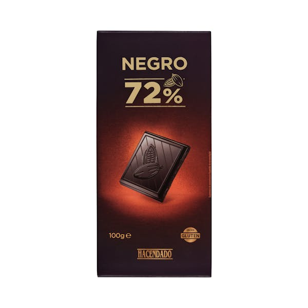

| | |
|---|---|
| **Formato** | Tableta 0.1kg |
| **Precio** | 1.65 € / ud. |
| **Origen** | Portugal |
| **Ingredientes** | Pasta de cacao, azúcar, manteca de cacao, emulgente (lecitina de soja) y aroma. Cacao: 72% mínimo. Puede contener trazas de frutos de cáscara, leche y sus derivados. Sin gluten. |

**Beneficios nutricionales:** Alimento de calidad con importantes propiedades nutricionales. Incluirlo regularmente en una dieta variada y equilibrada contribuye al bienestar general.

---

### Cacao puro en polvo La Chocolatera

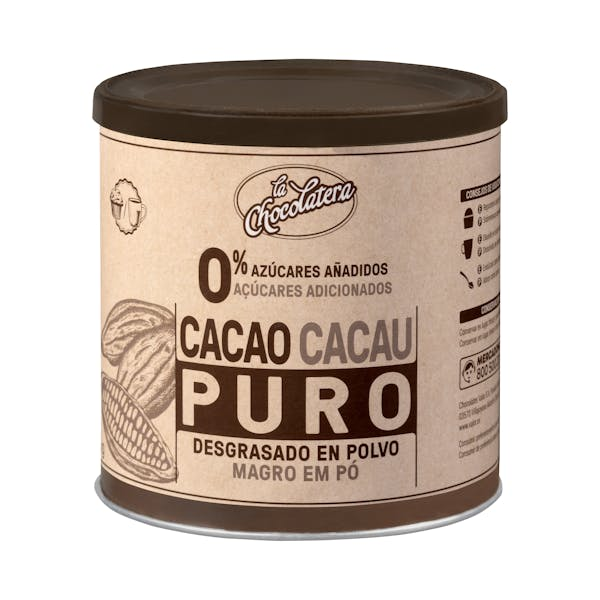

| | |
|---|---|
| **Formato** | Bote 0.265kg |
| **Precio** | 4.75 € / ud. |
| **Ingredientes** | Cacao desgrasado en polvo, correctores de acidez: carbonato de potasio, hidróxido de potasio |

**Beneficios nutricionales:** Alimento de calidad con importantes propiedades nutricionales. Incluirlo regularmente en una dieta variada y equilibrada contribuye al bienestar general.

---

### Cereales copos de maíz Corn Flakes Hacendado 0% azúcares añadidos

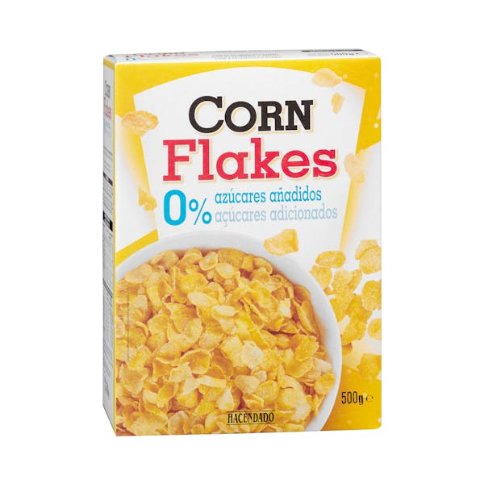

| | |
|---|---|
| **Formato** | Caja 0.5kg |
| **Precio** | 1.50 € / ud. |
| **Origen** | España |
| **Ingredientes** | Maíz  (98%), sal, antioxidante (extracto rico en tocoferoles), vitaminas (B3, B5, B8,  B1, B2, B6, B12, B9), mineral (hierro). Puede contener trazas de gluten,  leche, frutos de cáscara y soja. ***** / / / / / A PARTIR DEL LOTE 103069 061000 Y FCP  28-09-2023 HAY UN CAMBIO DE ETIQUETADO / / / / / *****  Maíz (98%), sal, antioxidante  (extracto rico en tocoferoles). Puede contener trazas de cereales que contienen gluten,  leche, frutos de cáscara y soja. |

**Beneficios nutricionales:** Cereal de desayuno ligero y fácil de digerir. Las versiones sin azúcar añadido son una buena fuente de carbohidratos y vitaminas del grupo B. Mejores enriquecidos con hierro.

---

### Copos de avena sin gluten Hacendado

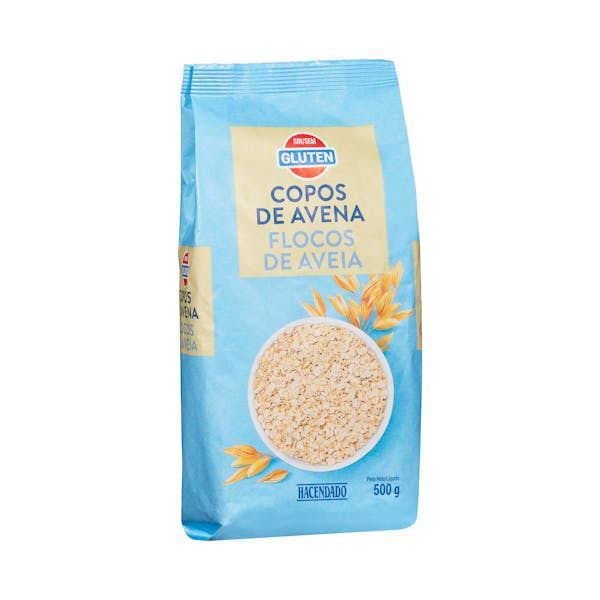

| | |
|---|---|
| **Formato** | Paquete 0.5kg |
| **Precio** | 2.10 € / ud. |
| **Ingredientes** | Avena en grano entero sin gluten (sin alergenos). |

**Beneficios nutricionales:** Cereal integral rey de los desayunos. Sus beta-glucanos (fibra soluble) reducen el colesterol LDL demostrado científicamente. Energía de liberación lenta, rico en magnesio, zinc y vitaminas B.

---

### Copos de avena Brüggen

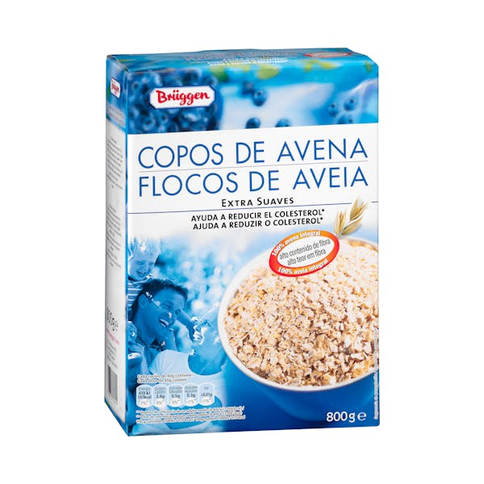

| | |
|---|---|
| **Formato** | Caja 0.8kg |
| **Precio** | 1.35 € / ud. |
| **Ingredientes** | 100% Avena integral |

**Beneficios nutricionales:** Cereal integral rey de los desayunos. Sus beta-glucanos (fibra soluble) reducen el colesterol LDL demostrado científicamente. Energía de liberación lenta, rico en magnesio, zinc y vitaminas B.

---

### Tortitas de arroz Hacendado

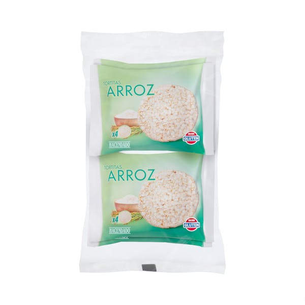

| | |
|---|---|
| **Formato** | Paquete 0.124kg |
| **Precio** | 1.10 € / ud. |
| **Origen** | España |
| **Ingredientes** | Arroz (98%), sal, emulgente (lecitina de girasol). Puede contener trazas de soja, leche. |

**Beneficios nutricionales:** Las tortitas de arroz o maíz son snacks sin grasas trans, bajos en calorías y sin gluten (arroz). Aportan carbohidratos de liberación media. Elige sin sal añadida.

---

### Tortitas de legumbres y arroz Hacendado

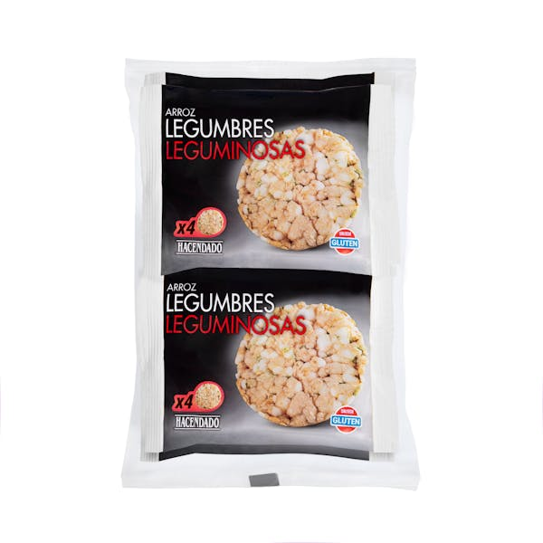

| | |
|---|---|
| **Formato** | Paquete 0.109kg |
| **Precio** | 1.75 € / ud. |
| **Origen** | España |
| **Ingredientes** | Legumbres en proporción variable (44%) (guisantes amarillos, guisantes verdes, lentejas rojas), harina de arroz (26%), proteína de guisante, harina de lentejas (10%), almidón de patata y sal. Puede contener trazas de leche y soja. |

**Beneficios nutricionales:** Las tortitas de arroz o maíz son snacks sin grasas trans, bajos en calorías y sin gluten (arroz). Aportan carbohidratos de liberación media. Elige sin sal añadida.

---

### Cereales avena Crunchy Hacendado

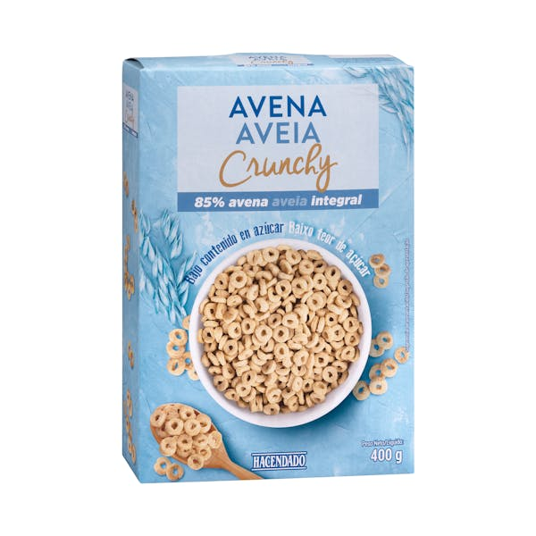

| | |
|---|---|
| **Formato** | Caja 0.4kg |
| **Precio** | 1.90 € / ud. |
| **Origen** | Francia |
| **Ingredientes** | Cereales [harina integral de avena (gluten) (85%), sémola de maíz], azúcar, sal, antioxidante: extracto rico en tocoferoles. Puede contener trazas de soja, lácteos y otros frutos de cáscara. |

**Beneficios nutricionales:** Cereal integral rey de los desayunos. Sus beta-glucanos (fibra soluble) reducen el colesterol LDL demostrado científicamente. Energía de liberación lenta, rico en magnesio, zinc y vitaminas B.

---

### Cereales Cereal Mix Hacendado 0% azúcares añadidos

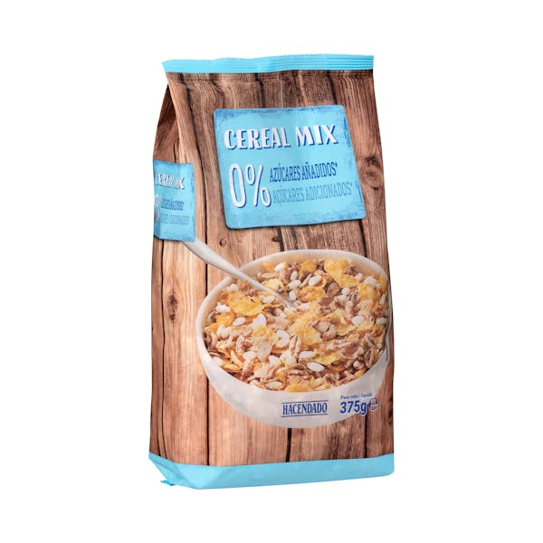

| | |
|---|---|
| **Formato** | Paquete 0.375kg |
| **Precio** | 2.40 € / ud. |
| **Origen** | Suiza |
| **Ingredientes** | AVENA (GLUTEN) INFLADO (40%), copos de maíz (40%) (maíz, sal, emulgente: lecitina de girasol), quinoa inflada (10%), arroz inflado (10%) |

**Beneficios nutricionales:** Los cereales integrales mantienen el salvado y el germen con fibra, vitaminas B y minerales que se pierden en el refinado. Prioriza siempre la versión integral.

---

### Cereales copos de trigo espelta integral Hacendado 0% azúcares añadidos

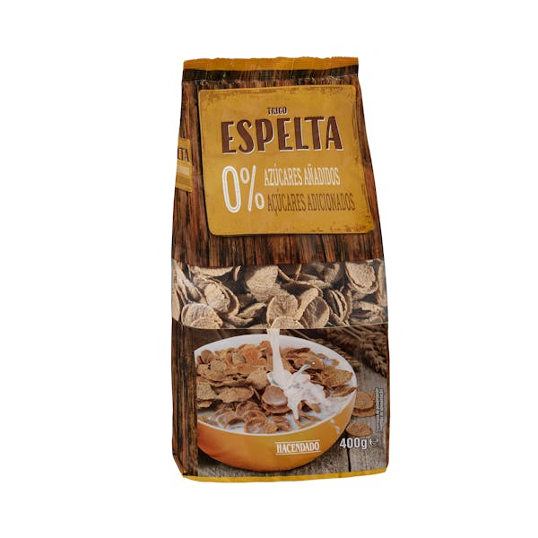

| | |
|---|---|
| **Formato** | Paquete 0.4kg |
| **Precio** | 1.70 € / ud. |
| **Ingredientes** | — |

**Beneficios nutricionales:** Cereal ancestral con mayor contenido en proteínas, fibra y minerales que el trigo común. Su gluten es más soluble y tolerado por algunos sensibles al trigo convencional.

---

### Cereales copos de trigo integral y arroz Hacendado 0% azúcares añadidos

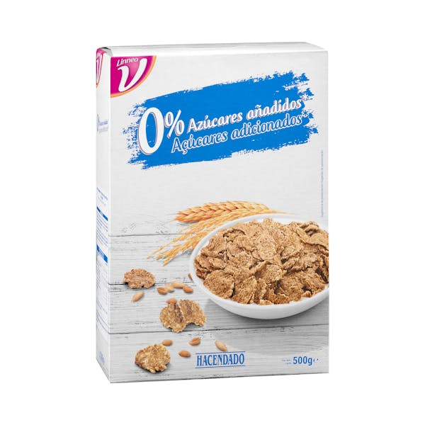

| | |
|---|---|
| **Formato** | Caja 0.5kg |
| **Precio** | 2.00 € / ud. |
| **Origen** | Fabricado en Francia |
| **Ingredientes** | Cereales [trigo integral, arroz], extracto de malta de cebada, sal. Puede contener trazas de soja, lácteos y otros frutos de cáscara. La información en negrita es para las personas con alergias. |

**Beneficios nutricionales:** Conserva el salvado con fibra, vitaminas B y minerales. Índice glucémico más bajo que el arroz blanco. Favorece el tránsito intestinal y proporciona energía sostenida sin picos de glucosa.

---

## 6. Charcutería y Quesos

El jamón ibérico de bellota concentra ácido oleico como el AOVE. El lomo embuchado es el embutido curado más magro. En quesos, prioriza los frescos (feta, mozzarella, ricota) y el curado por su vitamina K2.

### Tiras de pechuga pollo al horno Hacendado

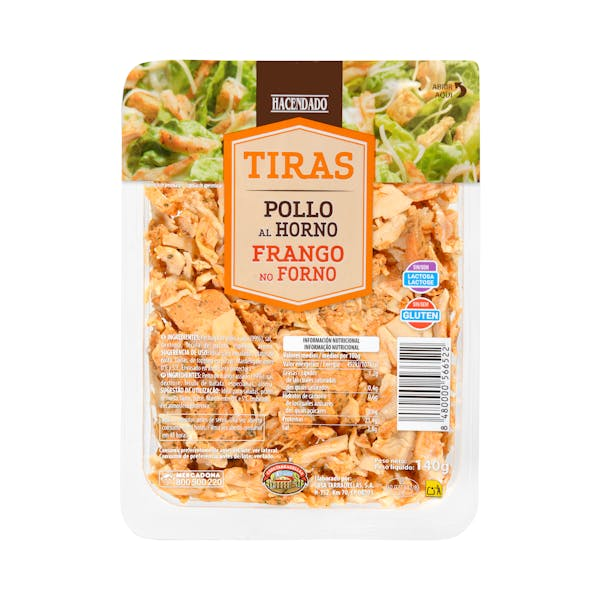

| | |
|---|---|
| **Formato** | Paquete 0.14kg |
| **Precio** | 2.25 € / ud. |
| **Ingredientes** | Pechuga de pollo asada (99%), sal, dextrosa, fécula de patata, especias, aroma. |

**Beneficios nutricionales:** Proteína magra de alta calidad y bajo contenido en grasa saturada. Rica en vitaminas B3 y B6, fósforo y selenio. Base de cualquier dieta equilibrada y especialmente recomendada para deportistas.

---

### Tiras de pechuga de pollo al natural Hacendado

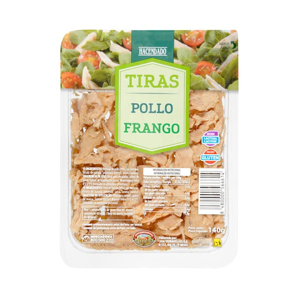

| | |
|---|---|
| **Formato** | Paquete 0.14kg |
| **Precio** | 2.25 € / ud. |
| **Ingredientes** | Pechuga de pollo (99%), sal, dextrosa, fécula de patata, pimienta, perejil, aroma natural. |

**Beneficios nutricionales:** Proteína magra de alta calidad y bajo contenido en grasa saturada. Rica en vitaminas B3 y B6, fósforo y selenio. Base de cualquier dieta equilibrada y especialmente recomendada para deportistas.

---

### Pechuga 92% pavo Hacendado lonchas

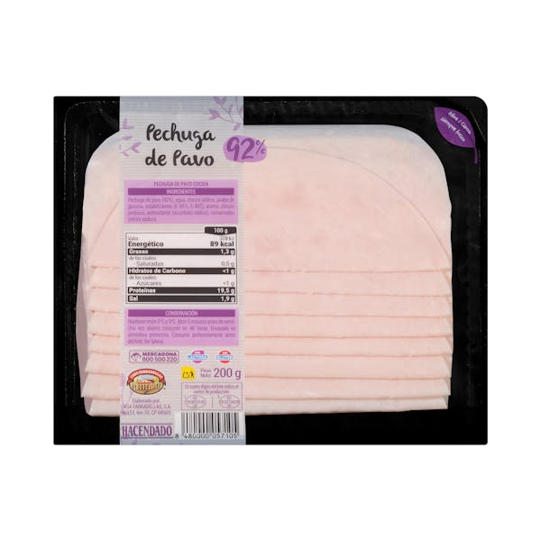

| | |
|---|---|
| **Formato** | Paquete 0.2kg |
| **Precio** | 2.85 € / ud. |
| **Ingredientes** | Pechuga de pavo (92%), agua, cloruro sódico, jarabe de glucosa, estabilizantes (E-451i, E-407), aroma, cloruro potásico, antioxidante (ascorbato sódico), conservador (nitrito sódico). |

**Beneficios nutricionales:** Proteína magra de alta calidad y bajo contenido en grasa saturada. Rica en vitaminas B3 y B6, fósforo y selenio. Base de cualquier dieta equilibrada y especialmente recomendada para deportistas.

---

### Pollo 97% relleno La Carloteña asado al horno lonchas

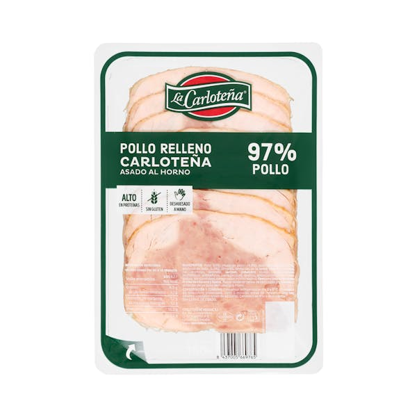

| | |
|---|---|
| **Formato** | Paquete 0.15kg |
| **Precio** | 2.40 € / ud. |
| **Origen** | España |
| **Ingredientes** | Pollo (97%), [Muslo de pollo (48,6%), Pollo deshuesado (40%), pechuga de pollo (8,4%)], almidón, proteinas de la leche, proteina de soja, sal, especias, dextrosa, lactosa, almendra molida, estabilizantes (E-450, E-452, E-407), aromas, antioxidantes (E-301, E-331), conservador (E-250). Contiene trazas de otros frutos de cascara y huevo. Puede contener restos de cartílagos y/o huesos al proceder de un auténtico pollo deshuesado a mano. Sin Gluten |

**Beneficios nutricionales:** Proteína magra de alta calidad y bajo contenido en grasa saturada. Rica en vitaminas B3 y B6, fósforo y selenio. Base de cualquier dieta equilibrada y especialmente recomendada para deportistas.

---

### Jamón serrano Incarlopsa lonchas extrafinas

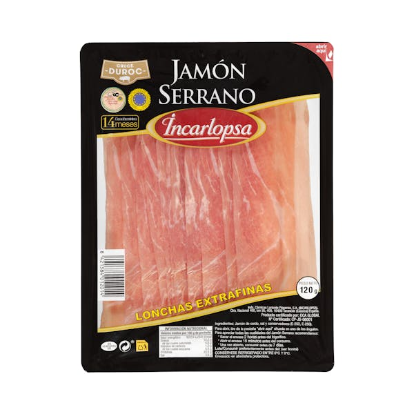

| | |
|---|---|
| **Formato** | Paquete 0.12kg |
| **Precio** | 2.45 € / ud. |
| **Origen** | España |
| **Ingredientes** | Jamón de cerdo, sal y conservadores (E-252, E-250). |

**Beneficios nutricionales:** El jamón ibérico de bellota es rico en ácido oleico (como el AOVE), vitaminas B1, B12 y zinc. El serrano aporta proteína de calidad, hierro hem y selenio. Consumo moderado.

---

### Mini taquitos de jamón Incarlopsa

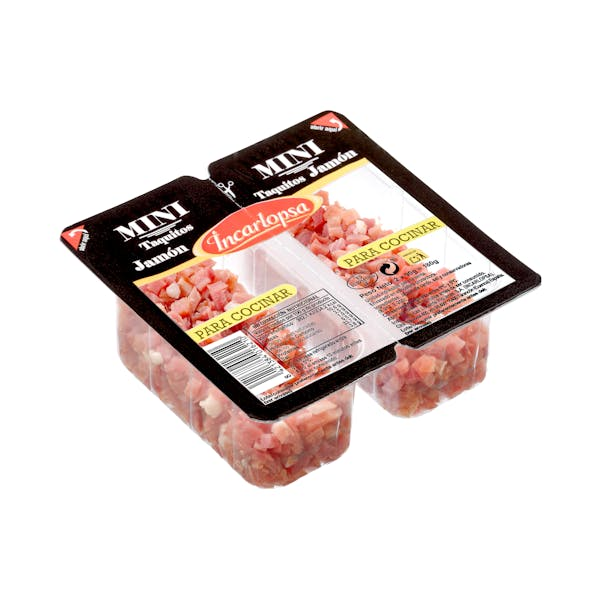

| | |
|---|---|
| **Formato** | Pack-2 0.18kg |
| **Precio** | 2.65 € / ud. |
| **Origen** | España |
| **Ingredientes** | Jamón de cerdo, sal y conservadores (E-252, E-250). |

**Beneficios nutricionales:** El jamón ibérico de bellota es rico en ácido oleico (como el AOVE), vitaminas B1, B12 y zinc. El serrano aporta proteína de calidad, hierro hem y selenio. Consumo moderado.

---

### Jamón serrano lonchas Incarlopsa

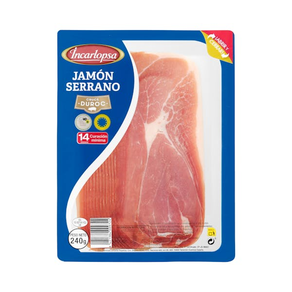

| | |
|---|---|
| **Formato** | Paquete 0.24kg |
| **Precio** | 4.10 € / ud. |
| **Origen** | España |
| **Ingredientes** | Jamón de cerdo, sal y conservadores (E-252, E-250). |

**Beneficios nutricionales:** El jamón ibérico de bellota es rico en ácido oleico (como el AOVE), vitaminas B1, B12 y zinc. El serrano aporta proteína de calidad, hierro hem y selenio. Consumo moderado.

---

### Jamón serrano cortado a máquina

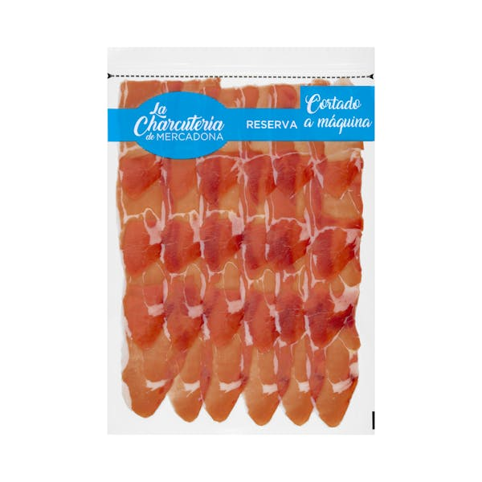

| | |
|---|---|
| **Formato** | Paquete 0.19kg |
| **Precio** | 4.75 € / ud. |
| **Ingredientes** | — |

**Beneficios nutricionales:** El jamón ibérico de bellota es rico en ácido oleico (como el AOVE), vitaminas B1, B12 y zinc. El serrano aporta proteína de calidad, hierro hem y selenio. Consumo moderado.

---

### Jamón de cebo ibérico cortado a máquina

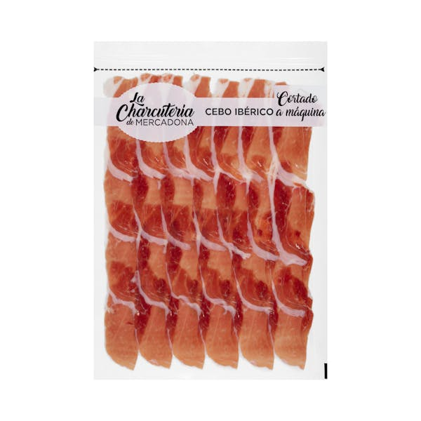

| | |
|---|---|
| **Formato** | Paquete 0.19kg |
| **Precio** | 10.26 € / ud. |
| **Ingredientes** | — |

**Beneficios nutricionales:** El jamón ibérico de bellota es rico en ácido oleico (como el AOVE), vitaminas B1, B12 y zinc. El serrano aporta proteína de calidad, hierro hem y selenio. Consumo moderado.

---

### Jamón serrano reserva cortado a tapas

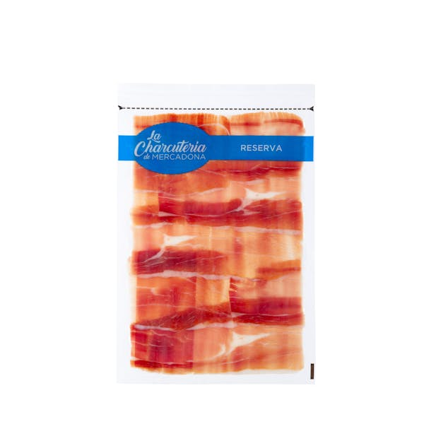

| | |
|---|---|
| **Formato** | Paquete 0.09kg |
| **Precio** | 3.60 € / ud. |
| **Ingredientes** | — |

**Beneficios nutricionales:** El jamón ibérico de bellota es rico en ácido oleico (como el AOVE), vitaminas B1, B12 y zinc. El serrano aporta proteína de calidad, hierro hem y selenio. Consumo moderado.

---

### Jamón de cebo ibérico cortado a tapas

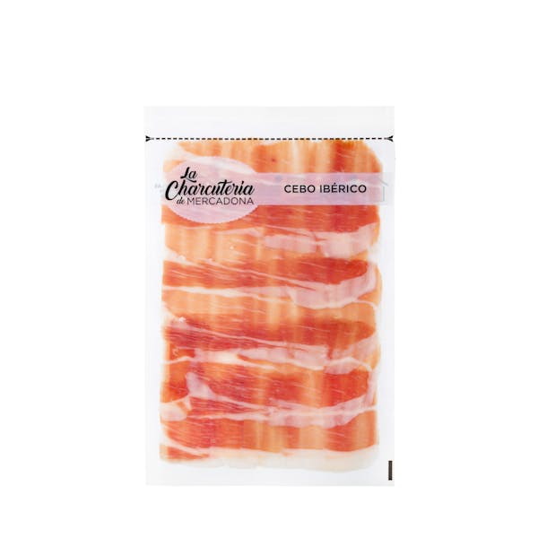

| | |
|---|---|
| **Formato** | Paquete 0.09kg |
| **Precio** | 7.11 € / ud. |
| **Ingredientes** | — |

**Beneficios nutricionales:** El jamón ibérico de bellota es rico en ácido oleico (como el AOVE), vitaminas B1, B12 y zinc. El serrano aporta proteína de calidad, hierro hem y selenio. Consumo moderado.

---

### Jamón de bellota ibérico cortado a tapas

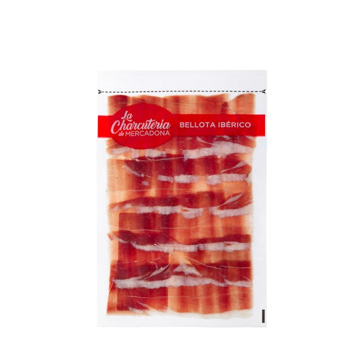

| | |
|---|---|
| **Formato** | Paquete 0.09kg |
| **Precio** | 12.87 € / ud. |
| **Ingredientes** | — |

**Beneficios nutricionales:** El jamón ibérico de bellota es rico en ácido oleico (como el AOVE), vitaminas B1, B12 y zinc. El serrano aporta proteína de calidad, hierro hem y selenio. Consumo moderado.

---

### Jamón de bellota ibérico 100% cortado a tapas

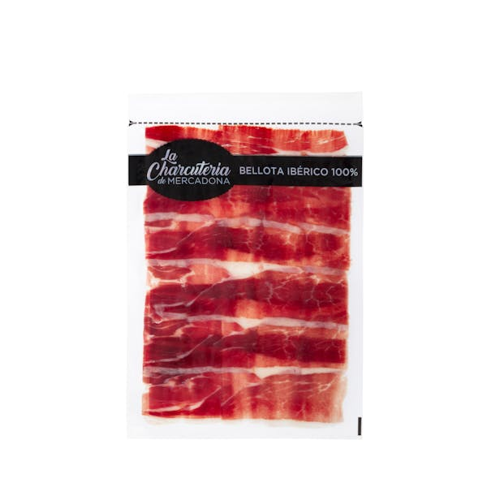

| | |
|---|---|
| **Formato** | Paquete 0.09kg |
| **Precio** | 15.12 € / ud. |
| **Ingredientes** | — |

**Beneficios nutricionales:** El jamón ibérico de bellota es rico en ácido oleico (como el AOVE), vitaminas B1, B12 y zinc. El serrano aporta proteína de calidad, hierro hem y selenio. Consumo moderado.

---

### Jamón de cebo ibérico 50% raza ibérica La Hacienda del Ibérico

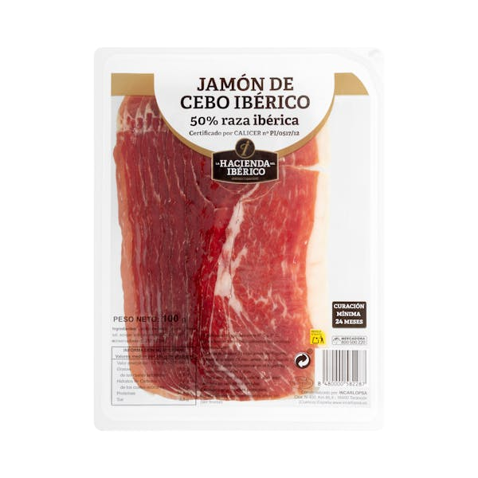

| | |
|---|---|
| **Formato** | Paquete 0.1kg |
| **Precio** | 4.90 € / ud. |
| **Origen** | España |
| **Ingredientes** | Jamón de cerdo de cebo ibérico, sal, azúcar, antioxidantes (E-331, E-301) y conservadores (E-252, E-250). |

**Beneficios nutricionales:** El jamón ibérico de bellota es rico en ácido oleico (como el AOVE), vitaminas B1, B12 y zinc. El serrano aporta proteína de calidad, hierro hem y selenio. Consumo moderado.

---

### Jamón serrano medias lonchas Jamcal

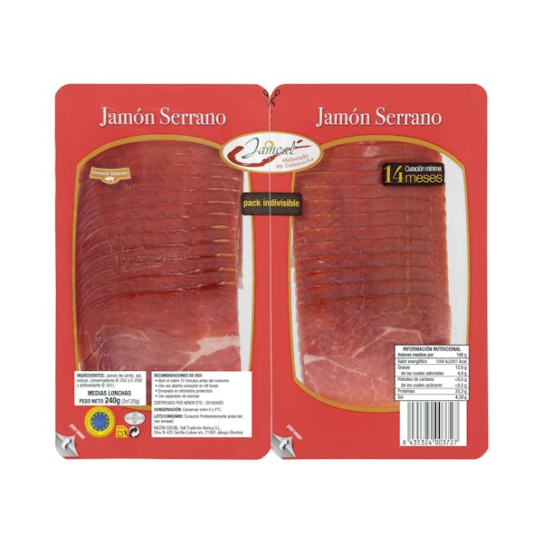

| | |
|---|---|
| **Formato** | 0.24kg |
| **Precio** | 4.10 € / ud. |
| **Origen** | Jamón Serrano |
| **Ingredientes** | Jamón de cerdo, sal,azucar, conservadores (E-252, E-250) y antioxidantes (E-301), |

**Beneficios nutricionales:** El jamón ibérico de bellota es rico en ácido oleico (como el AOVE), vitaminas B1, B12 y zinc. El serrano aporta proteína de calidad, hierro hem y selenio. Consumo moderado.

---

### Paleta curada lonchas Paletas Marpa

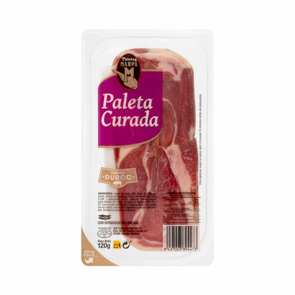

| | |
|---|---|
| **Formato** | Paquete 0.12kg |
| **Precio** | 2.50 € / ud. |
| **Ingredientes** | Paleta de cerdo 50% duroc (95,8%), Sal, Azúcar, Corrector de la acidez (E-331iii), Conservadores (E-252, E-250) y Antioxidante (E-301). |

**Beneficios nutricionales:** Alimento de calidad con importantes propiedades nutricionales. Incluirlo regularmente en una dieta variada y equilibrada contribuye al bienestar general.

---

### Lomo embuchado Hacendado lonchas

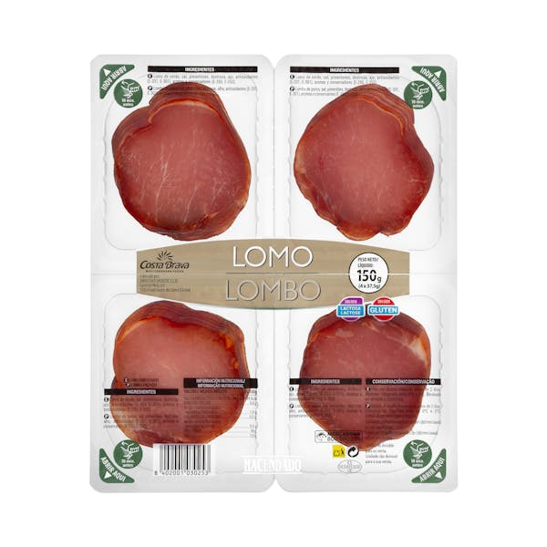

| | |
|---|---|
| **Formato** | 0.15kg |
| **Precio** | 2.55 € / ud. |
| **Ingredientes** | Lomo de cerdo, sal, pimentones, dextrosa, ajo,  antioxidantes (E-331, E-301), aromas y conservadores (E-250, E-252). |

**Beneficios nutricionales:** El lomo embuchado es el embutido curado más magro: alto en proteína y bajo en grasa comparado con otros embutidos. Aporta vitaminas B1, B12, zinc y hierro hem de alta absorción. Consumo moderado por su contenido en sal.

---

### Cabecero de lomo Hacendado lonchas

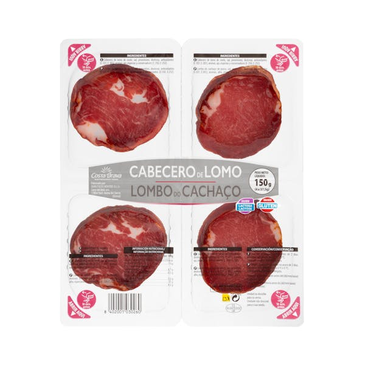

| | |
|---|---|
| **Formato** | 0.15kg |
| **Precio** | 2.70 € / ud. |
| **Ingredientes** | Cabecero de lomo de cerdo, sal, pimentones, dextrosa, antioxidantes (E-331,E-301), aromas, ajo, especias y conservadores (E-250, E-252). |

**Beneficios nutricionales:** Alimento de calidad con importantes propiedades nutricionales. Incluirlo regularmente en una dieta variada y equilibrada contribuye al bienestar general.

---

### Lomo de cebo ibérico 50% raza ibérica cortado a máquina

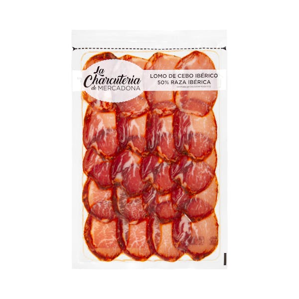

| | |
|---|---|
| **Formato** | Paquete 0.11kg |
| **Precio** | 6.33 € / ud. |
| **Ingredientes** | Lomo de cerdo de cebo ibérico, sal, especias, azúcar, aceite de oliva, dextrosa, antioxidante (E-301) y conservadores (E-250 y E-252). Puede contener trazas de proteína de soja. |

**Beneficios nutricionales:** Alimento de calidad con importantes propiedades nutricionales. Incluirlo regularmente en una dieta variada y equilibrada contribuye al bienestar general.

---

### Lomo de bellota ibérico 50% raza ibérica cortado a máquina

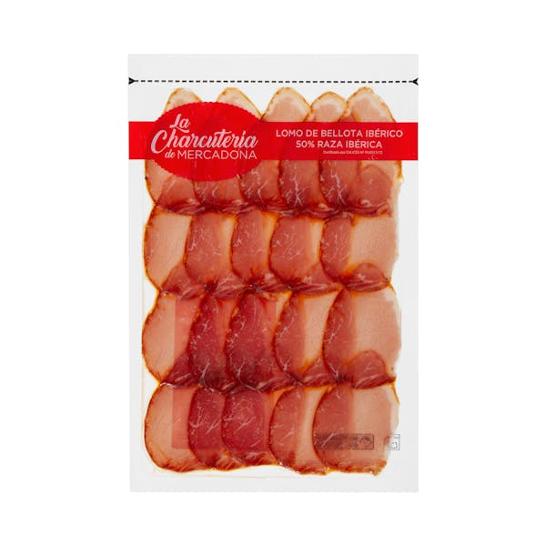

| | |
|---|---|
| **Formato** | Paquete 0.11kg |
| **Precio** | 7.43 € / ud. |
| **Ingredientes** | Lomo de cerdo de bellota ibérico, sal, especias, azúcar, aceite de oliva, dextrosa, antioxidante (E-301) y conservadores (E-250 y E-252). Puede contener trazas de proteína de soja. |

**Beneficios nutricionales:** Alimento de calidad con importantes propiedades nutricionales. Incluirlo regularmente en una dieta variada y equilibrada contribuye al bienestar general.

---

### Lomo de pavo Hacendado lonchas

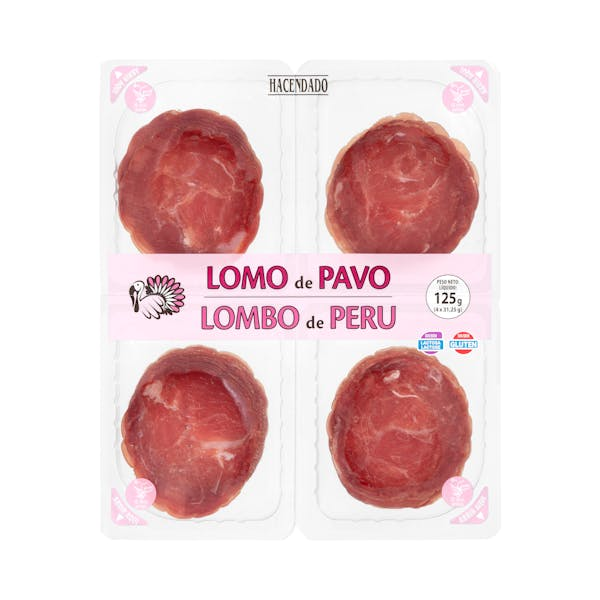

| | |
|---|---|
| **Formato** | 0.125kg |
| **Precio** | 3.20 € / ud. |
| **Ingredientes** | Muslo de pavo (175 g para obtener 100 g producto final), sal, antioxidantes (E-326, E-331, E-301), aromas, maltodextrina y conservadores (E-250, E-252). |

**Beneficios nutricionales:** Proteína magra de alta calidad y bajo contenido en grasa saturada. Rica en vitaminas B3 y B6, fósforo y selenio. Base de cualquier dieta equilibrada y especialmente recomendada para deportistas.

---

### Lomo Hacendado

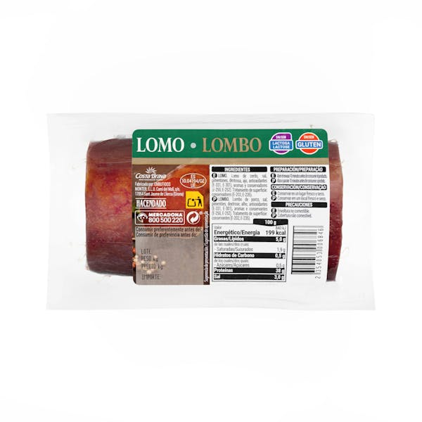

| | |
|---|---|
| **Formato** | Pieza 0.35kg |
| **Precio** | 6.13 € / ud. |
| **Origen** | España |
| **Ingredientes** | Lomo de cerdo, sal, pimentones, dextrosa, ajo,  antioxidantes (E-331, E-301), aromas y conservadores (E-250, E-252). Tratamiento de superficie: conservadores (E-202, E-235). Envoltura no comestible. |

**Beneficios nutricionales:** Alimento de calidad con importantes propiedades nutricionales. Incluirlo regularmente en una dieta variada y equilibrada contribuye al bienestar general.

---

### Caña de lomo cebo ibérico La Hacienda del ibérico

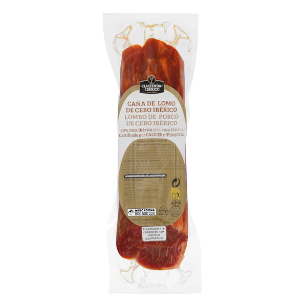

| | |
|---|---|
| **Formato** | Pieza 0.5kg |
| **Precio** | 23.75 € / ud. |
| **Origen** | España |
| **Ingredientes** | Lomo de cerdo de cebo ibérico, sal especias, aceite de oliva, lactosa, azúcar, dextrosa, proteínas de la leche, antioxidante (E-301) y conservadores (E-250 y E-252) |

**Beneficios nutricionales:** Alimento de calidad con importantes propiedades nutricionales. Incluirlo regularmente en una dieta variada y equilibrada contribuye al bienestar general.

---

### Queso untar suave de vaca Hacendado

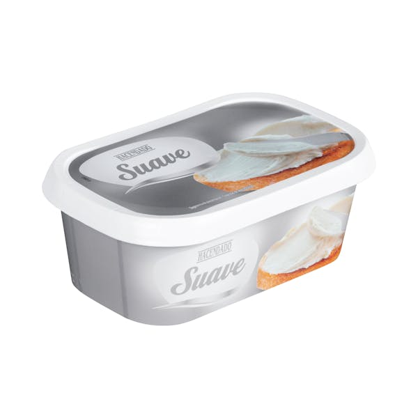

| | |
|---|---|
| **Formato** | Tarrina 0.3kg |
| **Precio** | 1.40 € / ud. |
| **Ingredientes** | Leche pasteurizada de vaca, nata pasteurizada de vaca, sal, estabilizantes(goma garrofín, alginato sódico y carragenano), conservador (sorbato potásico) y fermentos lácticos. SIN GLUTEN, SIN HUEVO |

**Beneficios nutricionales:** Alimento de calidad con importantes propiedades nutricionales. Incluirlo regularmente en una dieta variada y equilibrada contribuye al bienestar general.

---

### Queso untar original Philadelphia

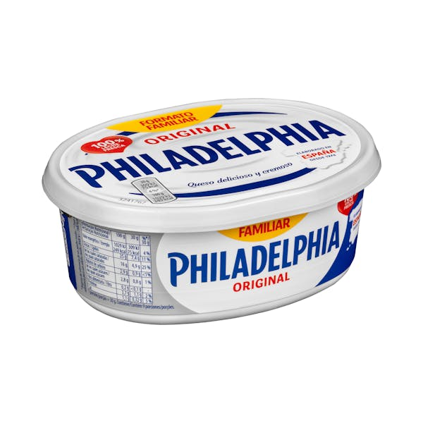

| | |
|---|---|
| **Formato** | Tarrina 0.27kg |
| **Precio** | 2.90 € / ud. |
| **Origen** | Origen de la leche: España. |
| **Ingredientes** | Ingredientes: LECHE, NATA, sal, estabilizantes (E412,  E401,  E407), conservador (E202). |

**Beneficios nutricionales:** Alimento de calidad con importantes propiedades nutricionales. Incluirlo regularmente en una dieta variada y equilibrada contribuye al bienestar general.

---

### Queso untar light Philadelphia

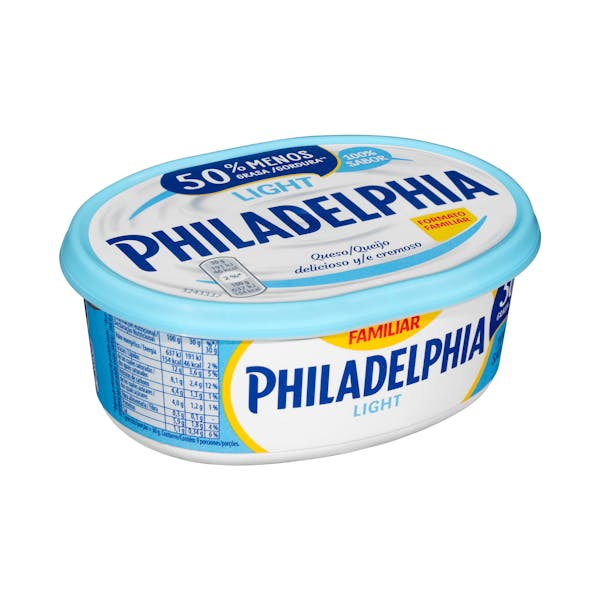

| | |
|---|---|
| **Formato** | Tarrina 0.27kg |
| **Precio** | 2.90 € / ud. |
| **Origen** | Origen de la leche: España. |
| **Ingredientes** | Ingredientes: LECHE, NATA, sal, estabilizantes (E412, E407), conservador (E202). |

**Beneficios nutricionales:** Alimento de calidad con importantes propiedades nutricionales. Incluirlo regularmente en una dieta variada y equilibrada contribuye al bienestar general.

---

### Queso untar light de vaca Hacendado

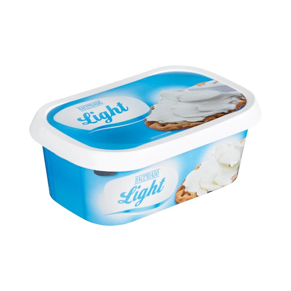

| | |
|---|---|
| **Formato** | Tarrina 0.3kg |
| **Precio** | 1.40 € / ud. |
| **Ingredientes** | Leche pasteurizada de vaca, leche desnatada pasteurizada de vaca, sal,estabilizantes (Goma garrofín, alginato sódico y carragenano), conservador (sorbato potásico) y Fermentos lácticos. SIN GLUTEN, SIN HUEVO |

**Beneficios nutricionales:** Alimento de calidad con importantes propiedades nutricionales. Incluirlo regularmente en una dieta variada y equilibrada contribuye al bienestar general.

---

### Queso untar sin lactosa de vaca Hacendado

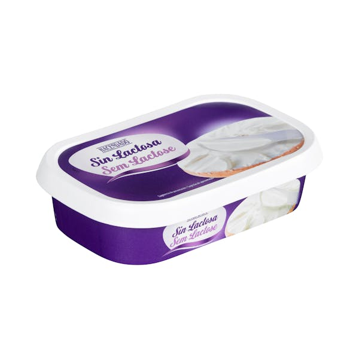

| | |
|---|---|
| **Formato** | Tarrina 0.2kg |
| **Precio** | 1.90 € / ud. |
| **Ingredientes** | No apto para alérgicos a la proteína de la leche de vaca. Leche pasteurizada de vaca, nata pasteurizada de vaca,sal, estabilizantes (goma garrofín, alginato sódico y carragenano), lactasa, conservador (sorbato potásico) y fermentos lácticos. SIN GLUTEN, SIN HUEVO |

**Beneficios nutricionales:** Alimento de calidad con importantes propiedades nutricionales. Incluirlo regularmente en una dieta variada y equilibrada contribuye al bienestar general.

---

### Queso fresco Burgos natural Hacendado

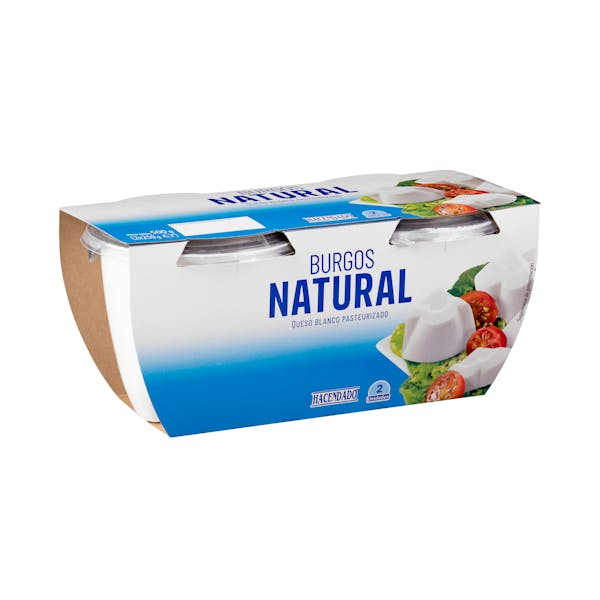

| | |
|---|---|
| **Formato** | Pack-2 0.5kg |
| **Precio** | 2.05 € / ud. |
| **Ingredientes** | Leche pasteurizada (Origen: España), sal y cuajo (microbiano). Sin gluten. |

**Beneficios nutricionales:** Queso bajo en grasa con alto contenido proteico y calcio. Versátil en cocina y más ligero que los quesos curados. Ideal para deportistas y control de peso.

---

### Queso curado mezcla Hacendado

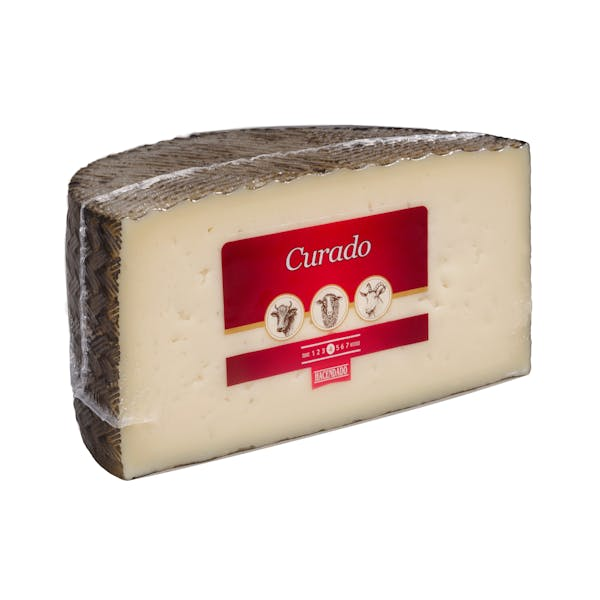

| | |
|---|---|
| **Formato** | Pieza 1.63kg |
| **Precio** | 18.06 € / ud. |
| **Ingredientes** | Leche [pasteurizada de vaca (min 50%*), pasteurizada de oveja (min 20%*) y pasteurizada de cabra (min 15%*)], sal, cuajo**,estabilizante (cloruro cálcico) y fermentos lácticos. SIN GLUTEN, SIN HUEVO.*Promedios mínimos.**Origen no animal. |

**Beneficios nutricionales:** Los quesos curados concentran proteínas, calcio, fósforo y vitamina K2 (esencial para la salud ósea y cardiovascular). Consumo moderado por su contenido en sal y grasa saturada.

---

### Queso curado mezcla Hacendado cortado en cuñitas

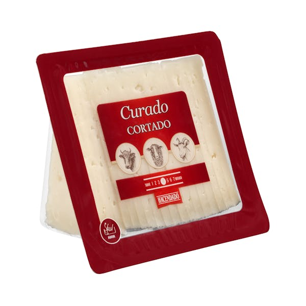

| | |
|---|---|
| **Formato** | Pieza 0.33kg |
| **Precio** | 4.69 € / ud. |
| **Ingredientes** | Leche [vaca (50%*), oveja (20%*) y cabra (15%*)] pasteurizada, sal, cuajo no animal, estabilizante (cloruro cálcico) y fermentos lácticos.* Promedios mínimos. |

**Beneficios nutricionales:** Los quesos curados concentran proteínas, calcio, fósforo y vitamina K2 (esencial para la salud ósea y cardiovascular). Consumo moderado por su contenido en sal y grasa saturada.

---

### Queso grana padano Zanetti

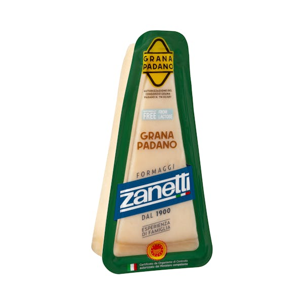

| | |
|---|---|
| **Formato** | Pieza 0.23kg |
| **Precio** | 3.77 € / ud. |
| **Origen** | Italia |
| **Ingredientes** | Leche, sal, cuajo, conservante: lysozyme de huevo, M.G./E.S. 32%min. |

**Beneficios nutricionales:** Alimento de calidad con importantes propiedades nutricionales. Incluirlo regularmente en una dieta variada y equilibrada contribuye al bienestar general.

---

### Queso viejo tostado mezcla Hacendado

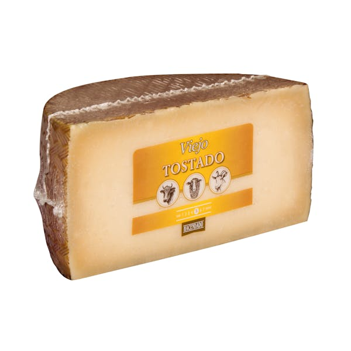

| | |
|---|---|
| **Formato** | Pieza 1.56kg |
| **Precio** | 20.94 € / ud. |
| **Ingredientes** | Leche [pasteurizada de vaca (50%*), pasteurizada de oveja (20%*), pasteurizada de cabra (15%*)], Sal, Cuajo**, estabilizante (cloruro cálcico) y fermentos lácticos. *Promedios mínimos.**Origen no animal. SIN GLUTEN, SIN HUEVO |

**Beneficios nutricionales:** Alimento de calidad con importantes propiedades nutricionales. Incluirlo regularmente en una dieta variada y equilibrada contribuye al bienestar general.

---

### Queso curado y cheddar Hacendado en dados

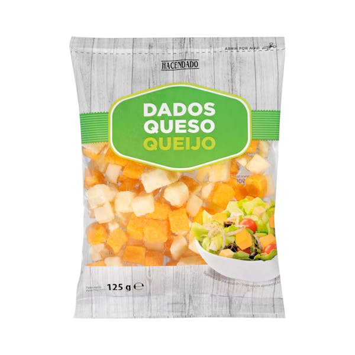

| | |
|---|---|
| **Formato** | Paquete 0.125kg |
| **Precio** | 1.15 € / ud. |
| **Ingredientes** | Queso cheddar, Quesos madurados (mezcla y oveja).Este producto contiene quesos elaborados a partir de leche cruda. SIN GLUTEN, SIN HUEVO. |

**Beneficios nutricionales:** Los quesos curados concentran proteínas, calcio, fósforo y vitamina K2 (esencial para la salud ósea y cardiovascular). Consumo moderado por su contenido en sal y grasa saturada.

---

### Queso viejo de oveja Hacendado

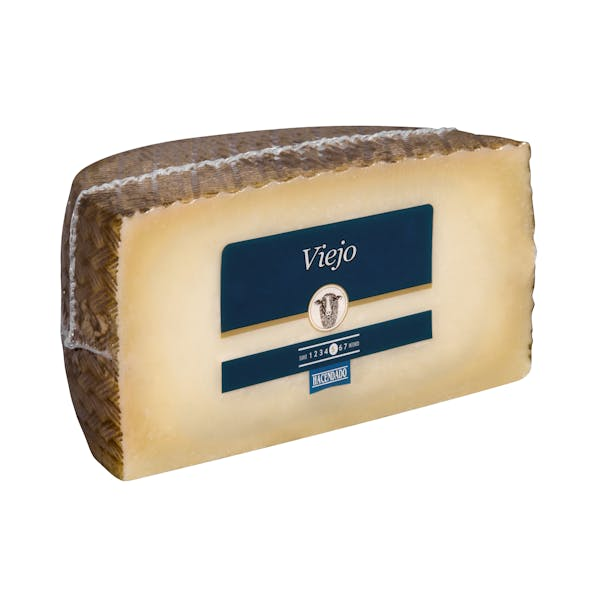

| | |
|---|---|
| **Formato** | Pieza 1.54kg |
| **Precio** | 19.25 € / ud. |
| **Ingredientes** | Leche pasteurizada de oveja, Sal, Cuajo* y Fermentos lácticos. SIN GLUTEN, SIN HUEVO.*Origen no animal. |

**Beneficios nutricionales:** Alimento de calidad con importantes propiedades nutricionales. Incluirlo regularmente en una dieta variada y equilibrada contribuye al bienestar general.

---

### Jamón cocido Hacendado lonchas

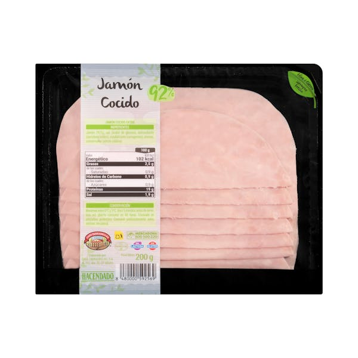

| | |
|---|---|
| **Formato** | Paquete 0.2kg |
| **Precio** | 2.25 € / ud. |
| **Ingredientes** | Jamón, sal, dextrosa, antioxidante (ascorbato sódico), estabilizante (carragenato), especias, aromas, conservador (nitrito sódico). |

**Beneficios nutricionales:** Alimento de calidad con importantes propiedades nutricionales. Incluirlo regularmente en una dieta variada y equilibrada contribuye al bienestar general.

---

## 7. Congelados

Los congelados de calidad conservan nutrientes tan bien como los frescos. Frutas del bosque, verduras, pescado y marisco congelados son la mejor opción práctica sin conservantes artificiales.

### Mix frutos rojos Hacendado ultracongeladas

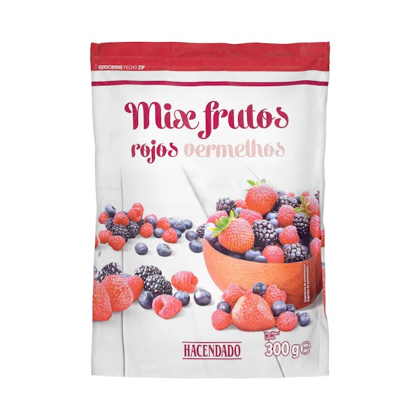

| | |
|---|---|
| **Formato** | Paquete 0.3kg |
| **Precio** | 1.90 € / ud. |
| **Origen** | Marruecos |
| **Ingredientes** | Fresas, zarzamoras, grosellas rojas, grosellas negras, frambuesas, arándanos silvestres |

**Beneficios nutricionales:** Fuente esencial de vitaminas, minerales, fibra y antioxidantes. Bajo en calorías y fundamental para la prevención de enfermedades crónicas. Al menos 5 raciones diarias.

---

### Fresas enteras Hacendado ultracongeladas

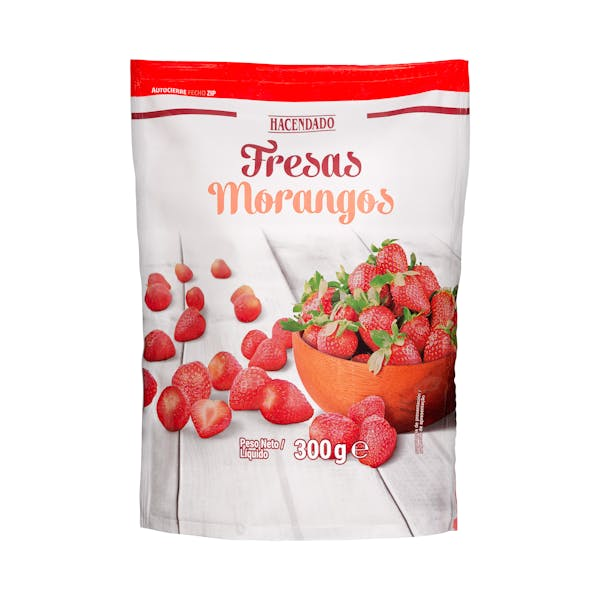

| | |
|---|---|
| **Formato** | Paquete 0.3kg |
| **Precio** | 1.90 € / ud. |
| **Origen** | Marruecos |
| **Ingredientes** | 100% Fresas enteras |

**Beneficios nutricionales:** Fuente esencial de vitaminas, minerales, fibra y antioxidantes. Bajo en calorías y fundamental para la prevención de enfermedades crónicas. Al menos 5 raciones diarias.

---

### Arándanos enteros Hacendado ultracongelados

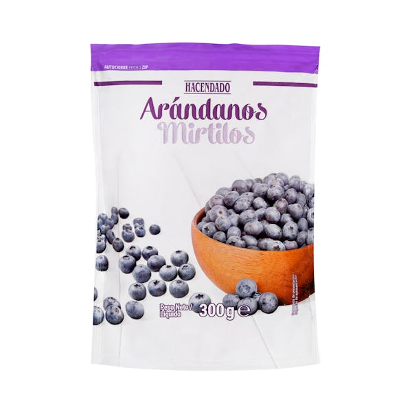

| | |
|---|---|
| **Formato** | Paquete 0.3kg |
| **Precio** | 2.15 € / ud. |
| **Origen** | Marruecos |
| **Ingredientes** | 100% Arándanos |

**Beneficios nutricionales:** Uno de los alimentos con mayor capacidad antioxidante. Rico en antocianinas que protegen la vista, el corazón y el sistema nervioso. Alto contenido en vitamina C.

---

### Mix frutas tropical Hacendado ultracongeladas

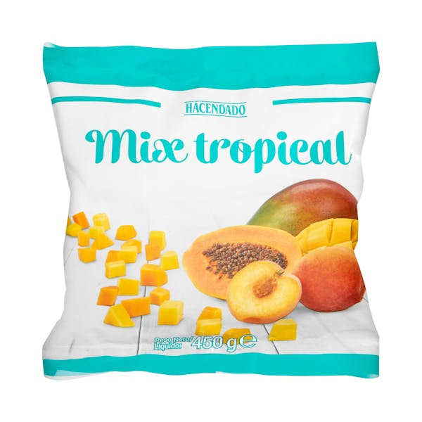

| | |
|---|---|
| **Formato** | Paquete 0.45kg |
| **Precio** | 2.75 € / ud. |
| **Ingredientes** | Mango, melocotón, papaya congelado |

**Beneficios nutricionales:** Fuente esencial de vitaminas, minerales, fibra y antioxidantes. Bajo en calorías y fundamental para la prevención de enfermedades crónicas. Al menos 5 raciones diarias.

---

### Aguacate en dados Hacendado congelado

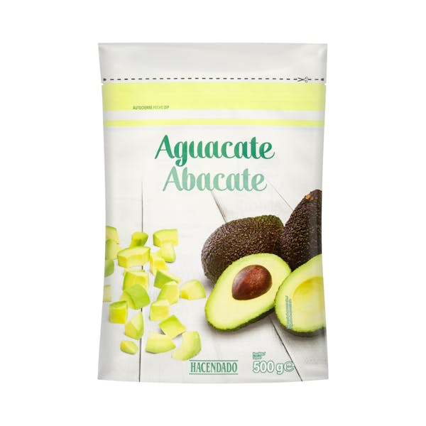

| | |
|---|---|
| **Formato** | Paquete 0.5kg |
| **Precio** | 3.50 € / ud. |
| **Ingredientes** | Aguacate 99%, antioxidante: ácido ascórbico, sal y regulador de acidez: ácido cítrico |

**Beneficios nutricionales:** Fruta única en su composición: rica en grasas monoinsaturadas (oleico), potasio, vitamina E y folato. Mejora la absorción de antioxidantes de otros alimentos.

---

### Dúo frutas fresa y plátano Hacendado congeladas

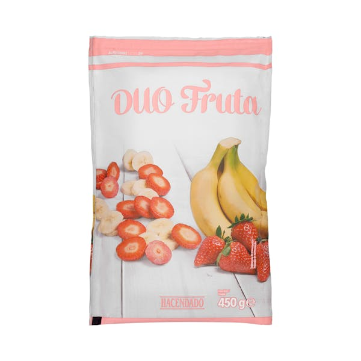

| | |
|---|---|
| **Formato** | Paquete 0.45kg |
| **Precio** | 2.75 € / ud. |
| **Ingredientes** | fresa, plátano Congelada |

**Beneficios nutricionales:** Fuente natural de potasio, magnesio, vitamina B6 y carbohidratos de energía rápida. Ideal pre-entrenamiento y para calambres musculares. Su fibra es prebiótica.

---

### Ensaladilla Hacendado ultracongelada

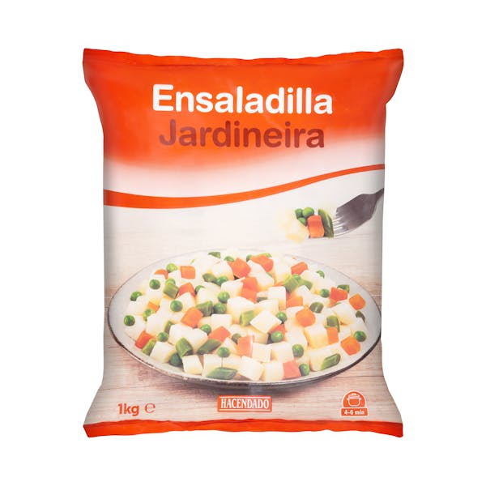

| | |
|---|---|
| **Formato** | Paquete 1kg |
| **Precio** | 1.36 € / ud. |
| **Ingredientes** | Patata, zanahoria, judía verde troceada  y guisantes. |

**Beneficios nutricionales:** Fuente esencial de vitaminas, minerales, fibra y antioxidantes. Bajo en calorías y fundamental para la prevención de enfermedades crónicas. Al menos 5 raciones diarias.

---

### Garrofón Hacendado ultracongelado

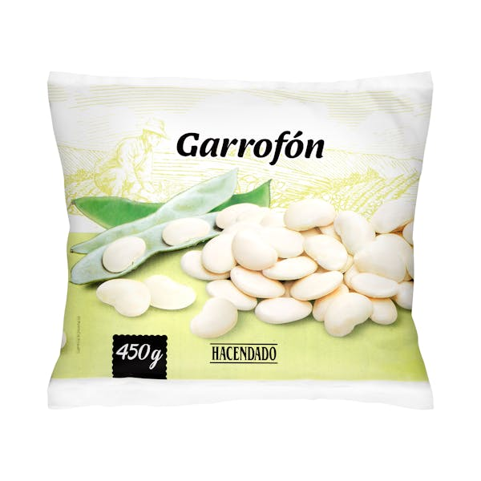

| | |
|---|---|
| **Formato** | Paquete 0.45kg |
| **Precio** | 1.55 € / ud. |
| **Ingredientes** | Garrofón |

**Beneficios nutricionales:** Fuente esencial de vitaminas, minerales, fibra y antioxidantes. Bajo en calorías y fundamental para la prevención de enfermedades crónicas. Al menos 5 raciones diarias.

---

### Garbanzo Hacendado ultracongelado

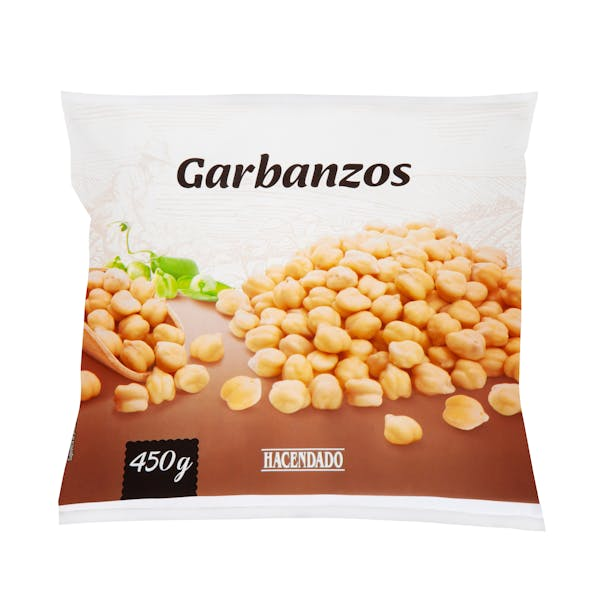

| | |
|---|---|
| **Formato** | Paquete 0.45kg |
| **Precio** | 1.36 € / ud. |
| **Ingredientes** | Garbanzos |

**Beneficios nutricionales:** Alto en proteína vegetal, fibra, hierro y folato. Su fibra soluble regula el colesterol y la glucemia. Base de la dieta mediterránea con probados beneficios cardiovasculares. Versátil en cocina.

---

### Guisante muy tierno Hacendado ultracongelado

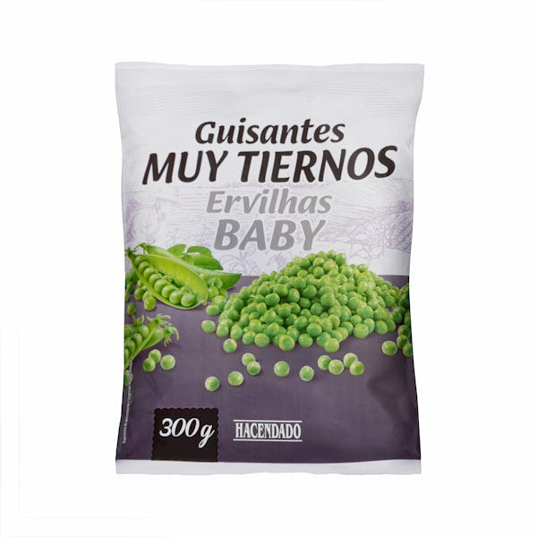

| | |
|---|---|
| **Formato** | Paquete 0.3kg |
| **Precio** | 1.05 € / ud. |
| **Ingredientes** | Guisantes |

**Beneficios nutricionales:** Fuente esencial de vitaminas, minerales, fibra y antioxidantes. Bajo en calorías y fundamental para la prevención de enfermedades crónicas. Al menos 5 raciones diarias.

---

### Guisante fino Hacendado ultracongelado

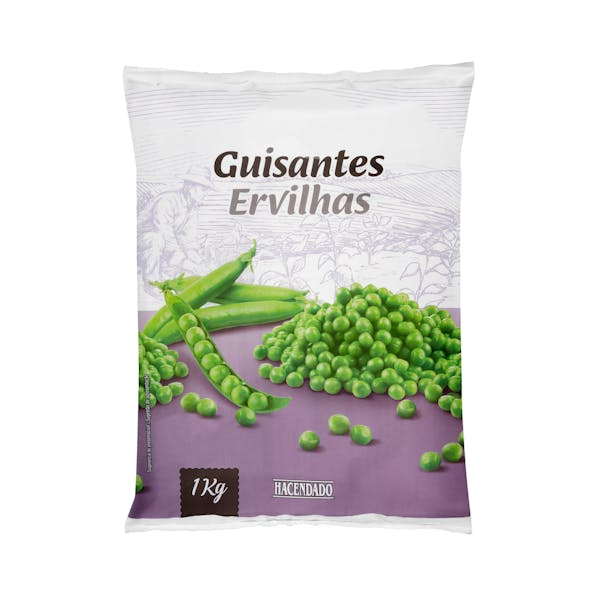

| | |
|---|---|
| **Formato** | Paquete 1kg |
| **Precio** | 1.55 € / ud. |
| **Ingredientes** | Guisantes |

**Beneficios nutricionales:** Fuente esencial de vitaminas, minerales, fibra y antioxidantes. Bajo en calorías y fundamental para la prevención de enfermedades crónicas. Al menos 5 raciones diarias.

---

### Judía verde plana Hacendado ultracongelada

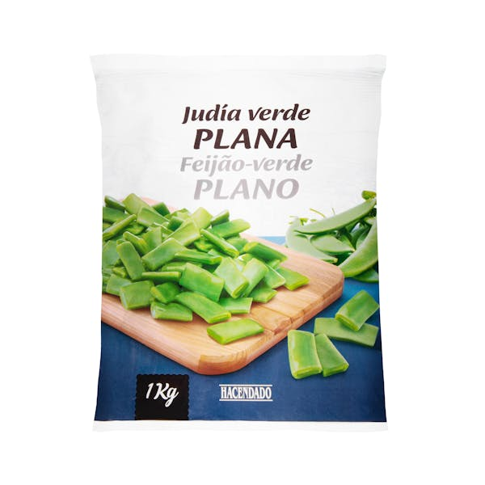

| | |
|---|---|
| **Formato** | Paquete 1kg |
| **Precio** | 1.45 € / ud. |
| **Ingredientes** | Judía verde plana |

**Beneficios nutricionales:** Ricas en proteína vegetal, fibra, potasio y magnesio. Reducen el colesterol y estabilizan el azúcar en sangre. Fuente de folato esencial para el embarazo.

---

### Cebolla troceada Hacendado ultracongelada

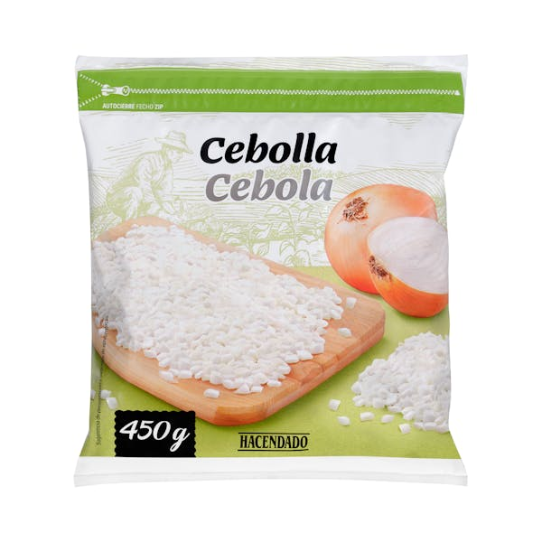

| | |
|---|---|
| **Formato** | Paquete 0.45kg |
| **Precio** | 0.95 € / ud. |
| **Origen** | España |
| **Ingredientes** | Cebolla |

**Beneficios nutricionales:** Fuente esencial de vitaminas, minerales, fibra y antioxidantes. Bajo en calorías y fundamental para la prevención de enfermedades crónicas. Al menos 5 raciones diarias.

---

### Judía verde redonda Hacendado ultracongelada

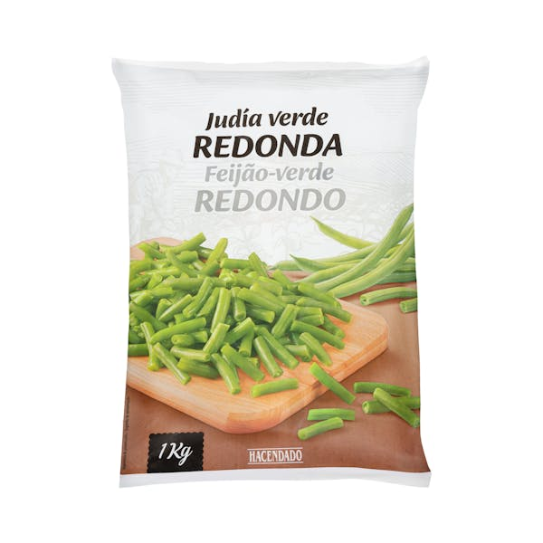

| | |
|---|---|
| **Formato** | Paquete 1kg |
| **Precio** | 1.45 € / ud. |
| **Ingredientes** | Judía verde |

**Beneficios nutricionales:** Ricas en proteína vegetal, fibra, potasio y magnesio. Reducen el colesterol y estabilizan el azúcar en sangre. Fuente de folato esencial para el embarazo.

---

### Ajo tierno Hacendado ultracongelado

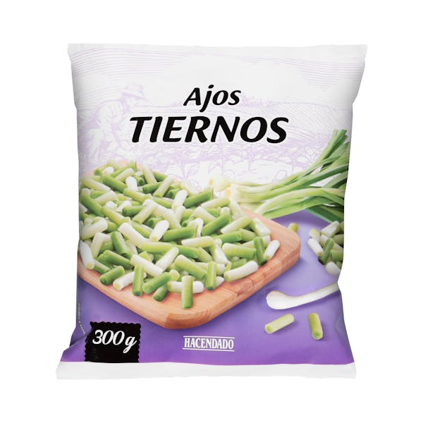

| | |
|---|---|
| **Formato** | Paquete 0.3kg |
| **Precio** | 2.05 € / ud. |
| **Ingredientes** | Ajos tiernos. |

**Beneficios nutricionales:** Fuente esencial de vitaminas, minerales, fibra y antioxidantes. Bajo en calorías y fundamental para la prevención de enfermedades crónicas. Al menos 5 raciones diarias.

---

### Filetes de merluza del Cabo sin piel Hacendado ultracongelados

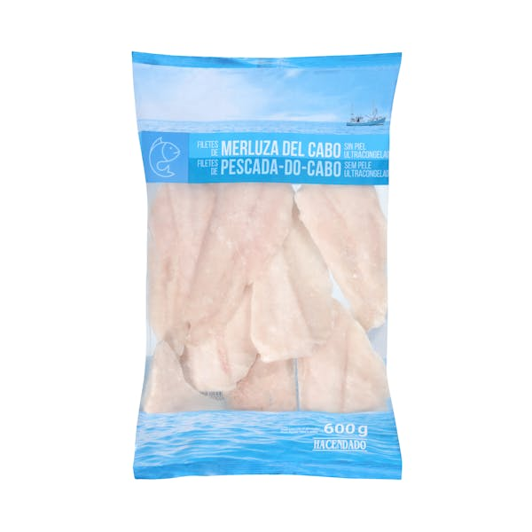

| | |
|---|---|
| **Formato** | Paquete |
| **Precio** | 5.70 € / ud. |
| **Origen** | España |
| **Ingredientes** | Merluza (pescado). Puede contener trazas de crustáceos y de moluscos. |

**Beneficios nutricionales:** Pescado blanco bajo en grasas, alto en proteínas de calidad. Aporta yodo, fósforo y vitaminas B. Muy fácil de digerir e ideal en dietas ligeras.

---

### Rodaja de emperador Hacendado ultracongelado

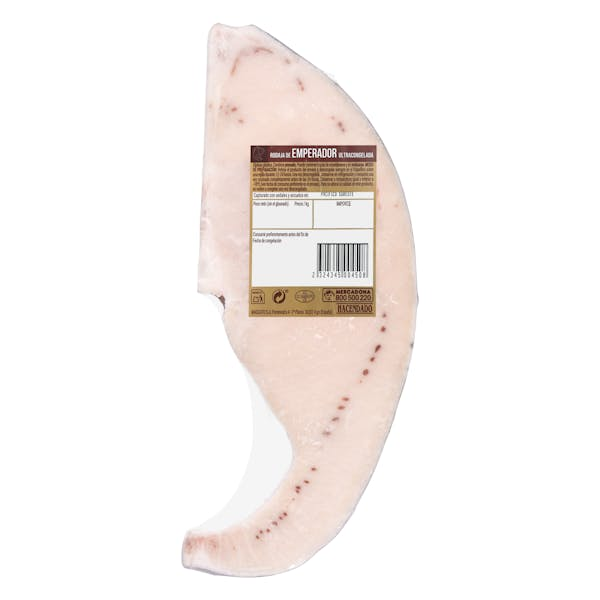

| | |
|---|---|
| **Formato** | Pieza |
| **Precio** | 4.47 € / ud. |
| **Origen** | España |
| **Ingredientes** | Pescado. |

**Beneficios nutricionales:** Proteína de alta calidad, bajo en grasas saturadas y rico en minerales como yodo, selenio y zinc. Consumir al menos 2-3 veces por semana según las recomendaciones dietéticas.

---

### Filetes de bacalao MareDeus ultracongelado

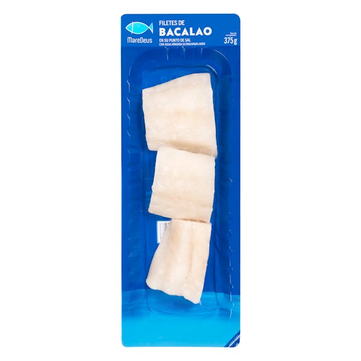

| | |
|---|---|
| **Formato** | Paquete |
| **Precio** | 7.80 € / ud. |
| **Origen** | Noruega/Rusia |
| **Ingredientes** | Bacalao (Gadus Morhua) 90%, agua 8% y sal 2%. |

**Beneficios nutricionales:** Proteína magra de alta biodisponibilidad, bajo en grasas y rico en vitamina B12, yodo y fósforo. El bacalao desalado es versátil y saciante.

---

### Tubo de pota Argentina limpio Hacendado congelado

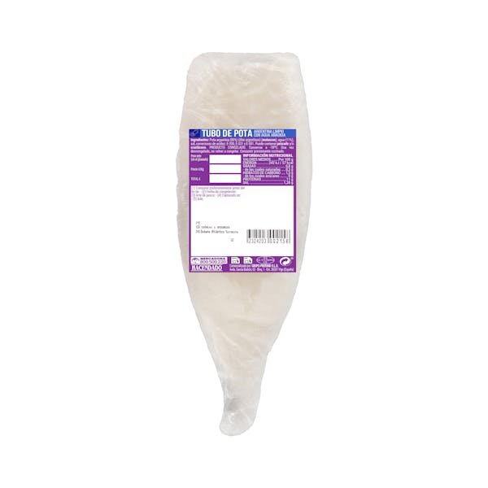

| | |
|---|---|
| **Formato** | Pieza |
| **Precio** | 1.50 € / ud. |
| **Origen** | España |
| **Ingredientes** | Pota argentina (89%) (Illex argentinus) (moluscos), agua (11%), sal, correctores de acidez: E-330, E-331 y E-501. Puede contener trazas pescado y/o crustáceos |

**Beneficios nutricionales:** Proteína de alta calidad, bajo en grasas saturadas y rico en minerales como yodo, selenio y zinc. Consumir al menos 2-3 veces por semana según las recomendaciones dietéticas.

---

### Sepia faraónica limpia Hacendado congelada

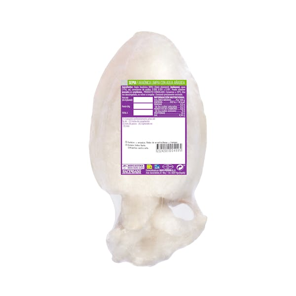

| | |
|---|---|
| **Formato** | Pieza |
| **Precio** | 6.40 € / ud. |
| **Origen** | España |
| **Ingredientes** | Sepia (89%) (Sepia officinalis) (moluscos), agua (11%), sal, correctores de acidez: E-330 y E-331. Puede contener pescado y/o crustáceos. / Sepia faraónica (89%) (Sepia pharaonis) (moluscos), agua (11%), sal, correctores de acidez: E-330, E-331 y E-501. Puede contener pescado y/o crustáceos. |

**Beneficios nutricionales:** Proteína de alta calidad, bajo en grasas saturadas y rico en minerales como yodo, selenio y zinc. Consumir al menos 2-3 veces por semana según las recomendaciones dietéticas.

---

### Filete de salmón rosado salvaje con piel Hacendado ultracongelado

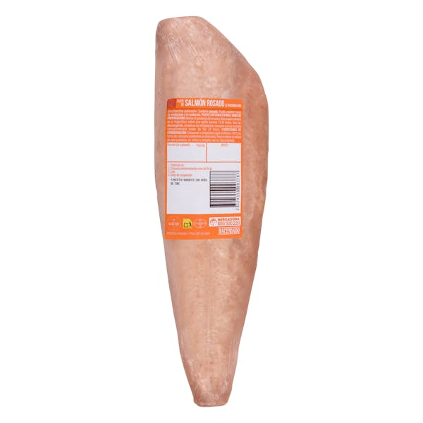

| | |
|---|---|
| **Formato** | Pieza |
| **Precio** | 4.05 € / ud. |
| **Origen** | España |
| **Ingredientes** | Filete de salmón. Puede contener trazas de crustáceos y de moluscos. |

**Beneficios nutricionales:** Pescado azul estrella: altísimo en omega-3 EPA y DHA, vitamina D, vitamina B12 y proteínas de alta calidad. Clave para la salud cardiovascular, el cerebro y el sistema inmune.

---

### Rodajas de emperador pequeñas Hacendado ultracongeladas

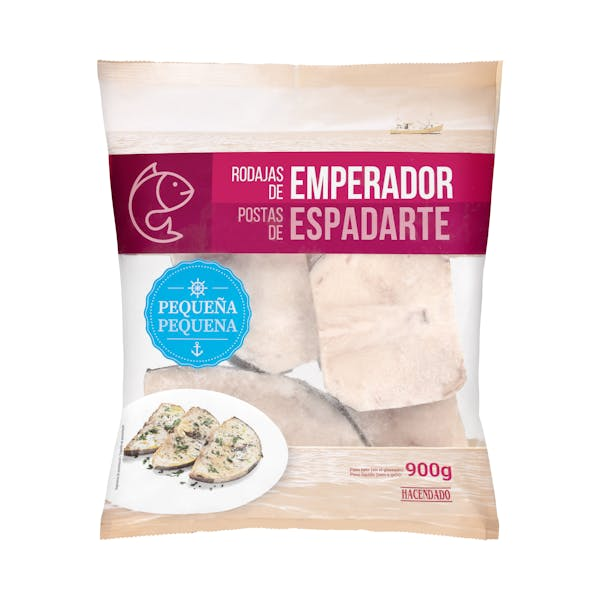

| | |
|---|---|
| **Formato** | Paquete |
| **Precio** | 12.95 € / ud. |
| **Origen** | FAO 21-27 / 34 / 41-47 / 51-57 / 81-87 |
| **Ingredientes** | Pez espada (pescado). Puede contener trazas de moluscos y/o crustaceos. |

**Beneficios nutricionales:** Proteína de alta calidad, bajo en grasas saturadas y rico en minerales como yodo, selenio y zinc. Consumir al menos 2-3 veces por semana según las recomendaciones dietéticas.

---

### Sepia faraónica troceada limpia Hacendado congelada

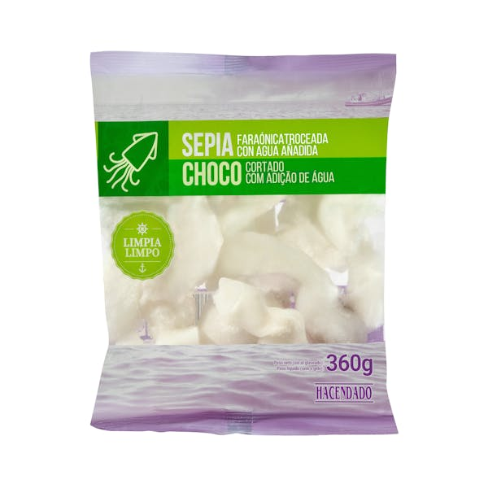

| | |
|---|---|
| **Formato** | Paquete |
| **Precio** | 6.00 € / ud. |
| **Origen** | España |
| **Ingredientes** | Sepias (86%) (Sepia spp) (moluscos), agua (14%), sal, reguladores de acidez: E-330 , E-331 y E-501 . Puede contener pescado y/o crustáceos |

**Beneficios nutricionales:** Proteína de alta calidad, bajo en grasas saturadas y rico en minerales como yodo, selenio y zinc. Consumir al menos 2-3 veces por semana según las recomendaciones dietéticas.

---

### Calamar troceado limpio Hacendado congelado

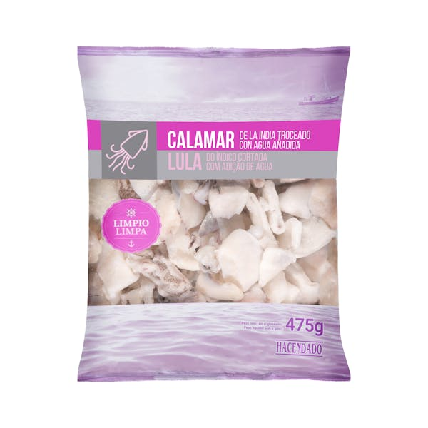

| | |
|---|---|
| **Formato** | Paquete |
| **Precio** | 6.00 € / ud. |
| **Origen** | España |
| **Ingredientes** | Calamares (Loligo spp) (88%) (moluscos), agua (12%), sal, correctores de acidez E-330, E-331. Puede contener pescado y/o crustáceos |

**Beneficios nutricionales:** Marisco bajo en grasa y calorías con alto contenido proteico. Fuente de zinc, cobre y vitamina B12. Su tinta contiene melanina con propiedades antioxidantes.

---

### Filetes de panga Hacendado ultracongelados

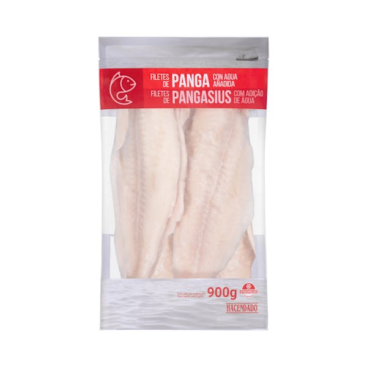

| | |
|---|---|
| **Formato** | Paquete |
| **Precio** | 4.75 € / ud. |
| **Origen** | Vietnam |
| **Ingredientes** | Filetes de Panga (Pangasianodon hypophthalmus) (Pescado) (78%), agua (21%), sal, estabilizadores (E451), correctores de la acidez (E331, E332). Puede contener espinas. |

**Beneficios nutricionales:** Proteína de alta calidad, bajo en grasas saturadas y rico en minerales como yodo, selenio y zinc. Consumir al menos 2-3 veces por semana según las recomendaciones dietéticas.

---

## 8. Conservas, Caldos y Cremas

Las conservas de calidad son aliadas de la cocina saludable. El atún y bonito en aceite de oliva, los berberechos al natural y el gazpacho concentran nutrientes sin procesado excesivo.

### Atún en aceite de oliva Hacendado

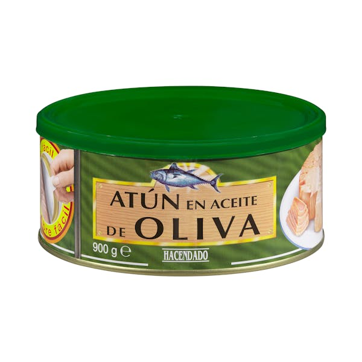

| | |
|---|---|
| **Formato** | Lata 0.9kg |
| **Precio** | 7.70 € / ud. |
| **Ingredientes** | Atún, aceite de oliva y sal |

**Beneficios nutricionales:** Fuente de grasas monoinsaturadas saludables. Aporta vitamina E y contribuye a reducir el colesterol LDL. Excelente para cocinar a temperaturas medias-altas.

---

### Atún claro en aceite de oliva Hacendado

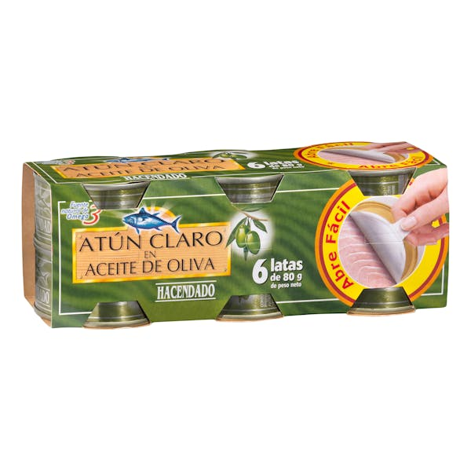

| | |
|---|---|
| **Formato** | Pack-6 0.48kg |
| **Precio** | 4.90 € / ud. |
| **Ingredientes** | Atún claro, aceite de oliva y sal. |

**Beneficios nutricionales:** Fuente de grasas monoinsaturadas saludables. Aporta vitamina E y contribuye a reducir el colesterol LDL. Excelente para cocinar a temperaturas medias-altas.

---

### Atún claro al natural Hacendado

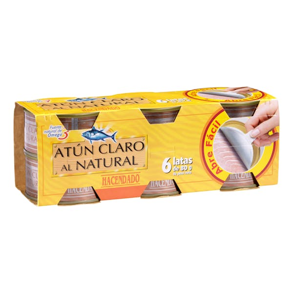

| | |
|---|---|
| **Formato** | 0.48kg |
| **Precio** | 4.20 € / ud. |
| **Ingredientes** | Atún claro, agua y sal |

**Beneficios nutricionales:** Proteína magra de alta calidad con bajo contenido en grasa saturada. Fuente de selenio, yodo y vitamina B3. El atún al natural conserva mejor todos sus nutrientes.

---

### Atún en salsa de tomate Hacendado

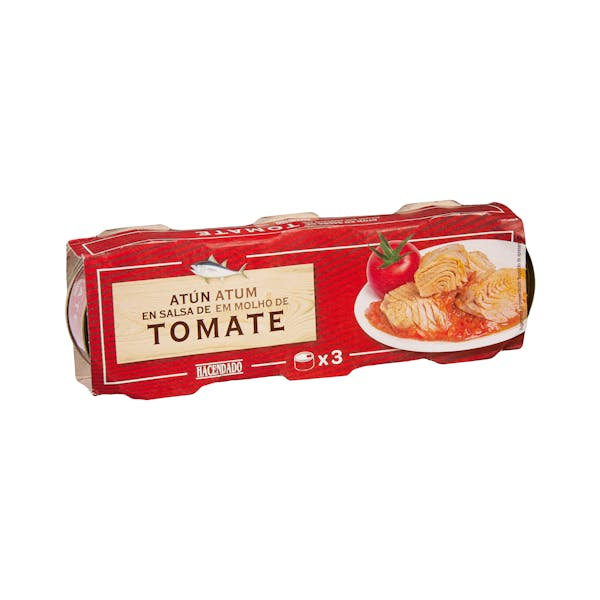

| | |
|---|---|
| **Formato** | Pack-3 0.24kg |
| **Precio** | 2.10 € / ud. |
| **Ingredientes** | Atum em Molho de Tomate |

**Beneficios nutricionales:** Proteína magra de alta calidad con bajo contenido en grasa saturada. Fuente de selenio, yodo y vitamina B3. El atún al natural conserva mejor todos sus nutrientes.

---

### Ventresca de atún claro en aceite de oliva Hacendado

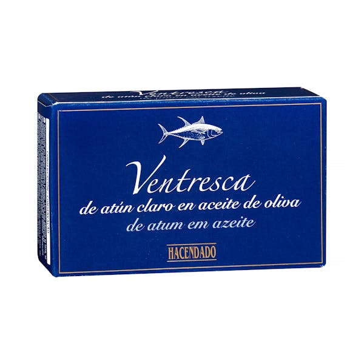

| | |
|---|---|
| **Formato** | Lata 0.111kg |
| **Precio** | 3.30 € / ud. |
| **Ingredientes** | Thunnus albacares |

**Beneficios nutricionales:** Fuente de grasas monoinsaturadas saludables. Aporta vitamina E y contribuye a reducir el colesterol LDL. Excelente para cocinar a temperaturas medias-altas.

---

### Migas de bonito del norte en aceite de oliva Hacendado

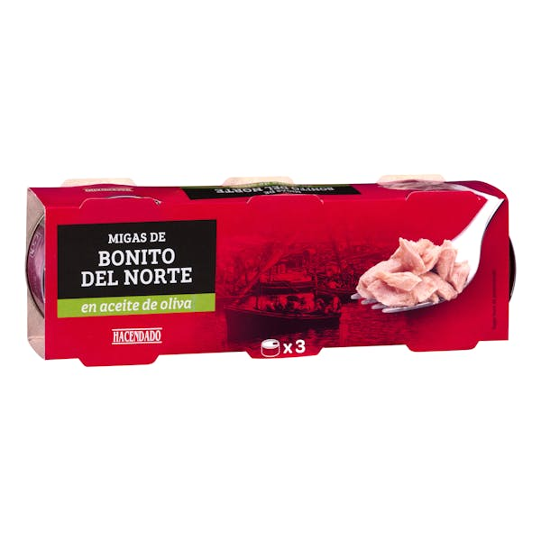

| | |
|---|---|
| **Formato** | Pack-3 0.24kg |
| **Precio** | 2.90 € / ud. |
| **Ingredientes** | Bonito del Norte ( Atún blanco-Thunnus alalunga ), aceite de oliva y sal |

**Beneficios nutricionales:** Fuente de grasas monoinsaturadas saludables. Aporta vitamina E y contribuye a reducir el colesterol LDL. Excelente para cocinar a temperaturas medias-altas.

---

### Bonito del norte en aceite de oliva Hacendado

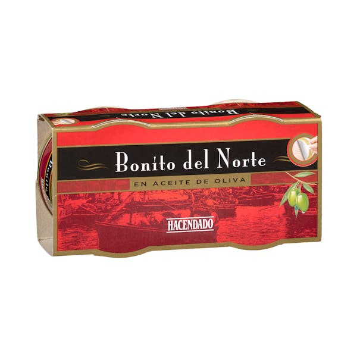

| | |
|---|---|
| **Formato** | Pack-2 0.222kg |
| **Precio** | 3.20 € / ud. |
| **Ingredientes** | Bonito del Norte ( Atún blanco - Thunnus alalunga ), aceite de oliva y sal |

**Beneficios nutricionales:** Fuente de grasas monoinsaturadas saludables. Aporta vitamina E y contribuye a reducir el colesterol LDL. Excelente para cocinar a temperaturas medias-altas.

---

### Filetes de bonito del norte en aceite de oliva Hacendado

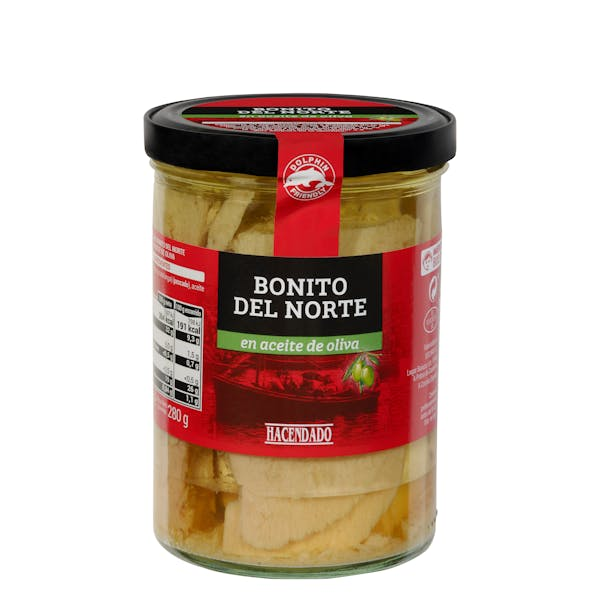

| | |
|---|---|
| **Formato** | Tarro 0.4kg |
| **Precio** | 8.10 € / ud. |
| **Ingredientes** | Bonito del Norte (Atún blanco-Thunnus alalunga), aceite de oliva y sal |

**Beneficios nutricionales:** Fuente de grasas monoinsaturadas saludables. Aporta vitamina E y contribuye a reducir el colesterol LDL. Excelente para cocinar a temperaturas medias-altas.

---

### Filetes de caballa del sur en aceite de oliva Hacendado

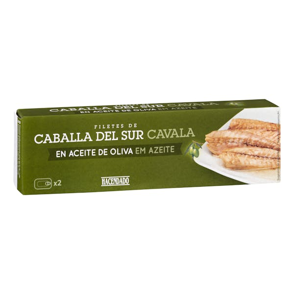

| | |
|---|---|
| **Formato** | Pack-2 0.24kg |
| **Precio** | 2.70 € / ud. |
| **Ingredientes** | Caballa del sur (pescado) (71%), aceite de oliva (28%) y sal. |

**Beneficios nutricionales:** Fuente de grasas monoinsaturadas saludables. Aporta vitamina E y contribuye a reducir el colesterol LDL. Excelente para cocinar a temperaturas medias-altas.

---

### Filetes de caballa del sur contenido reducido en sal Hacendado en aceite de oliva

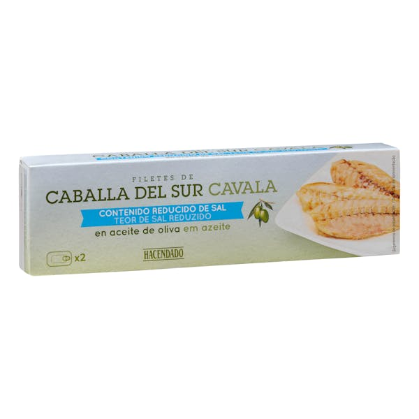

| | |
|---|---|
| **Formato** | 0.24kg |
| **Precio** | 3.20 € / ud. |
| **Ingredientes** | Caballa del sur (pescado) (71%) y aceite de oliva (29%). |

**Beneficios nutricionales:** Fuente de grasas monoinsaturadas saludables. Aporta vitamina E y contribuye a reducir el colesterol LDL. Excelente para cocinar a temperaturas medias-altas.

---

### Filetes de melva en aceite de oliva Hacendado

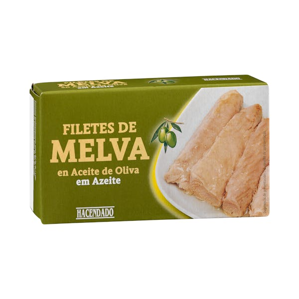

| | |
|---|---|
| **Formato** | Lata 0.12kg |
| **Precio** | 1.85 € / ud. |
| **Origen** | Cabo Verde |
| **Ingredientes** | Melva (pescado) (66%), aceite de oliva (33%) y sal. |

**Beneficios nutricionales:** Fuente de grasas monoinsaturadas saludables. Aporta vitamina E y contribuye a reducir el colesterol LDL. Excelente para cocinar a temperaturas medias-altas.

---

### Berberecho al natural XS Hacendado

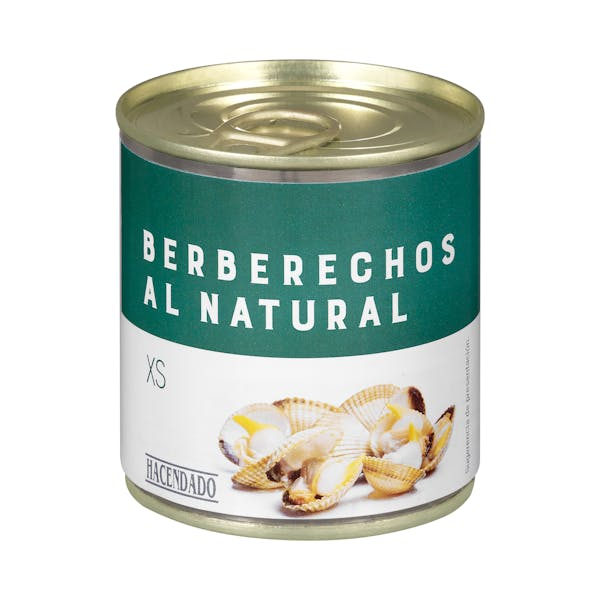

| | |
|---|---|
| **Formato** | Lata 0.185kg |
| **Precio** | 3.20 € / ud. |
| **Ingredientes** | Berberechos (moluscos), agua y sal. Puede contener trazas de pescado y crustáceos. |

**Beneficios nutricionales:** Marisco excepcional: proteína magra, hierro de alta biodisponibilidad, zinc y vitamina B12. Bajo en calorías y muy nutritivo. El hierro del mejillón se absorbe mejor que el vegetal.

---

### Berberechos al natural S Hacendado

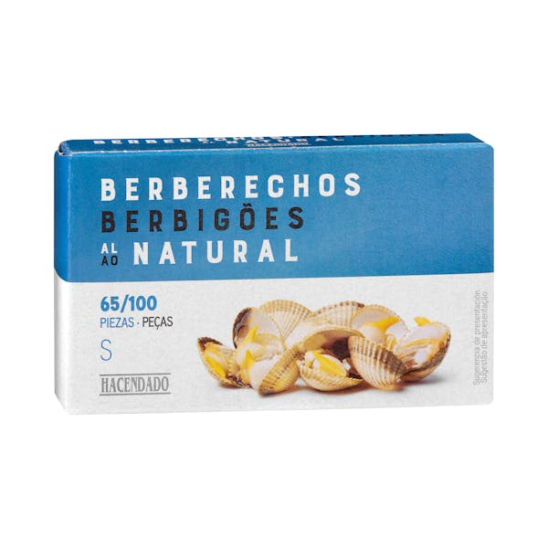

| | |
|---|---|
| **Formato** | Lata 0.111kg |
| **Precio** | 3.00 € / ud. |
| **Ingredientes** | Berberechos (moluscos), agua y sal. Puede contener trazas de pescado y crustáceos. |

**Beneficios nutricionales:** Marisco excepcional: proteína magra, hierro de alta biodisponibilidad, zinc y vitamina B12. Bajo en calorías y muy nutritivo. El hierro del mejillón se absorbe mejor que el vegetal.

---

### Almejones al natural Hacendado

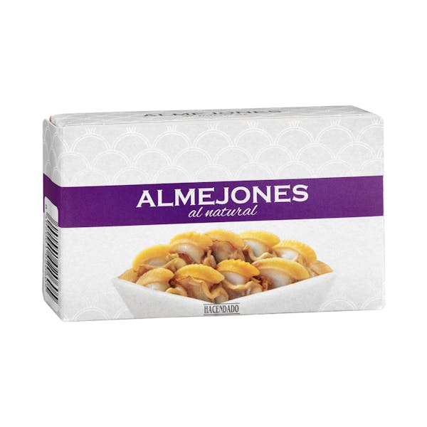

| | |
|---|---|
| **Formato** | Lata 0.111kg |
| **Precio** | 1.20 € / ud. |
| **Ingredientes** | Almejones (Moluscos), agua y sal. Puede contener trazas de pescado y crustáceo. |

**Beneficios nutricionales:** Alimento de calidad con importantes propiedades nutricionales. Incluirlo regularmente en una dieta variada y equilibrada contribuye al bienestar general.

---

### Mejillones al natural Hacendado pequeños

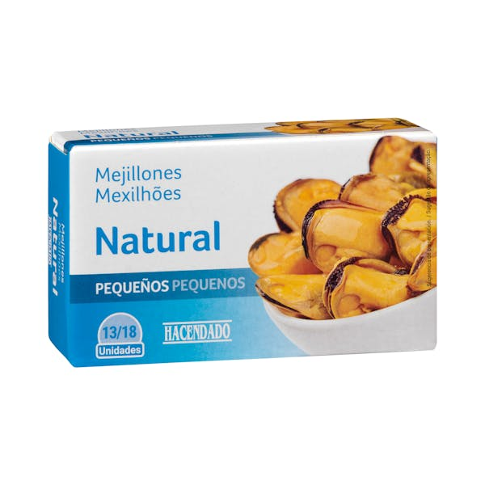

| | |
|---|---|
| **Formato** | Lata 0.111kg |
| **Precio** | 2.00 € / ud. |
| **Origen** | España |
| **Ingredientes** | Mejillones chilenos (Mythilus chilensis) (moluscos), agua y sal. Puede contener trazas de pescado y crustáceos. |

**Beneficios nutricionales:** Alimento de calidad con importantes propiedades nutricionales. Incluirlo regularmente en una dieta variada y equilibrada contribuye al bienestar general.

---

### Gazpacho tradicional Hacendado

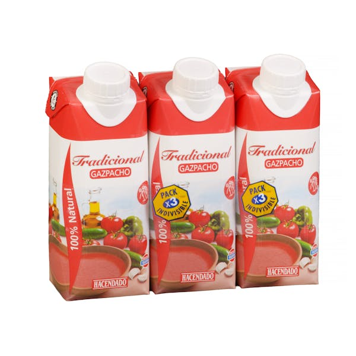

| | |
|---|---|
| **Formato** | Pack-3 0.99l |
| **Precio** | 2.20 € / ud. |
| **Ingredientes** | Hortalizas frescas 92% (Tomate, pimiento y pepino), agua,  aceite de oliva virgen extra (2,2%), vinagre de vino, sal y ajo. |

**Beneficios nutricionales:** El gazpacho es un superalimento líquido: tomate, aceite de oliva, ajo, pimiento, pepino y vinagre combinan licopeno, vitamina C, E y antioxidantes. Hidratante y bajo en calorías.

---

### Salmorejo al estilo cordobés Hacendado

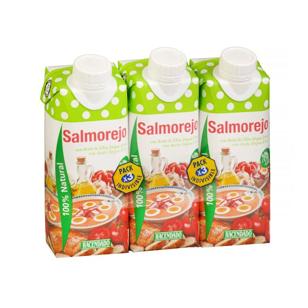

| | |
|---|---|
| **Formato** | Pack-3 0.99l |
| **Precio** | 2.70 € / ud. |
| **Ingredientes** | Tomate, agua, aceite de oliva virgen extra (6%), pan rallado (contiene trigo), pimiento, sal, vinagre de Jerez Reserva y ajo |

**Beneficios nutricionales:** Versión más densa del gazpacho, rico en licopeno, vitamina C y antioxidantes del tomate. El AOVE añade grasas saludables y potencia la absorción de licopeno.

---

### Gazpacho fresco Hacendado

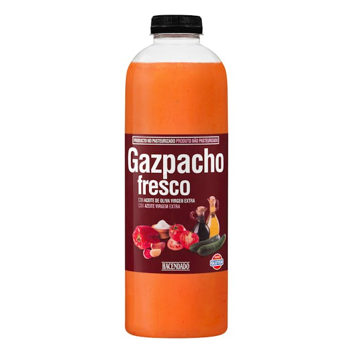

| | |
|---|---|
| **Formato** | Botella 1l |
| **Precio** | 2.75 € / ud. |
| **Ingredientes** | Tomate, agua, aceite de oliva virgen extra (7%), pimiento, pepino, vinagre de vino, sal y ajo. |

**Beneficios nutricionales:** El gazpacho es un superalimento líquido: tomate, aceite de oliva, ajo, pimiento, pepino y vinagre combinan licopeno, vitamina C, E y antioxidantes. Hidratante y bajo en calorías.

---

### Salmorejo fresco Hacendado

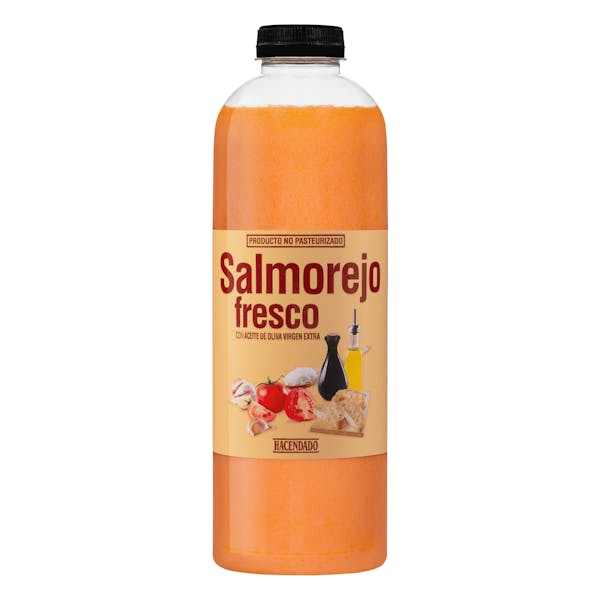

| | |
|---|---|
| **Formato** | Botella 1l |
| **Precio** | 3.10 € / ud. |
| **Ingredientes** | Tomate, agua, aceite de oliva virgen extra (6%), pan, vinagre de vino, sal y ajo. |

**Beneficios nutricionales:** Versión más densa del gazpacho, rico en licopeno, vitamina C y antioxidantes del tomate. El AOVE añade grasas saludables y potencia la absorción de licopeno.

---

### Crema de calabaza y zanahoria Hacendado

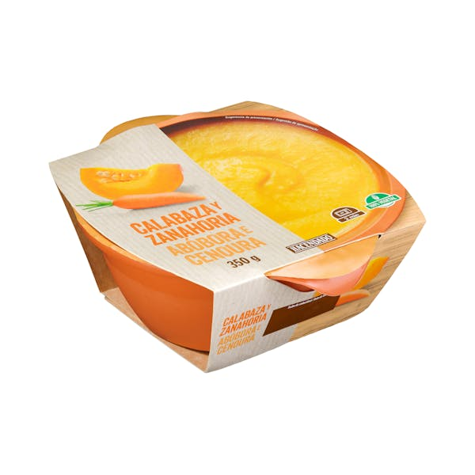

| | |
|---|---|
| **Formato** | Bol 0.35kg |
| **Precio** | 1.70 € / ud. |
| **Origen** | Italia |
| **Ingredientes** | Agua, calabaza 24%, zanahoria 17%, patata, puerro, jugo de soja (agua, semilla de soja libre de OGM, sal), aceite de oliva, sal, especias, aroma natural. |

**Beneficios nutricionales:** Excepcional fuente de beta-caroteno (provitamina A) para la salud ocular, inmune y cutánea. Rica en fibra y antioxidantes. Se absorbe mejor cocinada con grasa.

---

### Crema de espárragos Hacendado

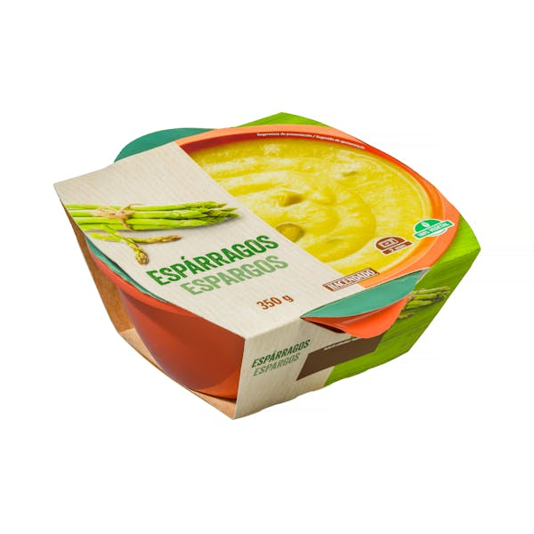

| | |
|---|---|
| **Formato** | Bol 0.35kg |
| **Precio** | 1.70 € / ud. |
| **Origen** | Italia |
| **Ingredientes** | Agua, patata, espárragos 23%, bebida de soja (agua, semillas de soja libres de OGM, sal), aceite de oliva, puerro, sal, aromas. Puede contener trazas de gluten, frutos de cáscara, leche, apio y huevo. |

**Beneficios nutricionales:** Alimento de calidad con importantes propiedades nutricionales. Incluirlo regularmente en una dieta variada y equilibrada contribuye al bienestar general.

---

### Crema de verduras Hacendado

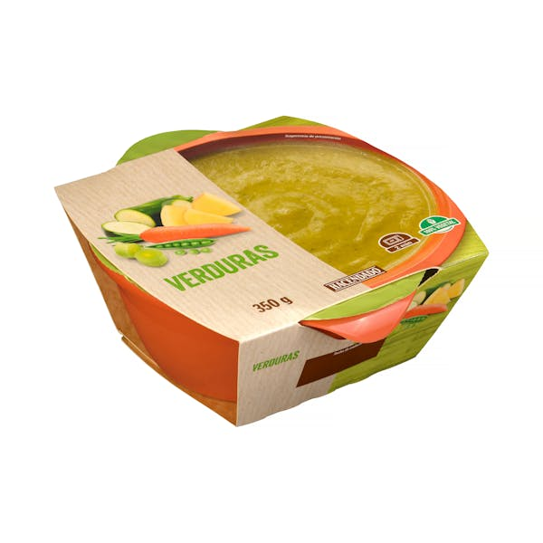

| | |
|---|---|
| **Formato** | Bol 0.35kg |
| **Precio** | 1.70 € / ud. |
| **Ingredientes** | Verduras 48% (verduras en proporción variable: patata, zanahoria, calabacín, calabaza, acelga, puerro, judía verde, berza), agua, guisante, aceite de oliva virgen extra, sal. |

**Beneficios nutricionales:** Las cremas de verduras son una forma práctica de consumir vegetales con todos sus nutrientes. Ricas en betacarotenos, vitamina C y fibra. Bajas en calorías y muy saciantes.

---

### Crema de pollo Hacendado con verduras

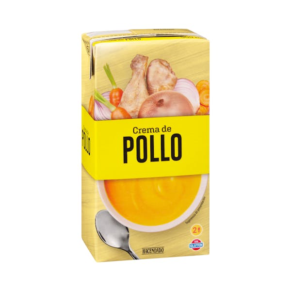

| | |
|---|---|
| **Formato** | Brik 0.5l |
| **Precio** | 1.00 € / ud. |
| **Ingredientes** | Agua, hortalizas 38,6% (patata, cebolla y zanahoria), pollo 2,3%, aceite de oliva, mantequilla, almidón modificado de maíz, sal, extracto de levadura, azúcar y aromas (contienen apio). |

**Beneficios nutricionales:** Proteína magra de alta calidad y bajo contenido en grasa saturada. Rica en vitaminas B3 y B6, fósforo y selenio. Base de cualquier dieta equilibrada y especialmente recomendada para deportistas.

---

### Tomate triturado Hacendado

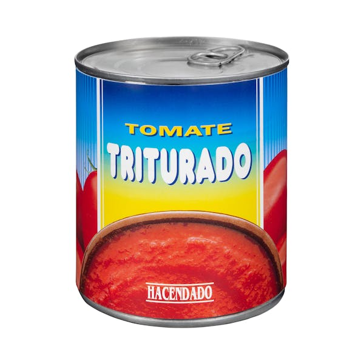

| | |
|---|---|
| **Formato** | Bote 0.8kg |
| **Precio** | 1.00 € / ud. |
| **Origen** | Producto de España |
| **Ingredientes** | Tomate, sal, azúcar, acidulante: ácido cítrico. |

**Beneficios nutricionales:** Rico en licopeno (potente antioxidante), vitamina C y potasio. El licopeno aumenta su biodisponibilidad con el cocinado y el aceite de oliva.

---

### Tomate troceado pelado Hacendado

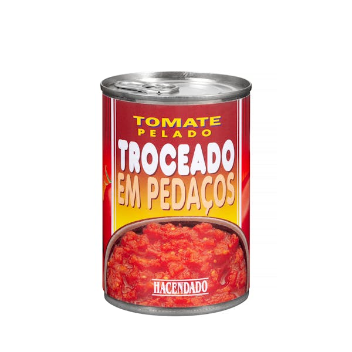

| | |
|---|---|
| **Formato** | Bote 0.41kg |
| **Precio** | 0.80 € / ud. |
| **Origen** | Producto de España |
| **Ingredientes** | Tomate, sal, acidulante: ácido cítrico, endurecedor: cloruro cálcico. |

**Beneficios nutricionales:** Rico en licopeno (potente antioxidante), vitamina C y potasio. El licopeno aumenta su biodisponibilidad con el cocinado y el aceite de oliva.

---

### Tomate doble concentrado Hacendado extra

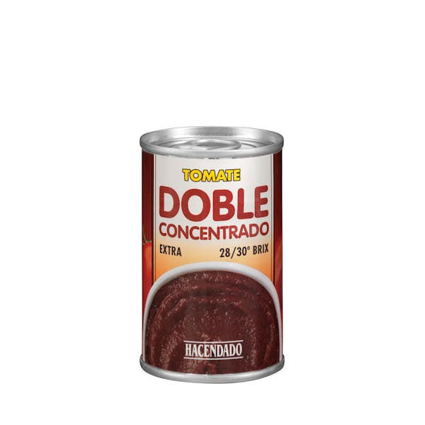

| | |
|---|---|
| **Formato** | Bote 0.17kg |
| **Precio** | 1.05 € / ud. |
| **Origen** | Producto de España |
| **Ingredientes** | Tomate concentrado y sal (0,5%). |

**Beneficios nutricionales:** Rico en licopeno (potente antioxidante), vitamina C y potasio. El licopeno aumenta su biodisponibilidad con el cocinado y el aceite de oliva.

---

### Tomate tamizado sin piel Hacendado

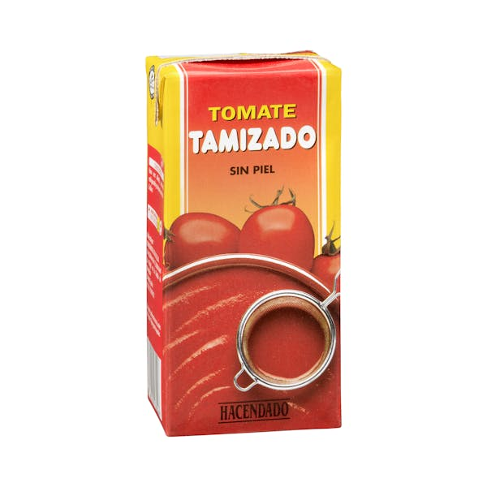

| | |
|---|---|
| **Formato** | Brik 0.39kg |
| **Precio** | 0.90 € / ud. |
| **Origen** | Producto de España |
| **Ingredientes** | Tomate tamizado y acidulante: ácido cítrico |

**Beneficios nutricionales:** Rico en licopeno (potente antioxidante), vitamina C y potasio. El licopeno aumenta su biodisponibilidad con el cocinado y el aceite de oliva.

---

### Maíz dulce Hacendado

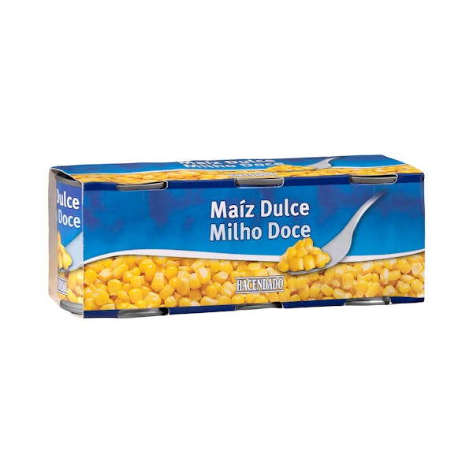

| | |
|---|---|
| **Formato** | Pack-3 0.45kg |
| **Precio** | 1.55 € / ud. |
| **Origen** | España |
| **Ingredientes** | Maíz dulce, agua y sal. |

**Beneficios nutricionales:** Alimento de calidad con importantes propiedades nutricionales. Incluirlo regularmente en una dieta variada y equilibrada contribuye al bienestar general.

---

### Espárragos blancos medianos Hacendado

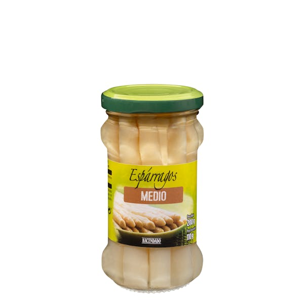

| | |
|---|---|
| **Formato** | Tarro 0.2kg |
| **Precio** | 1.50 € / ud. |
| **Origen** | Producto originario de China o Perú |
| **Ingredientes** | Espárragos, agua, sal, azúcar. Antoxidantes: ácido cítrico y ácido ascórbico (vitamina C). |

**Beneficios nutricionales:** Alimento de calidad con importantes propiedades nutricionales. Incluirlo regularmente en una dieta variada y equilibrada contribuye al bienestar general.

---

### Pimientos rojos asados Hacendado en tiras extra

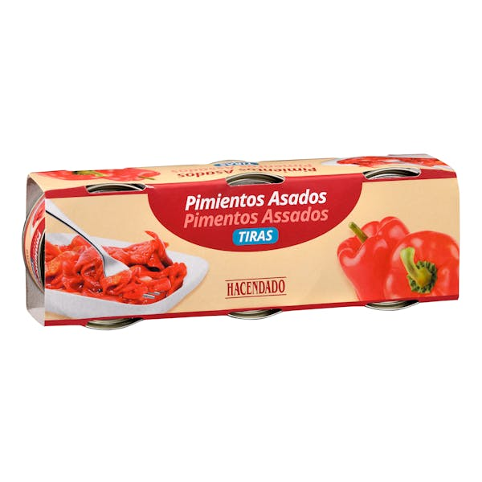

| | |
|---|---|
| **Formato** | Pack-3 0.24kg |
| **Precio** | 1.35 € / ud. |
| **Origen** | Producto de Perú |
| **Ingredientes** | Pimientos, agua, azúcar, sal y acidulante: ácido cítrico. |

**Beneficios nutricionales:** Alimento de calidad con importantes propiedades nutricionales. Incluirlo regularmente en una dieta variada y equilibrada contribuye al bienestar general.

---

### Guisantes extra Hacendado

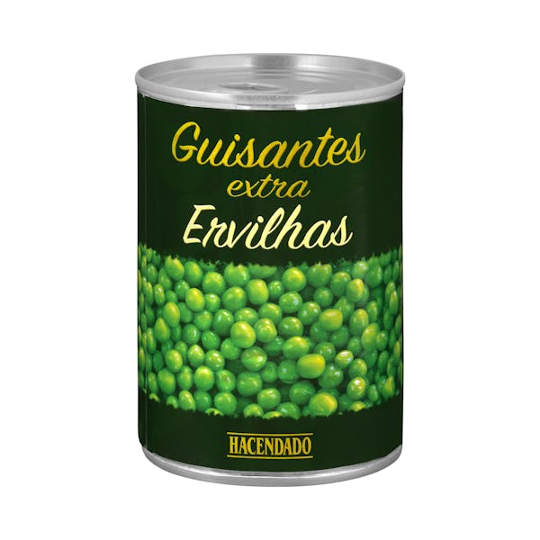

| | |
|---|---|
| **Formato** | Bote 0.39kg |
| **Precio** | 0.95 € / ud. |
| **Origen** | Producto de España |
| **Ingredientes** | Guisantes, agua, azúcar y sal |

**Beneficios nutricionales:** Alimento de calidad con importantes propiedades nutricionales. Incluirlo regularmente en una dieta variada y equilibrada contribuye al bienestar general.

---

### Judías verdes redondas Hacendado

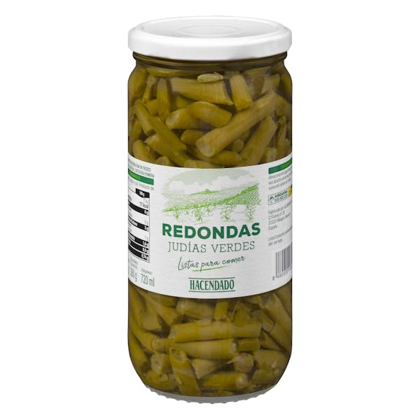

| | |
|---|---|
| **Formato** | Tarro 0.66kg |
| **Precio** | 1.20 € / ud. |
| **Origen** | Milagro- Navarra |
| **Ingredientes** | Judia verde, agua y sal |

**Beneficios nutricionales:** Ricas en proteína vegetal, fibra, potasio y magnesio. Reducen el colesterol y estabilizan el azúcar en sangre. Fuente de folato esencial para el embarazo.

---

### Patatas cocidas Hacendado

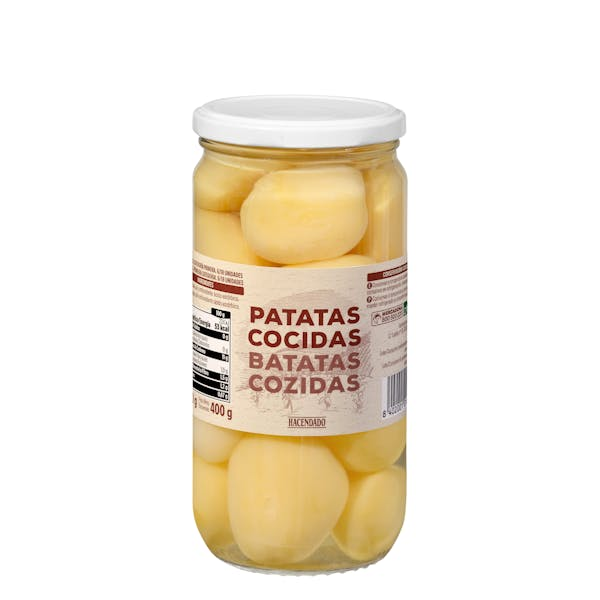

| | |
|---|---|
| **Formato** | Tarro 0.66kg |
| **Precio** | 1.90 € / ud. |
| **Ingredientes** | Patatas, agua, sal y antioxidante; ácido ascórbico |

**Beneficios nutricionales:** Alimento de calidad con importantes propiedades nutricionales. Incluirlo regularmente en una dieta variada y equilibrada contribuye al bienestar general.

---

### Palmito al natural entero Hacendado

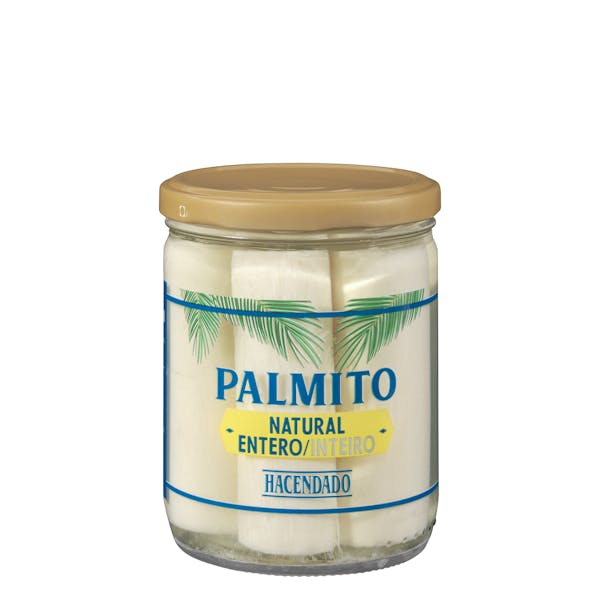

| | |
|---|---|
| **Formato** | Tarro 0.41kg |
| **Precio** | 2.65 € / ud. |
| **Origen** | Costa Rica |
| **Ingredientes** | Corazones de palmito, agua, sal y ácido cítrico como acidulante. |

**Beneficios nutricionales:** Alimento de calidad con importantes propiedades nutricionales. Incluirlo regularmente en una dieta variada y equilibrada contribuye al bienestar general.

---

### Caldo de pollo casero Gallina Blanca

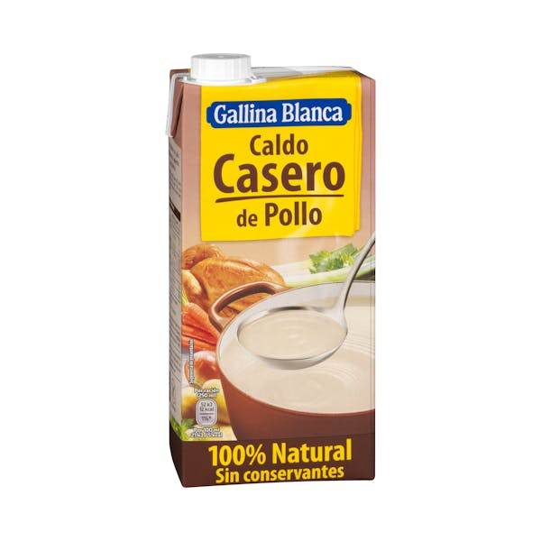

| | |
|---|---|
| **Formato** | Brik 1l |
| **Precio** | 2.20 € / ud. |
| **Origen** | España |
| **Ingredientes** | Agua, pollo (14%), APIO (0,5%), patata (0,4%), cebolla (0,2%), zanahoria (0,2%), puerro (0,2%), grasa de cerdo, aromas naturales (contienen HUEVO y APIO), sal, especias. |

**Beneficios nutricionales:** Proteína magra de alta calidad y bajo contenido en grasa saturada. Rica en vitaminas B3 y B6, fósforo y selenio. Base de cualquier dieta equilibrada y especialmente recomendada para deportistas.

---

## 9. Carne, Pescado y Huevos

Proteínas animales completas con todos los aminoácidos esenciales. El pescado azul aporta omega-3 EPA/DHA. El pollo y pavo son proteínas magras ideales. El huevo es el alimento proteico de referencia. La ternera magra aporta hierro hem de alta absorción.

### Filetes pechuga de pavo

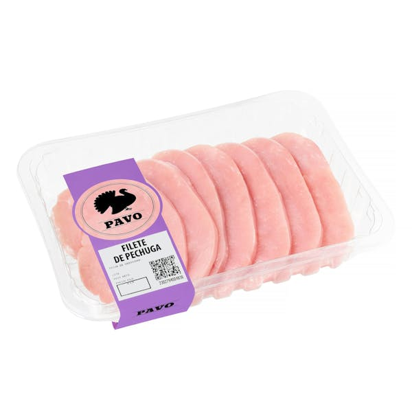

| | |
|---|---|
| **Formato** | Bandeja 0.59kg |
| **Precio** | 5.16 € / ud. |
| **Origen** | España |
| **Ingredientes** | Pavo |

**Beneficios nutricionales:** Proteína magra de alta calidad y bajo contenido en grasa saturada. Rica en vitaminas B3 y B6, fósforo y selenio. Base de cualquier dieta equilibrada y especialmente recomendada para deportistas.

---

### Chuletas de pavo contramuslo

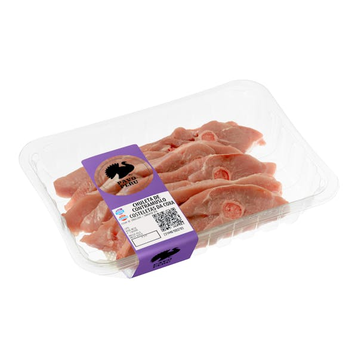

| | |
|---|---|
| **Formato** | Bandeja 0.46kg |
| **Precio** | 3.45 € / ud. |
| **Ingredientes** | Preparado de carne. Ingredientes: Pierna de pavo (99%) y aroma natural. |

**Beneficios nutricionales:** Proteína magra de alta calidad y bajo contenido en grasa saturada. Rica en vitaminas B3 y B6, fósforo y selenio. Base de cualquier dieta equilibrada y especialmente recomendada para deportistas.

---

### Tacos de pavo

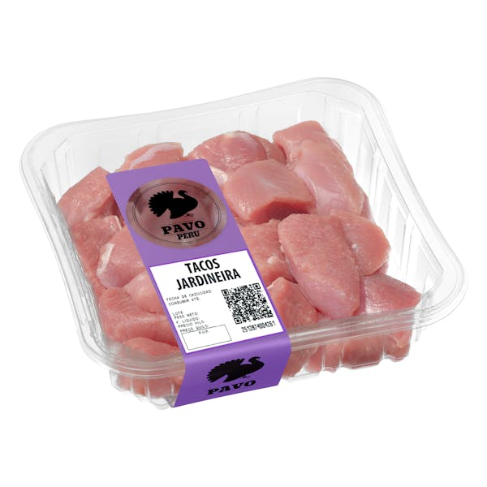

| | |
|---|---|
| **Formato** | Bandeja 0.57kg |
| **Precio** | 4.16 € / ud. |
| **Ingredientes** | PAVO A TACOS |

**Beneficios nutricionales:** Proteína magra de alta calidad y bajo contenido en grasa saturada. Rica en vitaminas B3 y B6, fósforo y selenio. Base de cualquier dieta equilibrada y especialmente recomendada para deportistas.

---

### Filetes pechuga de pollo

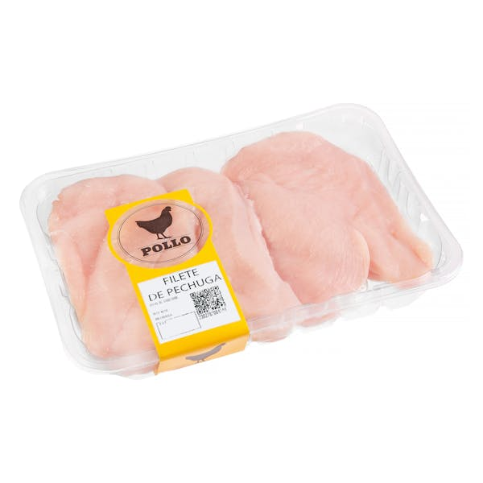

| | |
|---|---|
| **Formato** | Bandeja 0.56kg |
| **Precio** | 4.09 € / ud. |
| **Origen** | Planta de sacrificio Hijos de Juan Pujante, S.A. ubicada en España |
| **Ingredientes** | FILETE DE PECHUGA DE POLLO |

**Beneficios nutricionales:** Proteína magra de alta calidad y bajo contenido en grasa saturada. Rica en vitaminas B3 y B6, fósforo y selenio. Base de cualquier dieta equilibrada y especialmente recomendada para deportistas.

---

### Contramuslos de pollo deshuesados y sin piel

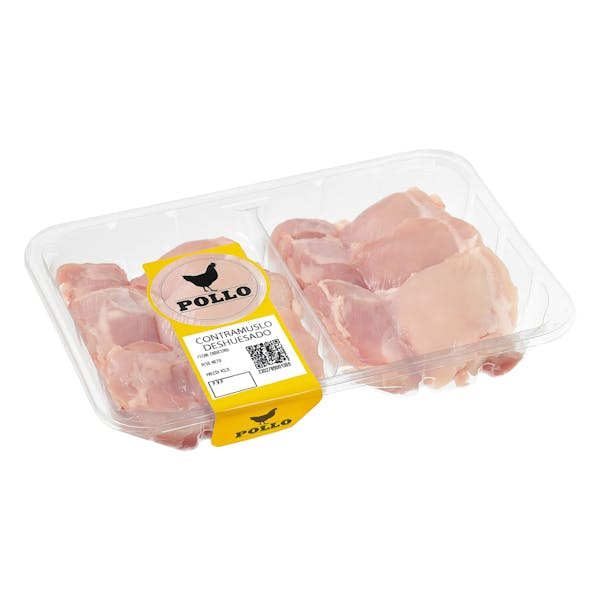

| | |
|---|---|
| **Formato** | Bandeja 0.55kg |
| **Precio** | 3.58 € / ud. |
| **Ingredientes** | CONTRAMUSLO DE POLLO (100%) |

**Beneficios nutricionales:** Proteína magra de alta calidad y bajo contenido en grasa saturada. Rica en vitaminas B3 y B6, fósforo y selenio. Base de cualquier dieta equilibrada y especialmente recomendada para deportistas.

---

### Burger de pollo

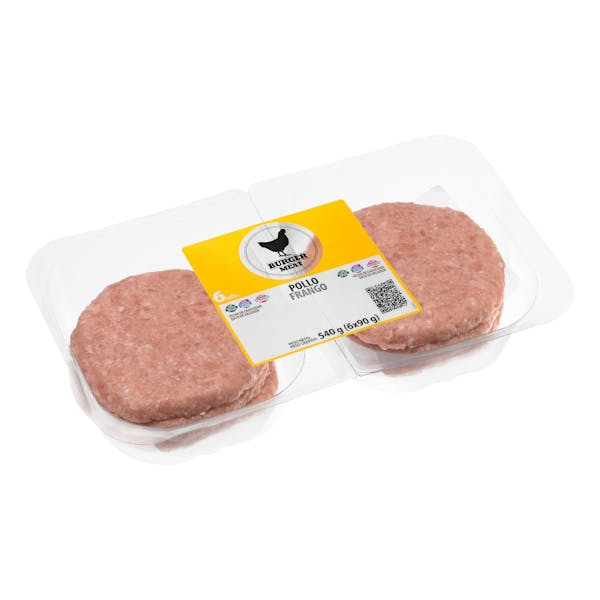

| | |
|---|---|
| **Formato** | Bandeja 0.54kg |
| **Precio** | 3.95 € / ud. |
| **Ingredientes** | Carne de pollo 90%, agua, vegetales (arroz), fibra vegetal, especias, aromas, sal, antioxidantes (E-301, E-331), conservador (E-221) (sulfito), colorante (E-120). Contiene trazas de soja y pavo. |

**Beneficios nutricionales:** Proteína magra de alta calidad y bajo contenido en grasa saturada. Rica en vitaminas B3 y B6, fósforo y selenio. Base de cualquier dieta equilibrada y especialmente recomendada para deportistas.

---

### Burger de pollo gruesa

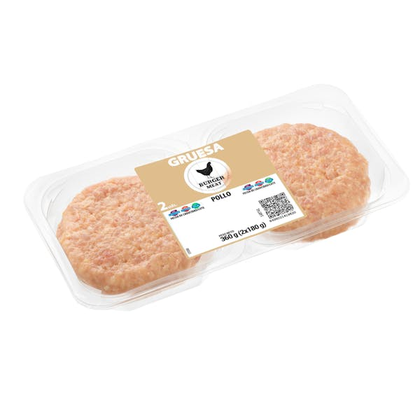

| | |
|---|---|
| **Formato** | Bandeja 0.36kg |
| **Precio** | 3.20 € / ud. |
| **Ingredientes** | Carne de pollo 91%, arroz (4%), agua, sal, antioxidantes (E-301, E-331), extractos de vegetales, pimienta molida y conservador (E-221) (sulfito). |

**Beneficios nutricionales:** Proteína magra de alta calidad y bajo contenido en grasa saturada. Rica en vitaminas B3 y B6, fósforo y selenio. Base de cualquier dieta equilibrada y especialmente recomendada para deportistas.

---

### Mini burgers de pollo

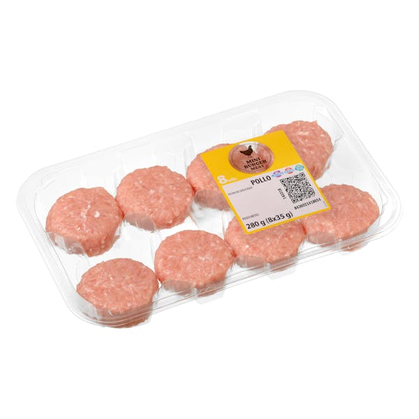

| | |
|---|---|
| **Formato** | Bandeja 0.28kg |
| **Precio** | 2.90 € / ud. |
| **Ingredientes** | Carne de pollo 90%, agua, vegetales (arroz), fibra vegetal (contiene guisante), especias, aromas, sal, antioxidantes (E-301, E-331), conservador (E-221) (sulfito), colorante (E-120). Contiene trazas de pavo. |

**Beneficios nutricionales:** Proteína magra de alta calidad y bajo contenido en grasa saturada. Rica en vitaminas B3 y B6, fósforo y selenio. Base de cualquier dieta equilibrada y especialmente recomendada para deportistas.

---

### Salmón a rodajas

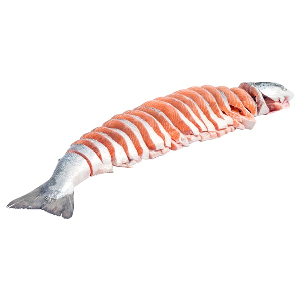

| | |
|---|---|
| **Formato** | Pieza 3.47kg |
| **Precio** | 41.47 € / ud. |
| **Ingredientes** | — |

**Beneficios nutricionales:** Pescado azul estrella: altísimo en omega-3 EPA y DHA, vitamina D, vitamina B12 y proteínas de alta calidad. Clave para la salud cardiovascular, el cerebro y el sistema inmune.

---

### Dorada limpia con cabeza

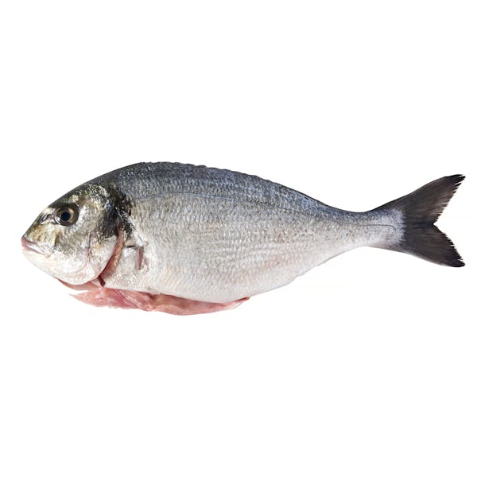

| | |
|---|---|
| **Formato** | Pieza 0.63kg |
| **Precio** | 6.27 € / ud. |
| **Ingredientes** | — |

**Beneficios nutricionales:** Pescado semigraso con buen aporte de omega-3, proteínas de calidad, yodo y fósforo. Su contenido en vitamina D lo hace valioso para huesos y sistema inmune.

---

### Dorada abierta a la espalda con espinas y con cabeza

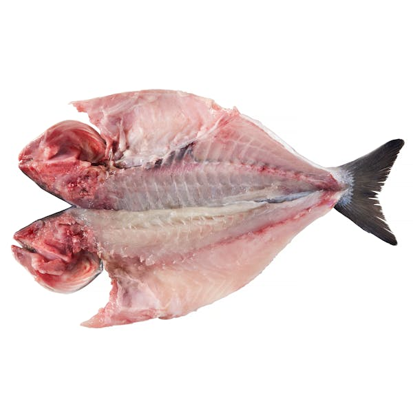

| | |
|---|---|
| **Formato** | Pieza 0.63kg |
| **Precio** | 6.27 € / ud. |
| **Ingredientes** | — |

**Beneficios nutricionales:** Pescado semigraso con buen aporte de omega-3, proteínas de calidad, yodo y fósforo. Su contenido en vitamina D lo hace valioso para huesos y sistema inmune.

---

### Dorada a filetes sin cabeza y sin espina

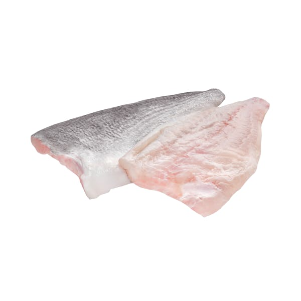

| | |
|---|---|
| **Formato** | Pieza 0.63kg |
| **Precio** | 6.27 € / ud. |
| **Ingredientes** | — |

**Beneficios nutricionales:** Pescado semigraso con buen aporte de omega-3, proteínas de calidad, yodo y fósforo. Su contenido en vitamina D lo hace valioso para huesos y sistema inmune.

---

### Dorada abierta en libro sin cabeza y sin espina

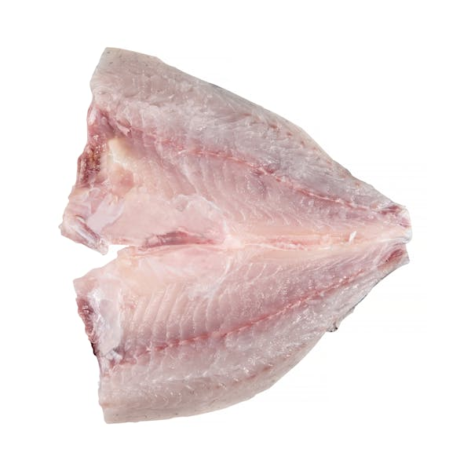

| | |
|---|---|
| **Formato** | Pieza 0.63kg |
| **Precio** | 6.27 € / ud. |
| **Ingredientes** | — |

**Beneficios nutricionales:** Pescado semigraso con buen aporte de omega-3, proteínas de calidad, yodo y fósforo. Su contenido en vitamina D lo hace valioso para huesos y sistema inmune.

---

### Dorada sin limpiar

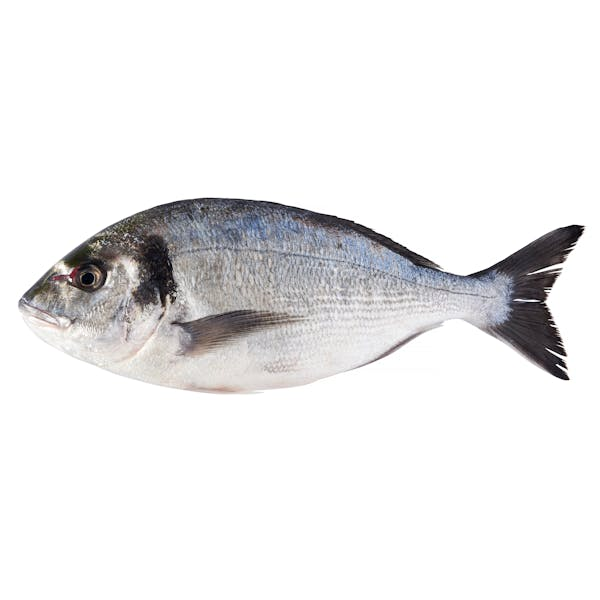

| | |
|---|---|
| **Formato** | Pieza 0.63kg |
| **Precio** | 6.27 € / ud. |
| **Ingredientes** | — |

**Beneficios nutricionales:** Pescado semigraso con buen aporte de omega-3, proteínas de calidad, yodo y fósforo. Su contenido en vitamina D lo hace valioso para huesos y sistema inmune.

---

### Filetes de anchoa en aceite de oliva Hacendado

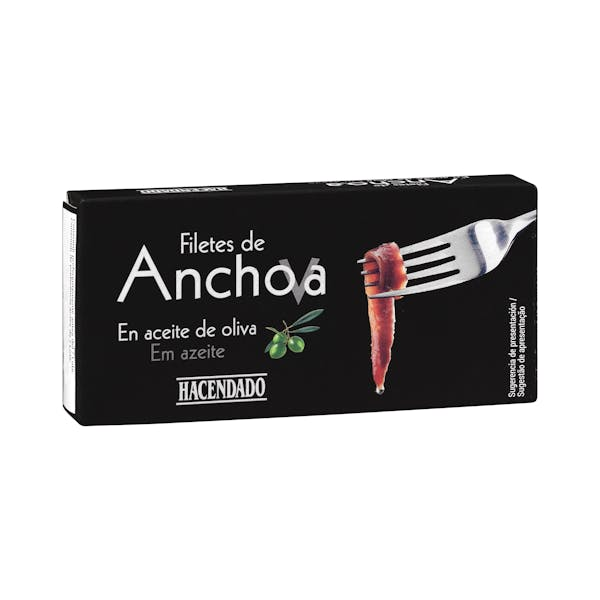

| | |
|---|---|
| **Formato** | Lata 0.042kg |
| **Precio** | 1.30 € / ud. |
| **Ingredientes** | Anchoa (PESCADO) (Engraulis encrasicolus), aceite de oliva y sal. Puede contener trazas de CRUSTÁCEOS y/o MOLUSCOS. |

**Beneficios nutricionales:** Fuente de grasas monoinsaturadas saludables. Aporta vitamina E y contribuye a reducir el colesterol LDL. Excelente para cocinar a temperaturas medias-altas.

---

### Migas de bacalao desaladas Hacendado

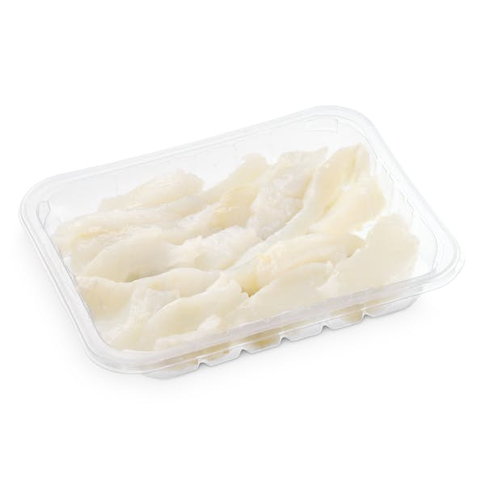

| | |
|---|---|
| **Formato** | Bandeja 0.285kg |
| **Precio** | 7.27 € / ud. |
| **Ingredientes** | — |

**Beneficios nutricionales:** Proteína magra de alta biodisponibilidad, bajo en grasas y rico en vitamina B12, yodo y fósforo. El bacalao desalado es versátil y saciante.

---

### Migas de bacalao al estilo inglés Hacendado

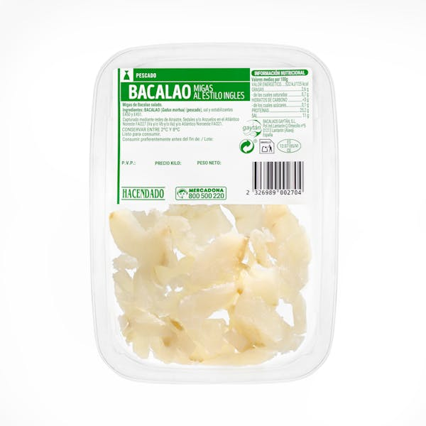

| | |
|---|---|
| **Formato** | Bandeja 0.08kg |
| **Precio** | 3.92 € / ud. |
| **Ingredientes** | — |

**Beneficios nutricionales:** Proteína magra de alta biodisponibilidad, bajo en grasas y rico en vitamina B12, yodo y fósforo. El bacalao desalado es versátil y saciante.

---

### Salmón ahumado Hacendado

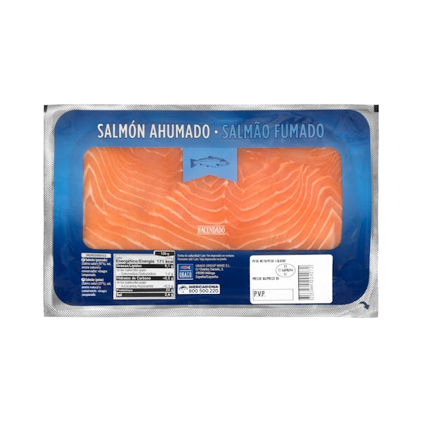

| | |
|---|---|
| **Formato** | Paquete 0.1kg |
| **Precio** | 3.80 € / ud. |
| **Origen** | Elaborado en España |
| **Ingredientes** | Salmón (pescado) (Salmo salar) (97%), sal, aroma natural y conservador: vinagre tamponado. |

**Beneficios nutricionales:** Pescado azul estrella: altísimo en omega-3 EPA y DHA, vitamina D, vitamina B12 y proteínas de alta calidad. Clave para la salud cardiovascular, el cerebro y el sistema inmune.

---

### Huevos de gallinas camperas

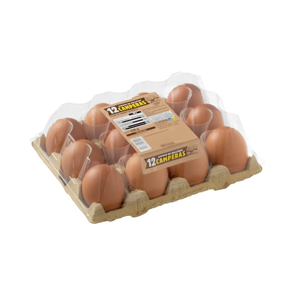

| | |
|---|---|
| **Formato** | Paquete 12ud |
| **Precio** | 3.50 € / ud. |
| **Ingredientes** | huevo |

**Beneficios nutricionales:** Considerado el alimento proteico de referencia. Un huevo completo aporta todos los aminoácidos esenciales, vitaminas A, D, E, B12, colina (salud cerebral) y luteína (salud ocular). Nutritivo y versátil.

---

### Huevos cocidos

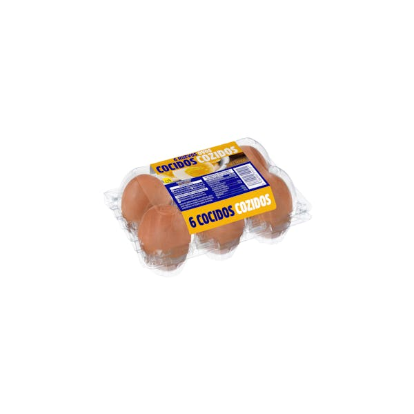

| | |
|---|---|
| **Formato** | Paquete 6ud |
| **Precio** | 2.20 € / ud. |
| **Origen** | España |
| **Ingredientes** | Huevo cocido de gallina, agente de recubrimiento de la cáscara E-904. |

**Beneficios nutricionales:** Considerado el alimento proteico de referencia. Un huevo completo aporta todos los aminoácidos esenciales, vitaminas A, D, E, B12, colina (salud cerebral) y luteína (salud ocular). Nutritivo y versátil.

---

### Claras de huevo líquidas pasteurizadas

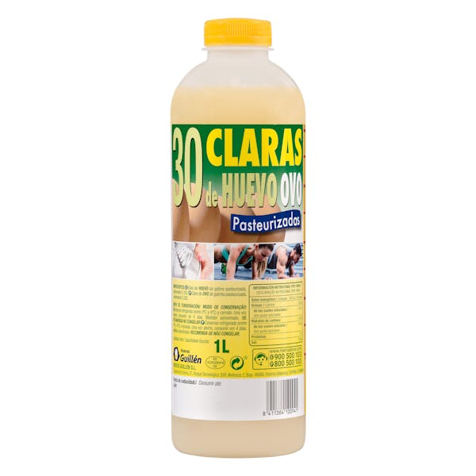

| | |
|---|---|
| **Formato** | Botella 1l |
| **Precio** | 2.85 € / ud. |
| **Origen** | España |
| **Ingredientes** | Clara de HUEVO de gallina pasteurizada, conservante E-202. Alérgenos: CONTIENE HUEVO. |

**Beneficios nutricionales:** Considerado el alimento proteico de referencia. Un huevo completo aporta todos los aminoácidos esenciales, vitaminas A, D, E, B12, colina (salud cerebral) y luteína (salud ocular). Nutritivo y versátil.

---

## 10. Proteínas Vegetales

La soja texturizada y el tofu son las proteínas vegetales más completas: todos los aminoácidos esenciales, hierro, calcio y fitoestrógenos. Ideales para complementar o sustituir la proteína animal en cualquier plato.

### Soja texturizada Luengo

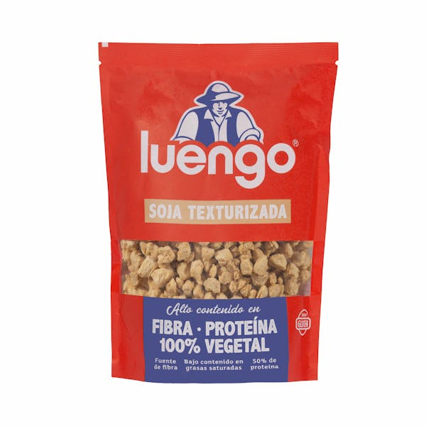

| | |
|---|---|
| **Formato** | Paquete 0.2kg |
| **Precio** | 2.70 € / ud. |
| **Ingredientes** | Soja |

**Beneficios nutricionales:** La legumbre más proteica con todos los aminoácidos esenciales. Rica en isoflavonas con beneficios cardiovasculares y óseos. Fuente importante de calcio vegetal.

---

### Tofu firme Hacendado

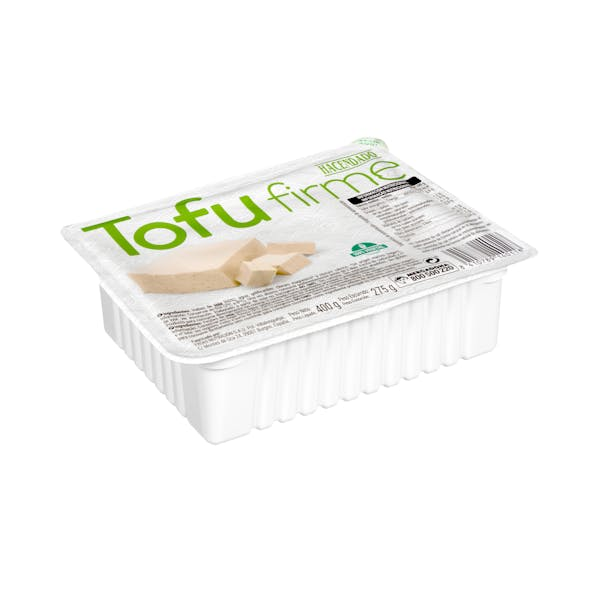

| | |
|---|---|
| **Formato** | Paquete 0.4kg |
| **Precio** | 1.90 € / ud. |
| **Ingredientes** | Habas de soja (65%), agua, gelificante: cloruro magnésico* y cloruro cálcico. *De origen marino (nigari) |

**Beneficios nutricionales:** El tofu es proteína vegetal completa: todos los aminoácidos esenciales, calcio, hierro y magnesio. Bajo en calorías y muy versátil. La versión firme es ideal para cocinar.

---

## 11. Postres y Yogures

El yogur natural y el kéfir son los lácteos fermentados más saludables: calcio, proteínas y probióticos. El queso fresco batido 0% es una fuente proteica excelente y baja en grasa. Elige siempre versiones sin azúcares añadidos.

### Yogur natural Hacendado

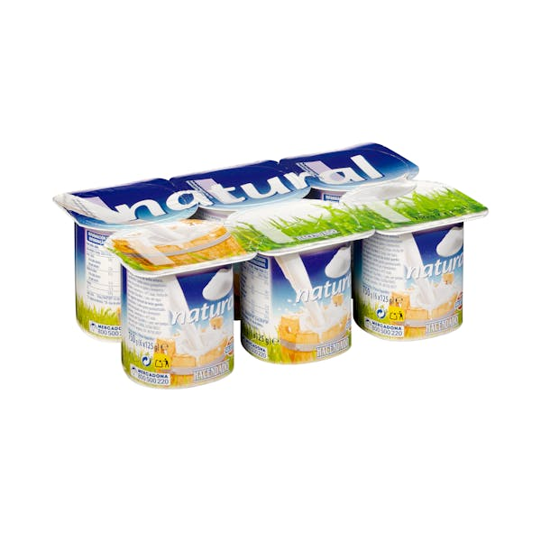

| | |
|---|---|
| **Formato** | Pack-6 0.75kg |
| **Precio** | 1.00 € / ud. |
| **Ingredientes** | Leche entera pasteurizada, leche desnatada en polvo y fermentos lácteos. |

**Beneficios nutricionales:** El yogur natural aporta proteínas, calcio y bacterias probióticas que mejoran la microbiota intestinal. Consumo regular asociado a mejor digestión e inmunidad.

---

### Yogur natural Danone

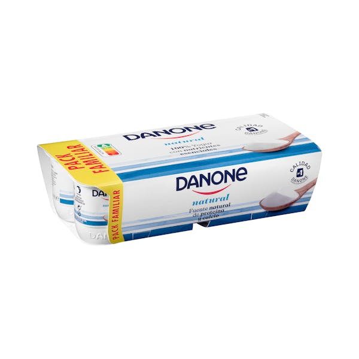

| | |
|---|---|
| **Formato** | Pack-8 0.96kg |
| **Precio** | 1.99 € / ud. |
| **Ingredientes** | Leche fresca pasteurizada (99,1%), leche en polvo desnatada y fermentos lácticos. Origen de la leche: España. |

**Beneficios nutricionales:** El yogur natural aporta proteínas, calcio y bacterias probióticas que mejoran la microbiota intestinal. Consumo regular asociado a mejor digestión e inmunidad.

---

### Kéfir natural sabor suave

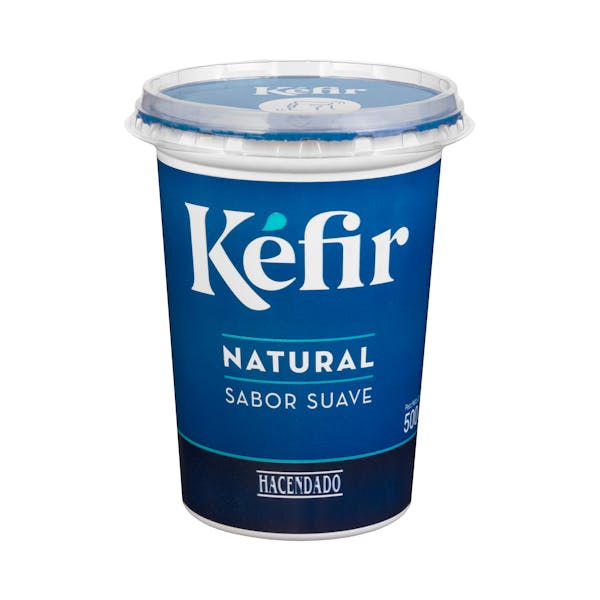

| | |
|---|---|
| **Formato** | Bote 0.5kg |
| **Precio** | 1.10 € / ud. |
| **Ingredientes** | Leche pasteurizada de vaca. nata (leche de vaca pasteurizada). leche en polvo desnatada pasteurizada de vaca y fermentos lácticos kéfir (cepas de lactococcus,leuconostoc,lactobacillus y Streptococcus). |

**Beneficios nutricionales:** Bebida fermentada con mayor densidad de probióticos que el yogur. Mejora la salud intestinal, el sistema inmune y la absorción de nutrientes como el calcio.

---

### Yogur natural de cabra Hacendado

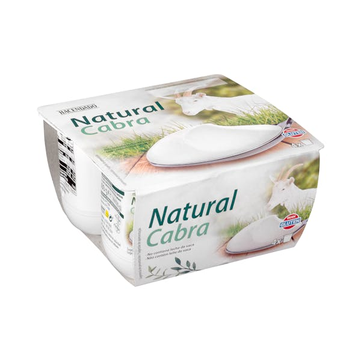

| | |
|---|---|
| **Formato** | Pack-4 0.5kg |
| **Precio** | 2.10 € / ud. |
| **Ingredientes** | Leche entera de cabra pasteurizada, fermentos lácticos. |

**Beneficios nutricionales:** El yogur natural aporta proteínas, calcio y bacterias probióticas que mejoran la microbiota intestinal. Consumo regular asociado a mejor digestión e inmunidad.

---

### Yogur griego natural Hacendado

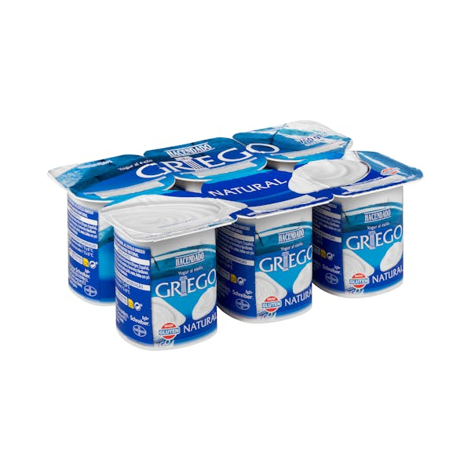

| | |
|---|---|
| **Formato** | Pack-6 0.75kg |
| **Precio** | 1.45 € / ud. |
| **Ingredientes** | Leche pasteurizada entera (Origen: España), nata, leche en polvo desnatada, fermentos lácteos. |

**Beneficios nutricionales:** El yogur natural aporta proteínas, calcio y bacterias probióticas que mejoran la microbiota intestinal. Consumo regular asociado a mejor digestión e inmunidad.

---

### Yogur griego natural ligero Hacendado 2% MG

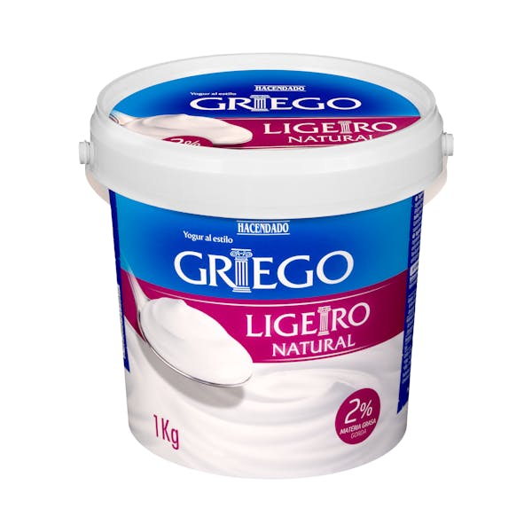

| | |
|---|---|
| **Formato** | Bote 1kg |
| **Precio** | 2.20 € / ud. |
| **Ingredientes** | Leche pasteurizada parcialmente desnatada (Origen: España), leche en polvo desnatada, proteínas de la leche y fermentos lácticos. |

**Beneficios nutricionales:** El yogur natural aporta proteínas, calcio y bacterias probióticas que mejoran la microbiota intestinal. Consumo regular asociado a mejor digestión e inmunidad.

---

### Yogur griego natural ligero Hacendado

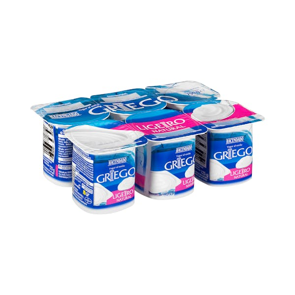

| | |
|---|---|
| **Formato** | 0.75kg |
| **Precio** | 1.45 € / ud. |
| **Ingredientes** | Leche, pasteurizada parcialmente desnatada (Origen: España), leche en polvo desnatada, proteínas de la leche y fermentos lácticos. |

**Beneficios nutricionales:** El yogur natural aporta proteínas, calcio y bacterias probióticas que mejoran la microbiota intestinal. Consumo regular asociado a mejor digestión e inmunidad.

---

### Postre de coco Natural Alpro sin azúcares añadidos

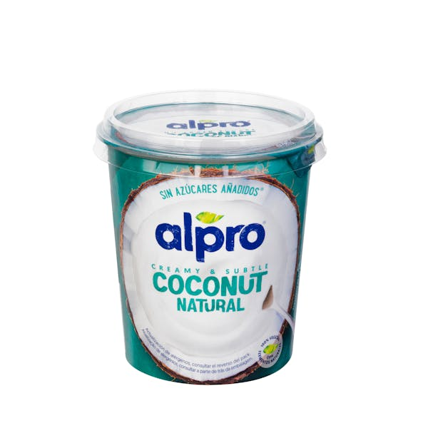

| | |
|---|---|
| **Formato** | Bote 0.35kg |
| **Precio** | 2.30 € / ud. |
| **Ingredientes** | Leche de coco (33%) [crema de coco, agua], agua de coco (33%), agua, almidón modificado, fermentos (S. thermophilus, L. bulgaricus). Puede contener trazas de soja. Sin lácteos y sin gluten. Naturalmente sin lactosa. |

**Beneficios nutricionales:** Los lácteos fermentados aportan probióticos beneficiosos para la microbiota intestinal, además de calcio, proteínas y vitaminas del grupo B.

---

### Postre lácteo natural +Proteínas Hacendado 0% MG 10 g proteínas

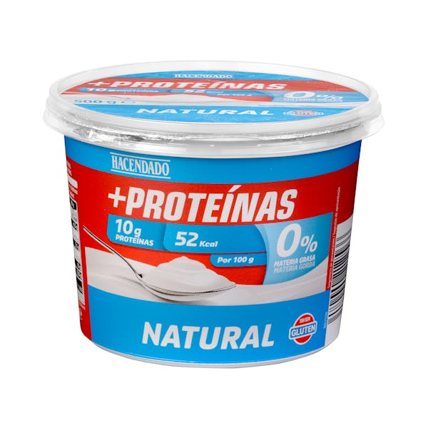

| | |
|---|---|
| **Formato** | Bote 0.5kg |
| **Precio** | 1.40 € / ud. |
| **Ingredientes** | Leche desnatada pasteurizada, fermentos lácticos |

**Beneficios nutricionales:** Los lácteos fermentados aportan probióticos beneficiosos para la microbiota intestinal, además de calcio, proteínas y vitaminas del grupo B.

---

### Bebida láctea desnatada sabor fresa y plátano +Proteínas Hacendado 0% MG 0% azúcares añadidos 17,4 g proteínas

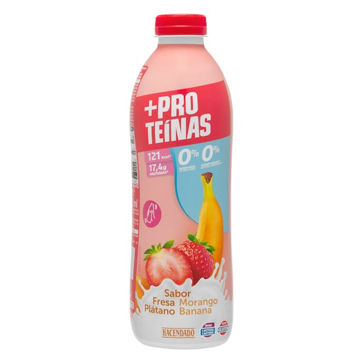

| | |
|---|---|
| **Formato** | Botella 1kg |
| **Precio** | 2.50 € / ud. |
| **Ingredientes** | Leche fresca pasteurizada desnatada (Origen: España), agua, proteínas de la leche, leche en polvo desnatada, almidón modificado, aromas, concentrado de zanahoria, edulcorante (sucralosa), fermentos lácticos, espesante (goma gellan), conservador (sorbato potásico) y lactasa. Contiene leche de vaca. Sin gluten. Sin lactosa. |

**Beneficios nutricionales:** Fuente natural de potasio, magnesio, vitamina B6 y carbohidratos de energía rápida. Ideal pre-entrenamiento y para calambres musculares. Su fibra es prebiótica.

---

### Bebida Kéfir natural Hacendado 0% MG

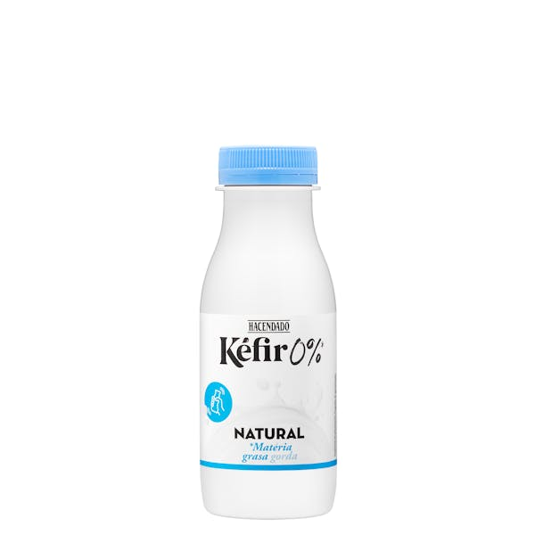

| | |
|---|---|
| **Formato** | Botella 0.25kg |
| **Precio** | 0.90 € / ud. |
| **Origen** | España |
| **Ingredientes** | Leche desnatada pasteurizada de vaca, fermentos lácticos de kéfir y ptrps fermentos lacticos. |

**Beneficios nutricionales:** Bebida fermentada con mayor densidad de probióticos que el yogur. Mejora la salud intestinal, el sistema inmune y la absorción de nutrientes como el calcio.

---

*Guía generada con datos de tienda.mercadona.es (28/4/2026). Precios y disponibilidad sujetos a cambios según zona.*
